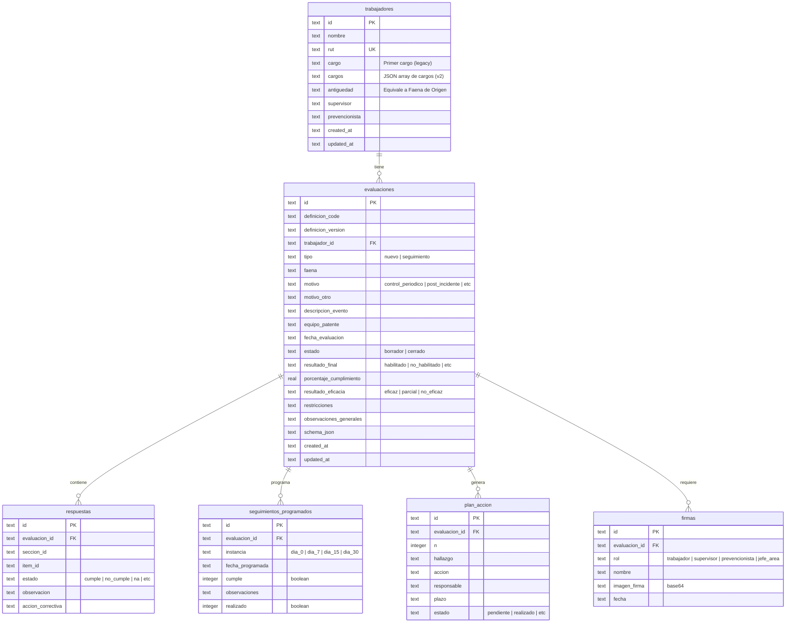

# Guía de Integración SaaS - Sistema de Listas de Chequeo SST

Esta guía detalla exhaustivamente el funcionamiento, arquitectura, reglas de negocio y estructura de datos de la aplicación **Chome Checklists SST** para facilitar su migración e integración en un sistema SaaS (Software as a Service) centralizado y multi-inquilino.

---

## Índice
1. [Visión General y Contexto](#1-visión-general-y-contexto)
2. [Arquitectura de la Aplicación y Estrategia de Migración](#2-arquitectura-de-la-aplicación-y-estrategia-de-migración)
3. [Modelo de Base de Datos y Adaptación SaaS](#3-modelo-de-base-de-datos-y-adaptación-saas)
4. [Esquema Dinámico (Schema-Driven Engine)](#4-esquema-dinámico-schema-driven-engine)
5. [Lógica de Negocio y Reglas de Validación](#5-lógica-de-negocio-y-reglas-de-validación)
6. [Flujo de Firmas y Evidencia Digital](#6-flujo-de-firmas-y-evidencia-digital)
7. [Generación de Actas en PDF](#7-generación-de-actas-en-pdf)
8. [Alertas y Agenda de Seguimiento](#8-alertas-y-agenda-de-seguimiento)
9. [Plan de Migración Paso a Paso](#9-plan-de-migración-paso-a-paso)

---

## 1. Visión General y Contexto

La aplicación es un sistema **offline-first** para la digitalización y gestión de listas de chequeo de Seguridad y Salud en el Trabajo (SST), enfocado en el control operacional de conductores y operadores de **Servicios Industriales Chome Ltda.**

Cumple con un marco legal exigente en Chile:
* **Ley N°16.744** (Accidentes del trabajo y enfermedades profesionales).
* **Decreto Supremo N°44/2024** (Inmutabilidad y trazabilidad legal de actas de seguridad).
* **Decreto Supremo N°594** (Condiciones sanitarias y ambientales básicas en los lugares de trabajo).
* **ISO 45001:2018** (Sistemas de gestión de la seguridad y salud en el trabajo).

### Formularios SGI Soportados
1. **Trabajadores Nuevos (`trabajador_nuevo`)**: Habilitación operacional inicial de personal nuevo, reubicado o con cambio de función.
2. **Control de Seguimiento / Post-Incidente (`trabajador_antiguo`)**: Control periódico y seguimiento a trabajadores después de un incidente, conducta insegura, reincorporación o reforzamiento.

---

## 2. Arquitectura de la Aplicación y Estrategia de Migración

### Arquitectura de Escritorio Actual (Electron)
La aplicación utiliza Electron con el siguiente flujo:
```
┌─────────────────────────────────────────────────────────┐
│  Renderer Process (React + Tailwind v4 + Zustand)       │
│  - Renderiza UI, calcula estados y recopila firmas.     │
└───────────────▲─────────────────────────────────────────┘
                │ IPC (Inter-Process Communication) seguro
┌───────────────┴─────────────────────────────────────────┐
│  Preload Script (Bridge seguro con contextBridge)       │
│  - Expone la interfaz `window.api` al Renderer.          │
└───────────────▲─────────────────────────────────────────┘
                │
┌───────────────┴─────────────────────────────────────────┐
│  Main Process (Node.js + Drizzle ORM + SQLite)          │
│  - Acceso a SQLite, guardados atómicos y printToPDF.     │
└──────────────────────────────────────────────────────────┘
```

### Estrategia de Migración a SaaS (Web)
Para integrar esto en tu SaaS, debes transformar la comunicación IPC local en llamadas HTTP a un servidor central:

```
┌─────────────────────────────────────────────────────────┐
│  Frontend (React v19 + Tailwind v4 + React Query)       │
│  - Renderiza UI dinámica y maneja el estado local.      │
└───────────────▲─────────────────────────────────────────┘
                │ HTTP / REST API (o tRPC / GraphQL)
┌───────────────┴─────────────────────────────────────────┐
│  Backend API (Node/NestJS, Python, Go, PHP, etc.)       │
│  - Autenticación, control multi-inquilino, lógica.      │
└───────────────▲─────────────────────────────────────────┘
                │ SQL Queries / ORM
┌───────────────┴─────────────────────────────────────────┐
│  Base de Datos Centralizada (PostgreSQL / MySQL)        │
│  - Tablas con partición lógica por `tenant_id`.         │
└──────────────────────────────────────────────────────────┘
```

---

## 3. Modelo de Base de Datos y Adaptación SaaS

### 3.1 Esquema de Tablas Actual (SQLite / Drizzle)
El diseño actual define 6 entidades principales representadas en [schema.ts](file:///Users/allopze/dev/tests/Cumplimiento/chome-checklists/src/main/db/schema.ts):



### 3.2 Adaptación Multi-Inquilino (Multi-Tenant) para SaaS
Al migrar a tu SaaS, debes realizar las siguientes transformaciones estructurales:

1. **Añadir `tenant_id` o `empresa_id`**:
   Agrega un campo FK `tenant_id` (UUID o BIGINT) a las tablas `trabajadores` y `evaluaciones` para garantizar el aislamiento lógico de los datos de cada cliente de tu SaaS.
   * Crea índices compuestos como `(tenant_id, rut)` en `trabajadores`.

2. **Migrar la Columna `cargos` (JSON en SQLite)**:
   * En SQLite se almacena como texto JSON (`'["conductor_ampliroll", "conductor_batea"]'`).
   * En PostgreSQL, se recomienda usar el tipo `JSONB` o crear una tabla intermedia de relación muchos-a-muchos `trabajador_cargos` si deseas búsquedas más óptimas por cargo.

3. **Almacenamiento de Firmas (`firmas.imagen_firma`)**:
   * Actualmente se almacena la firma en formato Base64 directamente en la base de datos (campo `TEXT` largo).
   * **Recomendación para el SaaS**: Guarda la imagen Base64 como un archivo `.png` en un almacenamiento de objetos en la nube (AWS S3, Google Cloud Storage, Azure Blob) y almacena solo la URL pública/firmada en la columna `imagen_firma`. Esto evitará que tu base de datos relacional crezca de manera desmesurada.

---

## 4. Esquema Dinámico (Schema-Driven Engine)

La gran ventaja de esta app es que es **dirigida por esquema**. El renderizado del formulario, el tipo de campos y las secciones se definen en código o JSON. No necesitas codificar pantallas diferentes para cada formulario.

### 4.1 Definición de Tipos
Los tipos compartidos están definidos en [types.ts](file:///Users/allopze/dev/tests/Cumplimiento/chome-checklists/src/shared/types.ts):

* **`FieldKind`**: Define qué control de formulario y qué columna de estados se pintará.
  ```typescript
  type FieldKind =
    | 'cumple_nocumple_obs'      // Genera botones: Cumple / No Cumple + campo Observación
    | 'cumple_nocumple_na_obs'   // Genera: Cumple / No Cumple / N/A + Observación
    | 'entregado_obs'            // Genera: Entregado / No Entregado + Observación
    | 'apto_obs'                 // Genera: Apto / No Apto + Observación
    | 'si_no_obs'                // Genera: Sí / No + Observación
    | 'text' | 'date' | 'select' | 'multiselect' | 'signature' | 'readonly'
  ```

* **`StatusValue`**: Representa el valor seleccionado en los campos evaluativos:
  ```typescript
  type StatusValue = 'cumple' | 'no_cumple' | 'na' | 'entregado' | 'no_entregado' | 'apto' | 'no_apto' | 'si' | 'no' | null;
  ```

* **`ChecklistDefinition`**: Estructura principal que define una evaluación.
  ```typescript
  interface ChecklistDefinition {
    code: string;                // Ej: 'trabajador_nuevo'
    version: string;             // Ej: '01'
    revisionDate: string;
    title: string;
    sections: ChecklistSection[];
    closingAct: {
      title: string;
      resultOptions: { value: string; label: string }[];
      signatureRoles: string[];  // roles que deben firmar
    };
  }
  ```

* **Esquemas de Checklists**: 
  * Los esquemas y catálogos de ítems están detallados en [nuevos.ts](file:///Users/allopze/dev/tests/Cumplimiento/chome-checklists/src/shared/checklists/nuevos.ts) y [seguimiento.ts](file:///Users/allopze/dev/tests/Cumplimiento/chome-checklists/src/shared/checklists/seguimiento.ts).

### 4.2 Guardar el esquema con la evaluación
Para asegurar la **trazabilidad legal**, cuando el usuario completa y cierra una evaluación, se almacena el esquema JSON exacto utilizado en la columna `evaluaciones.schema_json`. 
> [!IMPORTANT]
> Esto evita que si en el futuro se modifica la definición del checklist (versión `02`), los PDFs o pantallas históricas de la versión `01` cambien o pierdan ítems.

---

## 5. Lógica de Negocio y Reglas de Validación

Toda esta lógica está encapsulada en [compliance.ts](file:///Users/allopze/dev/tests/Cumplimiento/chome-checklists/src/renderer/lib/compliance.ts). Debes replicarla o reutilizarla en tu SaaS:

### 5.1 Validación de RUT (Chile)
Usa el algoritmo **Módulo 11** para verificar la consistencia del RUN/RUT chileno. La app limpia los caracteres especiales (`.`, `-`, espacios) y valida el dígito verificador (incluyendo la letra `K`).
* Implementado en [rut.ts](file:///Users/allopze/dev/tests/Cumplimiento/chome-checklists/src/renderer/lib/rut.ts).

### 5.2 Cálculo Automático de Porcentaje de Cumplimiento
El porcentaje se calcula dinámicamente con la fórmula:
$$\text{\% Cumplimiento} = \frac{\text{Ítems Cumplidos}}{\text{Ítems Cumplidos} + \text{Ítems No Cumplidos}} \times 100$$

* **Estados Positivos (Cumplidos)**: `'cumple'`, `'entregado'`, `'apto'`, `'si'`.
* **Estados Negativos (No Cumplidos)**: `'no_cumple'`, `'no_entregado'`, `'no_apto'`, `'no'`.
* **Excluidos del cálculo**: Los ítems con estado `'na'` (No Aplica) o `null` (sin responder) **no suman ni restan** en el denominador.

### 5.3 Clasificación de Eficacia (Para trabajador_antiguo)
Clasifica el desempeño de un trabajador tras un periodo de seguimiento:
* **Eficaz**: Porcentaje $\ge 90\%$ **Y** no posee desviaciones críticas **Y** no hay reincidencia.
* **Parcialmente Eficaz**: Porcentaje entre $70\%$ y $89\%$.
* **No Eficaz**: Porcentaje $< 70\%$ **O** se reporta alguna desviación crítica **O** hay reincidencia.

### 5.4 Habilitación Operacional Automática (Resultado Final)
La aplicación calcula automáticamente el resultado final (`ResultadoFinal`) basándose en reglas críticas:

1. **Secciones Bloqueantes (Safety Blockers)**:
   El incumplimiento (estado negativo) en cualquiera de los ítems de estas secciones resulta automáticamente en **NO HABILITADO**, sin importar el porcentaje global.
   * **En trabajador_nuevo (Nuevos)**: 
     * Sección `documentacion_requisitos` (1.1 - Requisitos Legales).
     * Sección `induccion_capacitacion` (1.2 - Inducción Inicial), *con excepción del ítem `protocolos_minsal` (que no es bloqueante)*.
   * **En trabajador_antiguo (Seguimiento)**:
     * Sección `verificacion_documental` (3 - Verificación Documental y Competencias).

2. **Umbral de Aprobación por Porcentaje**:
   * **Para Trabajadores Nuevos (`trabajador_nuevo`)**:
     * Cumple (Habilitado Autónomo): Porcentaje $\ge 90\%$.
     * No Cumple (No Habilitado): Porcentaje $< 90\%$.
   * **Para Control de Seguimiento (`trabajador_antiguo`)**:
     * Habilitado Autónomo: Porcentaje $\ge 90\%$ (sin bloqueos).
     * Habilitado con Restricciones: Porcentaje entre $70\%$ y $89\%$.
     * No Habilitado: Porcentaje $< 70\%$ o presencia de desviación crítica o reincidencia.

### 5.5 Secciones Condicionales por Cargo
En la lista de seguimiento (`trabajador_antiguo`), hay secciones específicas para cada rol operativo que solo deben mostrarse e influir en el cumplimiento si el trabajador posee dicho cargo:
* **Conductor Ampliroll**: Se muestra y evalúa la sección `control_operacional_ampliroll` (5.1).
* **Conductor Batea**: Se muestra y evalúa la sección `control_operacional_batea` (5.2).
* **Operador Maquinaria Pesada**: Se muestra y evalúa la sección `control_operacional_maquinaria` (5.3).

---

## 6. Flujo de Firmas y Evidencia Digital

La app garantiza la autoría de las evaluaciones a través de firmas en pantalla digital.

* **Firma Manuscrita**: Implementada mediante un componente `<canvas>` que captura los trazos y los convierte en una cadena `data:image/png;base64,...`.
* **Inmutabilidad post-cierre**:
  Antes de cualquier inserción o actualización de respuestas, firmas, o plan de acción, la app ejecuta `assertEditable(evaluacionId)`. Si la evaluación ya fue firmada y cerrada, la base de datos rechaza la operación.
  > [!WARNING]
  > Esto asegura el cumplimiento del DS N°44/2024. Una vez cerrada el acta, la información es inmutable y solo se pueden registrar seguimientos posteriores.

---

## 7. Generación de Actas en PDF

### Funcionamiento Actual (Electron)
1. El backend de Electron crea una ventana oculta (`BrowserWindow`).
2. Carga un String HTML auto-contenido (construido en [pdf.ts](file:///Users/allopze/dev/tests/Cumplimiento/chome-checklists/src/main/pdf/pdf.ts)) mediante un Data URI:
   `pdfWindow.loadURL("data:text/html;charset=utf-8,..." + encodeURIComponent(html))`
3. Llama a la API nativa de Chromium `webContents.printToPDF()` para generar el archivo binario.
4. Escribe el archivo en el disco local usando el sistema de archivos (`fs.writeFileSync`).

### Cómo Replicarlo en tu SaaS (Servidor)
No puedes usar `webContents.printToPDF` en un navegador web convencional. Tienes tres opciones para implementarlo en el backend del SaaS:

1. **Puppeteer (Recomendado)**:
   Levanta una instancia headless de Chromium en tu servidor Node.js y genera el PDF de forma idéntica a Electron:
   ```javascript
   const puppeteer = require('puppeteer');
   const browser = await puppeteer.launch();
   const page = await browser.newPage();
   await page.setContent(htmlString);
   const pdfBuffer = await page.pdf({
     format: 'Letter',
     printBackground: true,
     margin: { top: '0.5in', bottom: '0.7in', left: '0.5in', right: '0.5in' }
   });
   await browser.close();
   // Guardar pdfBuffer en S3 o enviarlo como stream al cliente
   ```
2. **Librerías del lado del Cliente (JS)**:
   Usa `@react-pdf/renderer` para construir el PDF de forma nativa en React o usa `jspdf` junto con `html2canvas` para convertir el HTML visible del navegador a PDF. *(Nota: html2canvas puede perder precisión en saltos de página).*
3. **Servicios de terceros**:
   Utilizar APIs como DocRaptor, PDFShift o Html2Pdf para delegar la renderización.

---

## 8. Alertas y Agenda de Seguimiento

Cuando se crea una evaluación de tipo **seguimiento** (`trabajador_antiguo`), el backend genera automáticamente 4 hitos en la tabla `seguimientos_programados`:

| Instancia | Cálculo de Fecha Programada | Objetivo del Hito |
|---|---|---|
| **Día 0** | Fecha de la evaluación + 0 días | Control inmediato inicial |
| **Día 7** | Fecha de la evaluación + 7 días | Verificación de corrección primaria |
| **Día 15** | Fecha de la evaluación + 15 días | Seguimiento de medidas a mediano plazo |
| **Día 30** | Fecha de la evaluación + 30 días | Cierre final del ciclo de seguimiento |

### Reglas Clave:
* El prevencionista puede ir marcando cada hito como `realizado: true`, indicando si `cumple: true/false` y añadiendo observaciones.
* **Excepción de Inmutabilidad**: Estos hitos de seguimiento programado **sí se pueden actualizar** después de que la evaluación esté en estado `cerrado` (utilizando el canal dedicado `mark-seguimiento`), ya que corresponden a tareas de control posteriores a la generación del acta de cierre.

---

## 9. Plan de Migración Paso a Paso

Si deseas llevar esta aplicación a tu SaaS, te sugerimos seguir estas etapas:

### Paso 1: Migración del Modelo de Datos
1. Crea las tablas de base de datos en el motor relacional de tu SaaS (ej: PostgreSQL) basándote en los esquemas de [schema.ts](file:///Users/allopze/dev/tests/Cumplimiento/chome-checklists/src/main/db/schema.ts).
2. Añade la columna `tenant_id` en `trabajadores` y `evaluaciones`.
3. Configura un almacenamiento de archivos (S3) para guardar las firmas en lugar de guardarlas en formato Base64.

### Paso 2: Creación de endpoints en el Backend
Mapea todos los IPC handlers definidos en [handlers.ts](file:///Users/allopze/dev/tests/Cumplimiento/chome-checklists/src/main/ipc/handlers.ts) a endpoints de una API REST o GraphQL. Por ejemplo:
* `create-evaluacion` $\rightarrow$ `POST /api/evaluations`
* `save-respuestas` $\rightarrow$ `POST /api/evaluations/:id/responses`
* `mark-seguimiento` $\rightarrow$ `PATCH /api/seguimientos/:id`

### Paso 3: Migración del Frontend
1. Copia la estructura de vistas de `src/renderer/pages` y `src/renderer/components` a tu proyecto web.
2. Reemplaza la instancia global `window.api` (puente IPC) por llamadas Axios, Fetch, o idealmente hooks de **React Query (TanStack Query)** para una gestión óptima de caché.
3. Adapta los estilos de Tailwind CSS v4 para que coincidan con el tema y diseño global de tu SaaS.

### Paso 4: Implementar Generación de PDF en la Nube
1. Copia el generador de HTML de [pdf.ts](file:///Users/allopze/dev/tests/Cumplimiento/chome-checklists/src/main/pdf/pdf.ts) en tu backend.
2. Integra **Puppeteer** en tu API para que cuando el usuario haga clic en "Exportar PDF", el servidor procese el HTML y devuelva un flujo binario descargable.

---
*Documento preparado para la integración en la infraestructura SaaS de Servicios Industriales Chome Ltda.*
