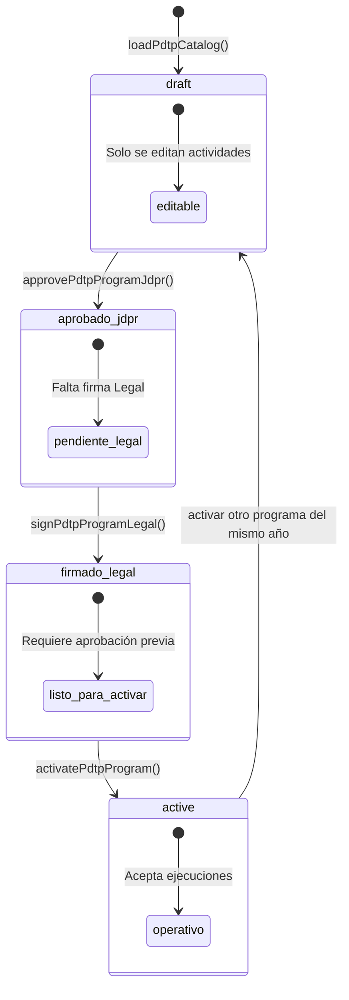
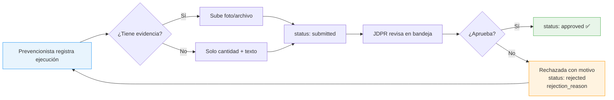
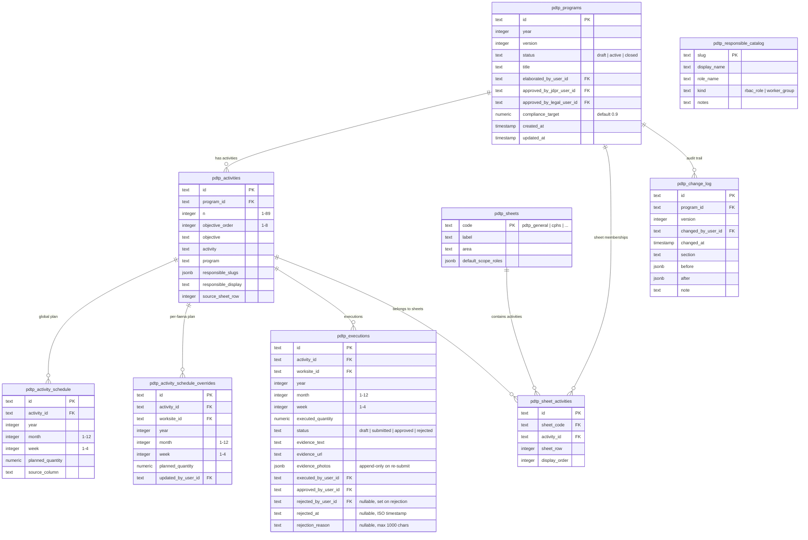
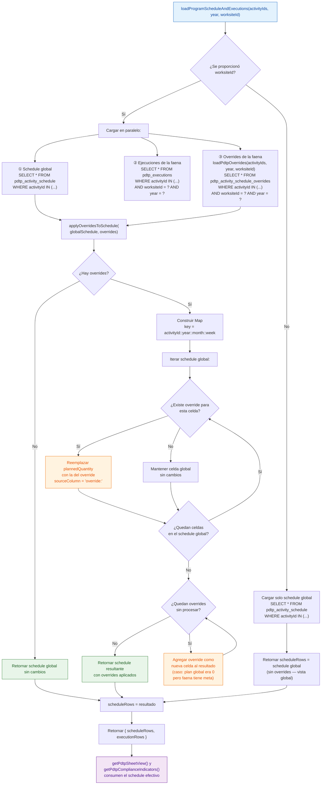
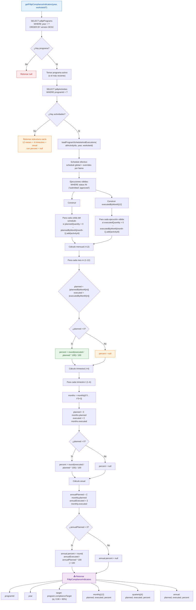

# Módulo PDTP — Programa de Trabajo Preventivo SG-SST

## ¿Qué es?

El módulo PDTP es el sistema digital que **reemplaza y supera** el archivo Excel `PROGRAMA DE TRABAJO PREVENTIVO SG-SST 2026.xlsx`. Digitaliza con alta fidelidad el programa preventivo de Seguridad y Salud en el Trabajo (SG-SST) exigido por la normativa chilena (Ley 16.744, D.S. N° 44, D.S. N° 594), convirtiendo un archivo estático en una herramienta operativa de terreno con ejecución, aprobación y cumplimiento en tiempo real.

**En resumen:** el módulo permite planificar 89 actividades preventivas distribuidas en 8 hojas oficiales, registrar ejecuciones semanales por faena con evidencia fotográfica, aprobar desde la jefatura de prevención, medir cumplimiento mensual/trimestral/anual con una meta del 90%, y generar recordatorios automáticos semanales a los responsables.

---

## ¿Qué hace?

### Funcionalidades principales

| Función | Descripción |
|---|---|
| **Catálogo de actividades** | 89 actividades preventivas (N° 1-89) organizadas en 8 objetivos específicos, importadas idempotentemente desde el Excel oficial |
| **8 hojas oficiales** | Réplica fiel de las vistas del Excel: PDTP General, CPHS, PRF y Adm. de contrato, Sup y JT, PRF, Adm. de contrato, Subgerencia, Capacitación y Campañas |
| **Cronograma semanal P/E** | 12 meses × 4 semanas = 48 semanas lógicas con cantidades planificadas y ejecutadas por actividad |
| **Ejecución por faena** | Los prevencionistas registran cantidades ejecutadas, texto de evidencia y fotos/archivos adjuntos |
| **Aprobación de ejecuciones** | Bandeja unificada para la jefatura de prevención (JDPR) que revisa y aprueba ejecuciones submitidas. Soporta **rechazo con motivo** (estado `rejected` + `rejectionReason` + `rejectedByUserId` + `rejectedAt`) que devuelve la ejecución al prevencionista para corrección. La ejecución rechazada puede ser re-enviada con nuevos datos; al hacerlo vuelve a `submitted` con campos de rechazo limpiados. |
| **Overrides por faena** | Cada faena puede tener metas planificadas distintas a las globales del catálogo (ej: según cantidad de equipos) |
| **Firma del programa** | Flujo Elaborado → Aprobado JDPR → Firmado Legal → Activo, con control de cambios en cada paso |
| **Indicadores de cumplimiento** | % mensual, trimestral y anual de actividades ejecutadas vs. planificadas, con meta configurable (default 90%) |
| **Dashboard** | Tarjeta de cumplimiento PDTP en el dashboard principal, gated por permiso |
| **Recordatorios semanales** | Cron automático que detecta faenas con actividades pendientes y notifica a los responsables |
| **Exportación XLSX** | Exporta cada hoja como archivo Excel con formato tabular (nunca CSV) |
| **Vista semanal / anual** | Toggle entre vista compacta de la semana actual y vista anual completa de 12 meses |

### Flujo de vida de un programa



- **draft**: El programa se está elaborando. Solo se pueden editar actividades.
- **Aprobado JDPR**: La jefatura de prevención revisó y aprobó el catálogo.
- **Firmado Legal**: Gerencia Legal y RRHH firmó el programa.
- **active**: Estado operativo. Solo los programas activos aceptan ejecuciones. Solo puede haber un programa activo por año.

### Flujo de una ejecución



### Detalle técnico: registro de una ejecución (sequence diagram)

Este diagrama muestra la interacción completa entre los componentes del sistema cuando un prevencionista registra una ejecución PDTP:

```mermaid
sequenceDiagram
    actor User as 👤 Prevencionista
    participant Form as PdtpExecutionForm
    participant Evidence as /api/prevencion/pdtp/evidence
    participant Action as markPdtpExecutionAction
    participant Auth as guardAuth + can()
    participant Scope as resolveWorksiteScope()
    participant Service as markPdtpExecution()
    participant Zod as pdtpExecutionSchema
    participant DB as PostgreSQL

    User->>Form: Llena mes, semana, cantidad, observación
    User->>Form: Adjunta archivo (JPEG/PNG/PDF)
    User->>Form: Click "Guardar"

    alt Tiene archivo adjunto
        Form->>Evidence: POST multipart (file, worksiteId)
        Evidence->>Evidence: Valida magic-bytes y tamaño
        Evidence->>DB: Guarda en storage/pdtp-evidence/
        Evidence-->>Form: { path: "storage/pdtp-evidence/abc.jpg" }
        Form->>Form: formData.set("evidenceUrl", path)
    end

    Form->>Action: startTransition(() => formAction(formData))

    Action->>Auth: guardAuth() → session
    Auth-->>Action: session (o redirect /forbidden)
    Action->>Auth: can(session, "prevention:pdtp:manage")
    Auth-->>Action: true ✅
    Action->>Scope: resolveWorksiteScope(session)
    Scope-->>Action: { mode: "some", ids: ["ws-1"] }

    Action->>Service: markPdtpExecution(input, userId, scope)
    Service->>Zod: pdtpExecutionSchema.parse(input)
    Zod-->>Service: data validado ✅

    Service->>Service: assertWorksiteAccess(worksiteId, scope)
    Note right of Service: Verifica que la faena
    pertenezca al scope del usuario

    Service->>DB: SELECT FROM pdtp_activities WHERE id = ?
    DB-->>Service: activity (programId)
    Service->>DB: SELECT FROM pdtp_programs WHERE id = ?
    DB-->>Service: program (status = "active")
    Note right of Service: Solo acepta programas activos

    Service->>DB: INSERT INTO pdtp_executions
    Note right of Service: ON CONFLICT (activityId, worksiteId,
    year, month, week) DO UPDATE
    DB-->>Service: row (status = "submitted")

    Service-->>Action: execution row
    Action->>Action: revalidatePath("/prevencion/pdtp")
    Action-->>Form: { ok: true }
    Form->>User: toast.success("Ejecución PDTP registrada.")
```

### Arquitectura general

El módulo sigue la arquitectura estándar de la aplicación:

- **Source of truth**: `lib/services/pdtp/` (lógica de negocio pura) + `app/(app)/prevencion/pdtp/actions.ts` (Server Actions)
- **Schema**: `db/schema/prevention/pdtp.ts` (Drizzle ORM, PostgreSQL)
- **Validación**: `lib/validation/prevention-module/pdtp.ts` (Zod)
- **UI**: `app/(app)/prevencion/pdtp/` (Next.js App Router, Server Components + Client Components)
- **Permisos**: `modules/prevention/manifest.ts` (RBAC con 4 permisos PDTP)
- **Exportaciones**: `app/api/prevencion/pdtp/export/route.ts` (XLSX)
- **Cron**: `app/api/cron/pdtp-weekly-reminders/route.ts` (recordatorios)

#### Diagrama de capas

```mermaid
flowchart TB
    subgraph UI["🖥️ UI — Next.js App Router"]
        direction LR
        ServerPages["Server Components<br/>page.tsx · loading.tsx"]
        ClientComponents["Client Components<br/>PdtpExecutionForm<br/>PdtpOverrideForm<br/>PdtpApprovalButtons"]
        APIClient["API Route Handlers<br/>/api/prevencion/pdtp/export<br/>/api/prevencion/pdtp/evidence<br/>/api/cron/pdtp-weekly-reminders"]
    end

    subgraph Actions["⚡ Server Actions — actions.ts"]
        direction LR
        Guard["guardAuth()<br/>can(session, permiso)<br/>resolveWorksiteScope()"]
        Actions_Exec["markPdtpExecutionAction"]
        Actions_Approve["approvePdtpExecutionAction"]
        Actions_Lifecycle["approvePdtpProgramJdprAction<br/>signPdtpProgramLegalAction<br/>activatePdtpProgramAction"]
        Actions_Override["setPdtpActivityOverrideFormAction"]
        Actions_Activity["addPdtpActivityFormAction"]
    end

    subgraph Validation["🔍 Validación — lib/validation/prevention-module/pdtp.ts"]
        direction LR
        ZodExec["pdtpExecutionSchema"]
        ZodApproval["pdtpExecutionApprovalSchema"]
        ZodSchedule["pdtpScheduleCellSchema"]
        ZodActivity["pdtpActivityUpdateSchema<br/>pdtpActivityAddSchema"]
        ZodOverride["pdtpActivityOverrideSchema"]
    end

    subgraph Services["🧠 Servicios — lib/services/pdtp/"]
        direction LR
        ExecSvc["executions.ts<br/>markPdtpExecution<br/>approvePdtpExecution<br/>listPendingPdtpExecutions"]
        SheetsSvc["sheets.ts<br/>getPdtpSheetView<br/>buildPdtpExport"]
        ComplianceSvc["compliance.ts<br/>getPdtpComplianceIndicators"]
        LifecycleSvc["lifecycle.ts<br/>approvePdtpProgramJdpr<br/>signPdtpProgramLegal<br/>activatePdtpProgram"]
        ActivitiesSvc["activities.ts<br/>updatePdtpActivity<br/>addPdtpActivity"]
        OverridesSvc["overrides.ts<br/>setPdtpActivityOverride<br/>applyOverridesToSchedule"]
        RemindersSvc["reminders.ts<br/>findPdtpWeeklyPending<br/>runPdtpWeeklyReminders"]
        CatalogSvc["catalog.ts<br/>loadPdtpCatalog"]
        PeriodSvc["period.ts<br/>currentPdtpPeriod<br/>deriveActivityStatus"]
        Helpers["helpers.ts<br/>assertWorksiteAccess<br/>loadProgramScheduleAndExecutions"]
    end

    subgraph DB["💾 PostgreSQL — db/schema/prevention/pdtp.ts"]
        direction LR
        T_Programs["pdtp_programs"]
        T_Activities["pdtp_activities"]
        T_Schedule["pdtp_activity_schedule"]
        T_Overrides["pdtp_activity_schedule_overrides"]
        T_Executions["pdtp_executions"]
        T_Sheets["pdtp_sheets"]
        T_SheetAct["pdtp_sheet_activities"]
        T_ChangeLog["pdtp_change_log"]
        T_Responsible["pdtp_responsible_catalog"]
    end

    %% UI → Actions
    ServerPages --> Guard
    ClientComponents --> Guard
    APIClient --> Guard

    %% Actions → Validation
    Guard --> ZodExec
    Guard --> ZodApproval
    Guard --> ZodActivity
    Guard --> ZodOverride

    %% Validation → Services
    ZodExec --> ExecSvc
    ZodApproval --> ExecSvc
    ZodActivity --> ActivitiesSvc
    ZodOverride --> OverridesSvc

    %% Actions → Services (direct calls)
    Actions_Lifecycle --> LifecycleSvc
    Actions_Activity --> ActivitiesSvc
    Actions_Override --> OverridesSvc

    %% Services → DB
    ExecSvc --> T_Executions
    ExecSvc --> T_Activities
    ExecSvc --> T_Programs
    SheetsSvc --> T_Sheets
    SheetsSvc --> T_SheetAct
    SheetsSvc --> T_Activities
    SheetsSvc --> T_Schedule
    SheetsSvc --> T_Executions
    SheetsSvc --> T_Overrides
    ComplianceSvc --> T_Programs
    ComplianceSvc --> T_Activities
    LifecycleSvc --> T_Programs
    ActivitiesSvc --> T_Activities
    ActivitiesSvc --> T_Schedule
    ActivitiesSvc --> T_SheetAct
    ActivitiesSvc --> T_ChangeLog
    OverridesSvc --> T_Overrides
    RemindersSvc --> T_Programs
    RemindersSvc --> T_Activities
    RemindersSvc --> T_Schedule
    RemindersSvc --> T_Executions
    CatalogSvc --> T_Programs
    CatalogSvc --> T_Activities
    CatalogSvc --> T_Schedule
    CatalogSvc --> T_Sheets
    CatalogSvc --> T_SheetAct
    CatalogSvc --> T_Responsible

    %% Styles
    classDef ui fill:#e3f2fd,stroke:#1565c0,color:#0d47a1
    classDef action fill:#fff3e0,stroke:#ef6c00,color:#e65100
    classDef validation fill:#fce4ec,stroke:#c62828,color:#b71c1c
    classDef service fill:#e8f5e9,stroke:#2e7d32,color:#1b5e20
    classDef db fill:#f3e5f5,stroke:#6a1b9a,color:#4a148c

    class ServerPages,ClientComponents,APIClient ui
    class Guard,Actions_Exec,Actions_Approve,Actions_Lifecycle,Actions_Override,Actions_Activity action
    class ZodExec,ZodApproval,ZodSchedule,ZodActivity,ZodOverride validation
    class ExecSvc,SheetsSvc,ComplianceSvc,LifecycleSvc,ActivitiesSvc,OverridesSvc,RemindersSvc,CatalogSvc,PeriodSvc,Helpers service
    class T_Programs,T_Activities,T_Schedule,T_Overrides,T_Executions,T_Sheets,T_SheetAct,T_ChangeLog,T_Responsible db
```



**Principios de la arquitectura:**
- **Server Components** cargan datos directamente (page.tsx, pdtp-sheet-table.tsx, pdtp-indicators-panel.tsx)
- **Client Components** manejan interacción del usuario (formularios, modales) y llaman Server Actions
- **Server Actions** son el único punto de entrada para mutaciones. Siempre ejecutan: `guardAuth()` → `can(permiso)` → `resolveWorksiteScope()` → servicio → `revalidatePath()`
- **Servicios** son funciones puras sin dependencia de Next.js. Reciben inputs tipados y acceden a la DB vía Drizzle
- **Validación Zod** actúa como capa de contract entre Actions y Services. Los schemas definen la forma exacta de los inputs. Adicionalmente, **CHECK constraints a nivel SQL** (`db/migrations/0022`) refuerzan `status IN (...)`, `month 1-12`, `week 1-4`, `executed/planned_quantity >= 0`, `compliance_target 0-1`, `objective_order 1-8`, `n >= 1`, `length(section) > 0`. Defense in depth.
- **DB** usa Drizzle ORM con relaciones declaradas. Las tablas usan `uniqueIndex` para upserts atómicos (`onConflictDoUpdate`)

### Modelo de datos (9 tablas)



**Relaciones clave:**
- `pdtp_programs` → 1 programa por año, con versionado y estados de firma
- `pdtp_activities` → N° 1-89, cada una pertenece a un programa y tiene un objetivo
- `pdtp_activity_schedule` → Celdas de planificación: `(activityId, year, month, week)` → `plannedQuantity`
- `pdtp_activity_schedule_overrides` → Override por faena: `(activityId, worksiteId, year, month, week)` → `plannedQuantity`
- `pdtp_executions` → Registro de ejecución: `(activityId, worksiteId, year, month, week)` → `executedQuantity` + evidencia
- `pdtp_sheet_activities` → Many-to-many entre hojas y actividades (replica exacta del Excel)
- `pdtp_change_log` → Traza de cada cambio con `before`/`after` en JSON

### Capa de servicios (`lib/services/pdtp/`)

| Archivo | Responsabilidad |
|---|---|
| `index.ts` | Punto de exportación pública del módulo |
| `catalog.ts` | `loadPdtpCatalog()` — importa el catálogo JSON a las tablas de forma idempotente |
| `sheets.ts` | `getPdtpSheetView()` — construye la vista de una hoja con actividades, schedule y ejecuciones; `buildPdtpExport()` — genera datos para XLSX |
| `executions.ts` | `markPdtpExecution()` — registra una ejecución; `approvePdtpExecution()` — aprueba; `listPendingPdtpExecutions()` — bandeja de pendientes |
| `compliance.ts` | `getPdtpComplianceIndicators()` — calcula % cumplimiento mensual, trimestral y anual |
| `period.ts` | `currentPdtpPeriod()` — período actual (year/month/week); `deriveActivityStatus()` — estado de una actividad (pending/executed/overdue/not_scheduled) |
| `lifecycle.ts` | `approvePdtpProgramJdpr()`, `signPdtpProgramLegal()`, `activatePdtpProgram()` — flujo de firma y activación |
| `activities.ts` | `updatePdtpActivity()`, `addPdtpActivity()` — CRUD de actividades (solo en draft) |
| `overrides.ts` | `setPdtpActivityOverride()`, `deletePdtpActivityOverride()`, `applyOverridesToSchedule()` — metas por faena |
| `reminders.ts` | `findPdtpWeeklyPending()`, `runPdtpWeeklyReminders()` — motor de recordatorios semanales |
| `helpers.ts` | Funciones utilitarias: IDs determinísticos (`pdtpProgramId`, `pdtpActivityId`, `pdtpExecutionId`), `assertWorksiteAccess()`, `loadProgramScheduleAndExecutions()`, `addPdtpChangeLogEntry()`, `collectResponsibleCatalog()` |
| `constants.ts` | Metadata de hojas (`SHEET_META`), nombres de exportación (`SHEET_EXPORT_NAMES`), etiquetas de meses (`MONTH_LABELS`), mapeo de roles a slugs (`ROLE_RESPONSIBLE_SLUGS`) |

**Total: 12 archivos** en `lib/services/pdtp/` (más el re-exportador `lib/services/prevention-pdtp.ts` y el parser `lib/services/prevention-pdtp-catalog.ts`).

### Importación del Excel

El catálogo se extrae del archivo Excel real (`PROGRAMA DE TRABAJO PREVENTIVO SG-SST 2026.xlsx`) mediante:

1. `scripts/generate-pdtp-catalog.ts` — genera `db/seed/pdtp-catalog-2026.json` desde el XLSX
2. `lib/services/prevention-pdtp-catalog.ts` — parser que lee el workbook XLSX con `XLSX.readFile()`, extrae las 89 actividades (validando secuencia 1-89), sus cronogramas con cantidades P/E, y la membresía de hojas (qué actividades pertenecen a cada hoja oficial)
3. `lib/services/pdtp/catalog.ts` — `loadPdtpCatalog()` inserta todo en la DB usando upserts idempotentes (`onConflictDoUpdate`): programa, catálogo de responsables, hojas, actividades, schedule y membresías
4. `db/seed.ts` — el seed bootstrap carga el catálogo, aprueba como JDPR, firma como Legal y activa el programa en una sola corrida

**Flujo completo de seed:** `loadPdtpCatalog()` → `approvePdtpProgramJdpr()` → `signPdtpProgramLegal()` → `activatePdtpProgram()`. Esto significa que después de `npm run db:seed`, el programa PDTP 2026 ya está activo y listo para recibir ejecuciones.

### Permisos RBAC

| Permiso | Descripción | Roles con acceso |
|---|---|---|
| `prevention:pdtp:view` | Ver el PDTP por hoja | prevencionista, jefa_chome, prevencionista_faena, admin_contrato, supervisor_faena, jefe_terreno, cphs, administrador |
| `prevention:pdtp:manage` | Gestionar catálogo, cronograma y ejecuciones | prevencionista, prevencionista_faena, admin_contrato, supervisor_faena, jefe_terreno, administrador |
| `prevention:pdtp:approve` | Aprobar como jefatura de prevención | prevencionista, jefa_chome, administrador |
| `prevention:pdtp:sign_legal` | Firmar como Gerencia Legal y RRHH | jefa_chome, administrador |

### Componentes UI

| Componente | Tipo | Archivo | Descripción |
|---|---|---|---|
| `PdtpSheetTable` | Server | `pdtp-sheet-table.tsx` | Tabla principal con vista semanal (solo actividades de la semana) y anual (12 meses). Filtra por `monthlyPlanned > 0` en modo semanal. Incluye `StatusBadge` con 4 estados |
| `PdtpWorksitePicker` | Server | `pdtp-sheet-table.tsx` | Selector de faena con pills enlazadas (navega por URL `?faena=...`) |
| `PdtpViewToggle` | Server | `pdtp-sheet-table.tsx` | Toggle entre "Esta semana" y "Vista anual" |
| `PdtpSheetPicker` | Server | `pdtp-sheet-table.tsx` | Selector de hoja oficial (8 opciones) |
| `PdtpOverrideForm` | Client | `pdtp-override-form.tsx` | Modal (`Dialog`) para fijar meta por faena: selecciona mes, semana y cantidad. Si cantidad = 0, borra el override y vuelve al plan global |
| `PdtpExecutionForm` | Client | `pdtp-execution-form.tsx` | Formulario con `useActionState` + `useTransition`: mes, semana, cantidad, observación (texto) y evidencia (archivo upload via `/api/prevencion/pdtp/evidence`). Acepta JPEG, PNG, PDF |
| `PdtpApprovalButtons` | Client | `pdtp-approval-buttons.tsx` | Botones de aprobación por fila que llaman `approvePdtpExecutionAction` |
| `PdtpIndicatorsPanel` | Server | `pdtp-indicators-panel.tsx` | Panel de cumplimiento: resumen anual con barra de progreso, meta, 4 trimestres con % y barras, y grilla mensual (Prog/Ejec/%/Checkmark) |
| `PdtpComplianceCard` | Server | `pdtp-compliance-card.tsx` | Tarjeta compacta para dashboard: % anual con barra, meta, Nº pendientes de aprobación, semana actual. Incluye `loadPdtpComplianceSummary()` como loader server-side |
| `PdtpProgramStatusBlock` | Server | `page.tsx` (inline) | Bloque de estado del programa: muestra elaborador, aprobación JDPR, firma Legal y botones de acción |
| `PdtpChangeLogSection` | Server | `page.tsx` (inline) | Últimos 20 entries del change log con fecha, sección y nota |
| `Loading` | Server | `loading.tsx` | Skeleton de carga con `SkeletonPage` |

**Archivos de test de componentes:** `pdtp-sheet-table.test.tsx` (render con datos mock, verifica estados de actividad).
### Rutas de navegación

| Ruta | Descripción |
|---|---|
| `/prevencion/pdtp` | Página principal del PDTP (vista por hoja, faena, semana/anual) |
| `/prevencion/pdtp/aprobaciones` | Bandeja de aprobación de ejecuciones pendientes |
| `/dashboard` | Incluye tarjeta de cumplimiento PDTP (gated por permiso) |
| `/api/prevencion/pdtp/export` | Exportación XLSX de hojas |
| `/api/cron/pdtp-weekly-reminders` | Cron de recordatorios semanales (protegido por CRON_SECRET) |

### Overrides por faena

El sistema soporta que cada faena tenga metas planificadas distintas al catálogo global. Por ejemplo, si una actividad dice "Inspección de EPP" con plan global de 4 unidades/mes, una faena con más equipos podría fijar 8 unidades/mes.

#### Flujo de merge: schedule global + overrides por faena



**Cómo funciona:**

1. **Tabla global** (`pdtp_activity_schedule`): Contiene el plan del catálogo — una fila por `(activityId, year, month, week)` con `plannedQuantity` y `sourceColumn` original del Excel
2. **Tabla de overrides** (`pdtp_activity_schedule_overrides`): Contiene ajustes por faena — una fila por `(activityId, worksiteId, year, month, week)` con `plannedQuantity` personalizado
3. **`loadProgramScheduleAndExecutions()`** en `helpers.ts` hace un merge en memoria:
   - Carga schedule global + overrides para la faena seleccionada (en paralelo)
   - `applyOverridesToSchedule()` reemplaza las celdas que tienen override, marcando `sourceColumn` como `override:<id>`
   - Si un override existe pero no hay celda global, lo agrega (caso: faena añade meta donde el plan global era 0)
4. **`getPdtpSheetView()`** y **`getPdtpComplianceIndicators()`** heredan el comportamiento porque llaman a `loadProgramScheduleAndExecutions()` internamente — no necesitan lógica adicional

**Key de merge:** `overrideKey = "${activityId}::${year}::${month}::${week}"` — esta tupla identifica de forma única cada celda del cronograma. Si existe un override con la misma key, prevalece sobre el global.

**Ejemplo concreto:**
- Actividad N° 5 "Inspección de equipos" tiene plan global: Ene S1=1, Ene S2=1, Ene S3=1, Ene S4=1 (total mensual = 4)
- La faena "Panguipulli" tiene 8 equipos, así que un prevencionista fija override: Ene S1=2, Ene S2=2, Ene S3=2, Ene S4=2 (total mensual = 8)
- Al seleccionar la faena Panguipulli, la tabla muestra 8 como planificado en vez de 4
- Al exportar XLSX para Panguipulli, el archivo refleja las 8 unidades
- El cumplimiento se calcula contra las 8 unidades (no contra las 4 globales)

### Flujo de datos: Cálculo de cumplimiento

El servicio `getPdtpComplianceIndicators()` calcula el porcentaje de cumplimiento en tres niveles (mensual, trimestral, anual) usando la siguiente lógica:



**Puntos clave del cálculo:**

| Concepto | Detalle |
|---|---|
| **Unidad de medida** | Número de **actividades distintas** ejecutadas vs. planificadas (no cantidad de unidades) |
| **Filtro de ejecuciones válidas** | Solo `status = 'submitted' | 'approved'` (rechazadas y draft no cuentan) |
| **Merge con overrides** | `loadProgramScheduleAndExecutions()` aplica los overrides por faena antes del cálculo |
| **División por cero** | Si `planned = 0` → `percent = null` (sin datos, no se muestra porcentaje) |
| **Trimestres fijos** | Q1=Ene-Mar, Q2=Abr-Jun, Q3=Jul-Sep, Q4=Oct-Dic |
| **Meta** | `program.complianceTarget` (decimal, ej. `0.90` = 90%) se compara contra `annual.percent` |
| **Set-based** | Usa `Set<activityId>` para contar actividades distintas, evitando duplicados |

### Recordatorios semanales

El cron `/api/cron/pdtp-weekly-reminders` se ejecuta semanalmente (via Vercel cron, GitHub Actions, o `curl` manual) y detecta faenas con actividades pendientes para notificar a los responsables.

```mermaid
flowchart TD
    A["⏰ Cron ejecuta GET /api/cron/pdtp-weekly-reminders"] --> B{"¿CRON_SECRET configurado?"}
    B -->|No| B1["❌ 500 — CRON_SECRET not configured"]
    B -->|Sí| C{"¿Authorization header válido?"}
    C -->|No| C1["❌ 401 — Unauthorized"]
    C -->|Sí| D["runPdtpWeeklyReminders()"]

    D --> E["findPdtpWeeklyPending(period)"]

    E --> F{"¿Hay programa activo para el año?"}
    F -->|No| F1["✅ Sin programa — nothing to do"]
    F -->|Sí| G["SELECT actividades del programa"]
    G --> H["JOIN pdtp_activity_schedule<br/>WHERE year = period.year<br/>AND month IN (period.month, period.month - 1)"]
    H --> I{"¿Hay actividades con plan?"}
    I -->|No| I1["✅ Sin planificaciones — nothing to do"]
    I -->|Sí| J["SELECT ejecuciones existentes<br/>WHERE year = period.year<br/>AND activityId IN (...)"
]

    J --> K{"Para cada faena × actividad:<br/>¿Existe ejecución en el período?"}
    K -->|Sí| L["Actividad ejecutada — omitir"]
    K -->|No| M["Agregar a lista de pendientes<br/>por faena"]

    M --> N{"¿Hay faenas con pendientes?"}
    N -->|No| N1["✅ Sin pendientes — nothing to do"]
    N -->|Sí| O["Para cada faena pendiente:"]

    O --> P["getUserIdsWithPermissionForWorksite(<br/>permission='prevention:pdtp:manage',<br/>worksiteId=faena.id)"]
    P --> Q{"¿Hay usuarios con permiso?"}
    Q -->|No| Q1["Omitir faena — sin destinatarios"]
    Q -->|Sí| R["createNotifications(userIds, {<br/>  type: 'system_alert',<br/>  title: '📋 PDTP semana X con N actividad(es) pendiente(s)',<br/>  body: 'La faena \"nombre\" tiene actividades del programa preventivo SG-SST sin registrar.',<br/>  entityType: 'pdtp_program',<br/>  entityHref: '/prevencion/pdtp'<br/>})"]

    R --> S["Acumular userIds notificados<br/>(deduplicado)"]
    S --> T{"¿Quedan más faenas?"}
    T -->|Sí| O
    T -->|No| U["Devolver resultado:<br/>period, programId, year,<br/>targets[], notifiedUsers"]

    U --> V["Route devuelve JSON:<br/>{ ok: true, ...result }"]

    style A fill:#e3f2fd,stroke:#1565c0,color:#0d47a1
    style B1 fill:#ffebee,stroke:#c62828,color:#b71c1c
    style C1 fill:#ffebee,stroke:#c62828,color:#b71c1c
    style F1 fill:#e8f5e9,stroke:#2e7d32,color:#1b5e20
    style I1 fill:#e8f5e9,stroke:#2e7d32,color:#1b5e20
    style N1 fill:#e8f5e9,stroke:#2e7d32,color:#1b5e20
    style R fill:#fff3e0,stroke:#ef6c00,color:#e65100
    style V fill:#e8f5e9,stroke:#2e7d32,color:#1b5e20
```

**Detalles de implementación:**

- **Trigger**: `GET /api/cron/pdtp-weekly-reminders` protegido por `CRON_SECRET`. Se llama semanalmente desde un cron externo (Vercel cron config, GitHub Actions, o `curl` manual)
- **Período evaluado**: El período actual (`currentPdtpPeriod()`) Y el mes anterior (para catch-up si se perdió una semana)
- **Detección**: Compara `pdtp_activity_schedule` (lo que está planeado) contra `pdtp_executions` (lo que se ejecutó). Si una actividad tiene plan pero no hay ejecución en `(activityId, worksiteId, month, week)`, está pendiente
- **Destinatarios**: `getUserIdsWithPermissionForWorksite('prevention:pdtp:manage', worksiteId)` — resuelve usuarios con permiso de gestión PDTP asignados a cada faena
- **Notificaciones**: `createNotifications()` crea entradas en la tabla de notificaciones del sistema, que alimenta el bell de notificaciones en el TopBar
- **Idempotencia**: El endpoint puede llamarse múltiples veces sin efectos secundarios — las notificaciones se crean con deduplicación por destinatario

### Periodización

El modelo usa **4 semanas lógicas por mes** (no semanas ISO), calculadas en `currentPdtpPeriod()`:

```
week = Math.min(4, Math.ceil(day / 7))
```

| Semana | Días del mes | Ejemplo (julio 2026) |
|---|---|---|
| S1 | 1 - 7 | 1 jul → 7 jul |
| S2 | 8 - 14 | 8 jul → 14 jul |
| S3 | 15 - 21 | 15 jul → 21 jul |
| S4 | 22 - 31 | 22 jul → 31 jul |

Esto coincide con el modelo del Excel original donde cada mes tiene exactamente 4 columnas de planificación. La semana 4 es más larga (10 días) porque absorbe los días sobrantes.

### Estados de actividad

`deriveActivityStatus()` en `period.ts` calcula el estado de cada actividad para el período actual. La lógica evalúa en este orden:

1. **`not_scheduled`**: No hay nada planificado este mes (`monthlyPlanned[month-1] === 0`)
2. **`executed`**: Se registró ejecución este mes (`monthlyExecuted[month-1] > 0`)
3. **`overdue`**: Había plan en un mes **anterior** sin ejecutar (se itera `i < month-1` buscando `planned > 0 && executed === 0`)
4. **`pending`**: Hay plan este mes, no se ha ejecutado, y no hay meses anteriores atrasados

Los badges se muestran en la tabla:
- `executed` → Badge verde "Ejecutado"
- `pending` → Badge neutro "Pendiente"
- `overdue` → Badge rojo "Atrasado"
- `not_scheduled` → Badge outline "—"

---

## Archivos clave

### Schema
- `db/schema/prevention/pdtp.ts` — 9 tablas + relaciones + tipos

### Servicios
- `lib/services/pdtp/*.ts` — 11 archivos de lógica de negocio
- `lib/services/prevention-pdtp-catalog.ts` — parser del Excel
- `lib/services/prevention-pdtp.ts` — re-exporta todo desde `lib/services/pdtp/`

### Páginas y componentes
- `app/(app)/prevencion/pdtp/page.tsx` — página principal
- `app/(app)/prevencion/pdtp/pdtp-sheet-table.tsx` — tabla con vista semanal/anual
- `app/(app)/prevencion/pdtp/pdtp-override-form.tsx` — modal de metas por faena
- `app/(app)/prevencion/pdtp/aprobaciones/page.tsx` — bandeja de aprobación
- `app/(app)/dashboard/pdtp-compliance-card.tsx` — tarjeta de dashboard

### Acciones y validación
- `app/(app)/prevencion/pdtp/actions.ts` — Server Actions (ejecución, aprobación, lifecycle, overrides)
- `lib/validation/prevention-module/pdtp.ts` — schemas Zod

### API routes
- `app/api/prevencion/pdtp/export/route.ts` — `GET` exportación XLSX de una hoja. Acepta query params `hoja` (sheetCode) y `faena` (worksiteId). Protegido por auth + permiso `prevention:pdtp:view`
- `app/api/prevencion/pdtp/evidence/route.ts` — `POST` multipart upload de evidencia (imagen/PDF). Guarda en `storage/pdtp-evidence/` con validación de magic-bytes y tamaño. Protegido por auth + permiso `prevention:pdtp:manage`
- `app/api/cron/pdtp-weekly-reminders/route.ts` — `GET` cron protegido por `CRON_SECRET`. Ejecuta `runPdtpWeeklyReminders()` que detecta faenas con actividades pendientes y envía notificaciones

### Seed y catálogo
- `db/seed/pdtp-catalog-2026.json` — catálogo JSON de las 89 actividades
- `scripts/generate-pdtp-catalog.ts` — genera el JSON desde el Excel
- `PROGRAMA DE TRABAJO PREVENTIVO SG-SST 2026.xlsx` — fuente original

### Módulo
- `modules/prevention/manifest.ts` — permisos, nav, defaultGrants del módulo PDTP

### Tests
- `lib/__tests__/prevention-pdtp.test.ts` — tests del servicio: carga de catálogo idempotente, 89 actividades, 8 objetivos, membresía de hojas, cantidades > 1, firmas con guard de rol, markExecution sin duplicados, getKpiMonthly calcula %, buildPdtpExport retorna XLSX no vacío
- `lib/__tests__/prevention-pdtp-catalog.test.ts` — tests del parser XLSX: lectura del workbook, extracción de catálogo, validación de 89 actividades
- `lib/__tests__/pdtp-period.test.ts` — tests de la lógica de períodos: `currentPdtpPeriod` con casos borde (día 1, 7, 8, 14, 15, 21, 22, 28, 31), `deriveActivityStatus` con matriz de estados
- `lib/__tests__/pdtp-execution-action.test.ts` — tests de la Server Action: `markPdtpExecutionAction` verifica que evidenceUrl y evidencePhotos se persisten correctamente
- `app/(app)/prevencion/pdtp/pdtp-sheet-table.test.tsx` — test de render del componente: verifica que la tabla muestra actividades con estados correctos


---

## Cambios posteriores a la versión original del documento

> Esta sección documenta funcionalidades que se agregaron o modificaron
> después de la redacción inicial del spec, validadas por la auditoría
> del módulo (`AUDITORIA_MODULO_PDTP.md`) y corregidas en las 17
> pasadas de fixes.

### Estado de ejecución `rejected` (rechazo con motivo)

`pdtp_executions.status` admite el valor `"rejected"` además de
`draft | submitted | approved`. Campos nuevos:

- `rejected_by_user_id` (FK a `users`)
- `rejected_at` (timestamp)
- `rejection_reason` (text, max 1000 chars, requerido al rechazar)

Flujo:

1. JDPR rechaza desde la bandeja con un motivo (mín. 3 chars).
2. La ejecución queda en `status = "rejected"` con `rejectionReason` y
   `rejectedByUserId` poblados.
3. El prevencionista puede re-enviar la ejecución con datos
   corregidos. `markPdtpExecution` limpia los campos de rechazo y
   vuelve a `submitted` (append-only de fotos preserva la historia).
4. JDPR aprueba normalmente.

No se puede aprobar una ejecución en `rejected` directamente sin un
re-envío previo. `markPdtpExecution` también rechaza modificar una
ejecución ya `approved`.

### Evidencia fotográfica: append-only

`pdtp_executions.evidence_photos` (jsonb) preserva la historia:
re-envíos concatenan las fotos previas con las nuevas, deduplicando
por nombre de archivo. `evidence_url` (text) se preserva si el
re-envío no incluye archivo nuevo. Esto evita pérdida de evidencia
histórica.

### Validación de prefijo en `evidenceUrl`

`pdtpExecutionSchema` (Zod) ahora valida que `evidenceUrl` y cada
item de `evidencePhotos` cumplan la regex
`^storage\/pdtp-evidence\/[A-Za-z0-9_-]{1,60}\.(pdf|jpg|jpeg|png)$`.
Previene path traversal, open redirect, y rutas arbitrarias.

### CHECK constraints SQL (migración `0022`)

Refuerzo a nivel DB de:

- `pdtp_programs.status` IN (`draft | active | closed`)
- `pdtp_programs.compliance_target` BETWEEN 0 AND 1
- `pdtp_activities.n` >= 1
- `pdtp_activities.objective_order` BETWEEN 1 AND 8
- `pdtp_activity_schedule.month` BETWEEN 1 AND 12
- `pdtp_activity_schedule.week` BETWEEN 1 AND 4
- `pdtp_activity_schedule.planned_quantity` >= 0
- `pdtp_activity_schedule_overrides.{month, week, planned_quantity}` análogos
- `pdtp_executions.status` IN (`draft | submitted | approved | rejected`)
- `pdtp_executions.{month, week, executed_quantity}` análogos
- `pdtp_change_log.length(section) > 0`

Defense in depth: la TS valida en runtime y la DB rechaza datos
inválidos incluso si alguien hace INSERT manual.

### Política de cascade en `worksite_id`

- `pdtp_executions.worksiteId`: `NO ACTION` (default). Las ejecuciones
  (datos legales) **deben sobrevivir** a la eliminación de la faena.
  Para "borrar" una faena usar `isActive = false` (soft delete).
- `pdtp_activity_schedule_overrides.worksiteId`: `CASCADE`. Los
  overrides son configuración de planificación, no datos legales.

### Cuarentenización de notificaciones del cron

`notifications` tiene una nueva columna `dedupe_key` + índice único
parcial. El cron `pdtp-weekly-reminders` consolida los targets por
`(userId, worksiteId)` y emite una sola notificación por (user,
faena, semana) con `dedupeKey = "pdtp-weekly:{userId}:{worksiteId}:
{year}:{month}:W{week}"`. Ejecuciones repetidas del cron no
duplican.

### Cron de GC de evidencia

`GET /api/cron/pdtp-evidence-gc` (protegido con `CRON_SECRET`)
ejecuta `cleanupPdtpEvidenceOrphans({ olderThanMs, dryRun })` que
elimina archivos en `storage/pdtp-evidence/` que no estén referenciados
en `pdtp_executions.evidence_url` ni `evidence_photos` y cuyo mtime
sea mayor al umbral. Pensado para llamarse semanalmente.

### Errores en producción (H-B11)

Los endpoints `/api/cron/*` ocultan `err.message` al cliente cuando
`NODE_ENV === "production"` para evitar fuga de paths internos,
queries SQL, etc. En desarrollo sí se exponen para debug.

### `elaboratedByName/Title` derivado del user (H-B13)

`loadPdtpCatalog` ahora deriva estos campos del usuario que ejecuta el
seed (lookup en `users`), en lugar de hardcodear "Lorena Alvarado
Cornejo".

### Form de agregar actividad con arrays múltiples (H-M2)

`PdtpAddActivityForm` (Client Component) permite capturar N
responsables y N hojas vía state local + `+`/`trash` buttons.
`addPdtpActivityFormAction` lee los arrays con `fd.getAll()`.
`displayOrder` en `pdtp_sheet_activities` se calcula como
`MAX(displayOrder) + 1` por hoja, no como número de actividad.
