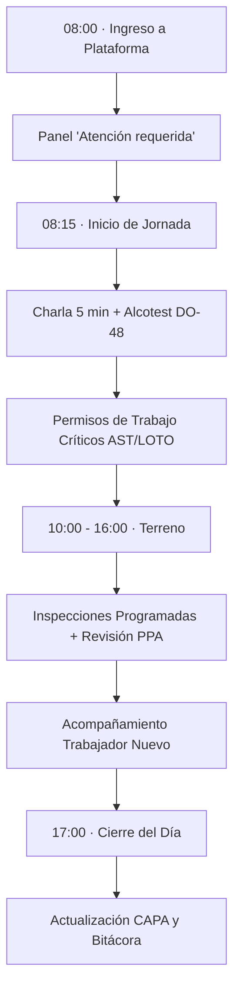

# Guía Rápida: El Día a Día del Prevencionista de Faena

> **Propósito:** Esta guía resume la rutina de trabajo recomendada para que el Prevencionista de Riesgos (PRF), junto a la línea de mando (Jefe de Terreno y Supervisor), mantenga la faena 100% al día en sus compromisos legales y operativos.

---

## 1. Rutina Diaria del Turno



### 1.1. A Primera Hora (08:00 hrs): El Panel de "Atención Requerida"
Lo primero que debes hacer al sentarte frente al computador o encender la tablet es ingresar a:
👉 **Menú lateral > Prevención** (Ruta: `/prevencion`)

En la parte superior verás la sección **"Atención requerida"**. Este panel consolida automáticamente todo lo que exige tu intervención hoy:
1. **PPA Detenidos:** Si un trabajador o cuadrilla detuvo una labor por riesgo grave durante la noche o madrugada, aparecerá aquí con alerta roja.
2. **Inspecciones con Plazo Vencido o por Vencer:** Te muestra qué inspecciones de tu faena corresponden a la semana en curso.
3. **Acciones Correctivas (CAPA) Próximas a Vencer:** Medidas que comprometiste con plazo y que están a punto de expirar.
4. **Accidentes o Incidentes sin DIAT o sin Cierre:** Casos abiertos que requieren seguimiento de notificación o investigación.

> [!TIP]
> **Consejo de terreno:** Haz clic directamente en cualquiera de las tarjetas de "Atención requerida" para ir a la pantalla exacta donde debes resolver la tarea.

---

### 1.2. Inicio de Jornada en Terreno (08:15 - 09:00 hrs)

#### A. Charla Diaria de 5 Minutos (Actividad PDTP N° 53)
*   **Quién la realiza:** Habitualmente la dicta el Supervisor de Terreno o Jefe de Terreno al iniciar el turno. El Prevencionista apoya técnicamente y verifica su registro.
*   **Dónde se registra:** `/prevencion/capacitacion` > botón **"Registrar sesión"**.
*   **Qué seleccionar:**
    *   Curso: *Charla diaria de inicio de jornada (PDTP-53)*.
    *   Relator: El supervisor o prevencionista que la impartió.
    *   Asistentes: Marca a los trabajadores presentes en el turno.
*   **Impacto:** Al guardar la sesión con asistencia, el cumplimiento de la charla se acredita automáticamente en el PDTP.

#### B. Control de Alcotest Aleatorio (Actividades PDTP N° 30 y 31)
*   **Dónde se registra:** `/prevencion/alcotest` > botón **"Nuevo control"**.
*   **Procedimiento DO-48:** Selecciona los trabajadores testeados aleatoriamente o por sospecha, ingresa el RUT, faena y resultado (`0.0 g/l` o positivo).
*   **Si marca positivo:** Suspende inmediatamente al trabajador de labores operacionales, trasládalo a rechequeo conforme al reglamento interno y genera el registro en la plataforma.

#### C. Permisos de Trabajo de Alto Riesgo (AST / LOTO)
*   Si la cuadrilla realizará trabajos en altura física, caliente (soldadura), espacios confinados o intervención de líneas de energía:
*   **Dónde se gestiona:** `/prevencion/permisos`.
*   El solicitante (supervisor/operador) elabora el permiso y su Análisis Seguro de Trabajo (AST); el prevencionista verifica las condiciones en terreno (bloqueo físico con candado LOTO, medición de gases, arnés) y **activa el permiso**.

---

### 1.3. Durante la Jornada: Inspecciones y Verificación en Terreno (10:00 - 16:30 hrs)

#### A. Ejecución de Inspecciones Programadas del Mes
*   Revisa en `/prevencion/inspecciones/programacion` qué equipos o áreas tocan esta semana:
    *   Extintores (PDTP N° 24)
    *   Contenedores / Residuos (PDTP N° 29)
    *   Carros y equipos de transporte (PDTP N° 34)
    *   Observación planeada del trabajo (PDTP N° 39)
    *   Inspección de área / condiciones de trabajo (PDTP N° 40)
*   **Ejecución interactiva:** Abre la inspección en tu tablet o teléfono, responde los ítems y toma fotografías inmediatas si encuentras un hallazgo.
*   **Ingesta de Reportes Físicos en Papel (Equipos/Vehículos - PDTP N° 26):**
    *   Si los operadores llenaron el "Report de uso diario" en papel autocopiante, no necesitas digitar cada casilla.
    *   Toma una foto nítida y bien iluminada de la hoja física y súbela en `/prevencion/inspecciones` > **"Subir reporte físico"**. El sistema detectará automáticamente las cruces y marcas de verificación.

#### B. Atención de Tarjetas "Para, Piensa y Actúa" (PPA Digital)
*   Si un trabajador escaneó el código QR de la faena y reportó una condición de peligro inminente:
    1. Dirígete a la zona reportada en terreno.
    2. En `/prevencion/ppa`, abre la tarjeta en estado `detenida`.
    3. Acuerda con el supervisor las medidas de control.
    4. Verifica que el riesgo esté controlado y presiona **"Autorizar reinicio seguro"**.

#### C. Acompañamiento del Trabajador Nuevo (Evaluaciones SST)
*   Si ingresó un nuevo conductor u operador a la faena:
    *   **Semana 1 a 4:** El Conductor Líder o Tutor registra su seguimiento semanal en `/prevencion/trabajador/[id]`.
    *   **Cumplidas las 4 semanas:** El Jefe de Terreno y Prevencionista firman la evaluación final y el **Acta de Cierre**.
    *   *Recuerda:* Cerrar el acta de trabajador nuevo acredita 6 actividades clave del PDTP de una sola vez.

---

### 1.4. Al Cierre de la Jornada (17:00 - 18:00 hrs)

1. **Revisión de Acciones Correctivas (CAPA):** Verifica si las acciones generadas en las inspecciones del día fueron implementadas. Si el supervisor te presenta la evidencia fotográfica, cárgala y marca la acción como `en verificación`.
2. **Registro de Constancias Especiales:** Si realizaste una actividad preventiva que no tiene un formulario propio (por ejemplo, una reunión de coordinación interna o una entrega de material informativo), ve a `/prevencion/constancias`, selecciona la actividad del PDTP y sube la foto o lista escaneada.

---

## 2. Qué Hacer Ante una Emergencia o Contingencia Grave

```
[OCURRE UN EVENTO]
       │
       ▼
1. Primeros Auxilios y Evacuación si aplica
       │
       ▼
2. ¿Es Accidente Grave o Fatal? (Circular SUSESO 3331)
       ├─► SÍ: Detención inmediata de faena + Llamar a DT y SEREMI
       │       Reportar de inmediato en /prevencion/incidentes/reportar
       │
       └─► NO: Traslado a centro asistencial Mutual
               Reportar en /prevencion/incidentes/reportar (plazo max: 24h)
       │
       ▼
3. El Administrador de Contrato emite la DIAT en la Mutual y sube el comprobante.
       │
       ▼
4. Se inicia Investigación RE-20 (declaraciones, fotos, árbol de causas).
```

> [!WARNING]
> **OBLIGACIÓN LEGAL INMEDIATA (Accidentes Graves o Fatales):**
> Si ocurre una caída de más de 1.8 metros, atrapamiento, amputación o muerte:
> 1. Detén la faena completa o el área afectada.
> 2. Comunica de inmediato por teléfono a la **Dirección del Trabajo (DT)** y a la **SEREMI de Salud**.
> 3. En la plataforma, al reportar el incidente marca la casilla **"¿Es grave o fatal?"**: el sistema activará la alerta legal y bloqueará el reinicio de los trabajos hasta que un profesional autorizado verifique documentalmente las condiciones de seguridad.

---

## 3. Checklist de Fin de Mes (Días 25 al 30 de cada mes)

Para cerrar el mes con la faena en cumplimiento verde:

* [ ] **Control de Alcotest Consolidado (PDTP N° 32):** Entra a `/prevencion/alcotest` y presiona **"Registrar envío mensual de alcotest"**.
* [ ] **Cierre de Estadísticas de Faena (PDTP N° 7):**
  1. Ingresa a `/prevencion/indicadores`.
  2. Digita las **Horas Hombre Trabajadas (HHT)** del mes en tu faena y la dotación promedio.
  3. Revisa los accidentes del mes y días perdidos.
  4. Presiona **"Cerrar período mensual"**.
  *Nota:* El cierre formal de la estadística es el acto legal que acredita la actividad N° 7 en tu faena.
* [ ] **Revisión del PDTP de Faena:** Ve a `/prevencion/pdtp`, filtra por tu faena y confirma que las celdas del mes en curso estén en color verde. Si alguna quedó pendiente o en amarillo, revisa qué evidencia te falta cargar.
