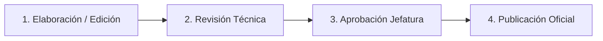

# Capítulo 04: Matriz IPER, Controles Críticos y Mapa de Riesgos

> **Marco Normativo:** Decreto Supremo 44 (DS 44), Artículos 7 (Matriz IPER) y 62 (Mapa de Riesgos).  
> **Rutas en Plataforma:**  
> *   Matriz IPER: `/prevencion/miper`  
> *   Mapa de Riesgos: `/prevencion/cgrd/mapa` (se opera en el capítulo 17)  
> **Actividades PDTP Asociadas:** N° 35 (Publicación de revisión MIPER) y N° 36 (Acuse de difusión MIPER-DIF).

---

## 1. Conceptos Fundamentales: MIPER vs. Mapa de Riesgos

El Decreto Supremo 44 exige que toda faena cuente con dos instrumentos distintos y complementarios para el control de peligros:

| Instrumento | Exigencia Legal | ¿Qué contiene? | ¿Para qué lo usa el PRF en Terreno? |
|---|---|---|---|
| **Matriz IPER** | DS 44 Art. 7 | Inventario tabular de todos los procesos, actividades, peligros, evaluación de probabilidad x consecuencia y **controles críticos obligatorios**. | Base técnica para elaborar los Procedimientos Seguros (PTS), las charlas y definir los EPP de la faena. |
| **Mapa de Riesgos** | DS 44 Art. 62 | Representación gráfica o plano espacial de la faena que localiza dónde están los mayores peligros físicos. | Inducción visual para visitas, transportistas y personal nuevo al ingresar al centro de trabajo. |

---

## 2. Cómo Consultar la Matriz IPER de tu Faena

1. Ingresa a `/prevencion/miper`.
2. Selecciona tu **Faena**.
3. Verás la versión vigente oficial (en estado `publicada`).
4. Puedes filtrar por:
   *   **Puesto de Trabajo:** Conductor de camión, operador de grúa horquilla, pañolero, mecánico.
   *   **Nivel de Riesgo Puro o Residual:** Crítico (Rojo), Alto (Naranja), Medio (Amarillo), Bajo (Verde).
   *   **Controles Críticos:** Aquellos controles cuya ausencia o falla puede causar un accidente grave o fatal (ej. bloqueo LOTO, uso obligatorio de arnés de seguridad con doble cabo de vida).

---

## 3. El Flujo de las 4 Firmas Segregadas

La Matriz IPER es un instrumento legal auditable que no puede modificarse libremente sin control técnico. Por eso cuenta con un flujo estricto de **4 etapas**:

1. **Elaboración (Edit):** El Prevencionista de Faena o Jefe de Terreno propone nuevos peligros ante cambios en los procesos o máquinas nuevas.
2. **Revisión (Review):** Un profesional técnico distinto revisa que las medidas de control se ajusten a la normativa.
3. **Aprobación (Approve):** La Jefa del Departamento de Prevención de Riesgos (JDPR) o la Administración aprueba formalmente la matriz.
4. **Publicación (Publish):** Se emite la versión inmutable oficial. Este acto acredita automáticamente la actividad **N° 35** del PDTP.

> [!NOTE]
> **Regla de Segregación:** Si tú elaboraste la propuesta de matriz, el botón de aprobación aparecerá deshabilitado para ti. Debe aprobarla una persona distinta para que tenga validez ante la Dirección del Trabajo y Mutuales.

---

## 4. Difusión de la MIPER a los Trabajadores (Actividad PDTP N° 36)

El Artículo 7 del DS 44 exige que cada trabajador conozca los riesgos específicos de su puesto y firme la toma de conocimiento:

1. Ve a `/prevencion/documentacion`.
2. Busca el documento tipo **MIPER-DIF** correspondiente a tu faena.
3. Puedes registrar la difusión por dos vías:
   *   **Firma Digital en Plataforma:** El trabajador ingresa con su RUT y confirma la lectura.
   *   **Carga de Acta Escaneada:** Imprimes la planilla de difusión, los trabajadores firman de puño y letra, y subes el PDF firmado como evidencia en `/prevencion/documentacion`.
4. Al completar la cobertura requerida de la dotación, se acredita la actividad **N° 36** en el programa preventivo anual.

---

## 5. El Mapa de Riesgos

El mapa de riesgos (DS 44 Art. 62) se documenta en el **capítulo 17 — Gestión del
Riesgo de Desastres** (`/prevencion/cgrd/mapa`).

Vive allá, pero sus marcadores salen de la matriz IPER que describe este
capítulo: al publicar una revisión de la MIPER, cada marcador se reubica sobre el
peligro equivalente de la versión nueva, y el marcador de un peligro que
desaparece se elimina. Si trabajas la MIPER, ése es el efecto que tu publicación
tiene sobre el mapa.
