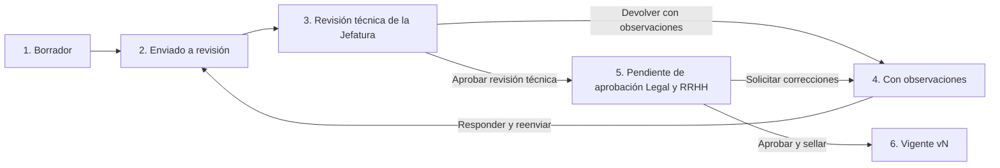

# Capítulo 04: Matriz IPER, Controles Críticos y Mapa de Riesgos

> **Marco Normativo:** Decreto Supremo 44 (DS 44), Artículos 7 (Matriz IPER) y 62 (Mapa de Riesgos).  
> **Rutas en Plataforma:**  
> *   Matriz IPER (MIPER): `/prevencion/miper`  
> *   Espacio de trabajo de una MIPER: `/prevencion/miper/[id]`  
> *   Verificación de un control: `/prevencion/miper/controles/[id]`  
> *   Mapa de Riesgos: `/prevencion/cgrd/mapa` (se opera en el capítulo 17)  
> **Permisos del Sistema:** `prevention:risk:view`, `prevention:risk:edit`, `prevention:risk:review`, `prevention:risk:approve_legal` y `prevention:risk:catalog:manage`.  
> **Actividades PDTP Asociadas:** N° 35 ("Mantener y actualizar inventario de riesgos MIPER") y N° 36 (Acuse de difusión MIPER-DIF).

---

## 1. Conceptos Fundamentales: MIPER vs. Mapa de Riesgos

El Decreto Supremo 44 exige que toda faena cuente con dos instrumentos distintos y complementarios para el control de peligros:

| Instrumento | Exigencia Legal | ¿Qué contiene? | ¿Para qué lo usa el PRF en Terreno? |
|---|---|---|---|
| **Matriz IPER (MIPER)** | DS 44 Art. 7 | Inventario tabular de procesos, actividades, tareas y puestos, con los peligros, la evaluación **Probabilidad × Consecuencia** y las cuatro bandas del RE-04, y las medidas de control con jerarquía, responsable y plazo. | Base técnica para elaborar los Procedimientos Seguros (PTS), las charlas y definir los EPP de la faena. Es también el origen de los marcadores del mapa de riesgos. |
| **Mapa de Riesgos** | DS 44 Art. 62 | Representación gráfica o plano espacial de la faena que localiza dónde están los mayores peligros físicos. | Inducción visual para visitas, transportistas y personal nuevo al ingresar al centro de trabajo. |

La MIPER ya no se piensa como una planilla que se sube una vez al año, sino como un **documento vivo**: se mantiene durante todo el período, se revisa, se aprueba y cada aprobación deja una versión sellada.

---

## 2. La MIPER es un Documento Vivo por Faena y Período

Cada faena tiene **una MIPER por período**, entendiendo por período el año (2026, 2027, …). Al abrir una MIPER encontrarás su espacio de trabajo con cuatro pestañas: **Antecedentes · Matriz · Revisión · Historial**.

### Cómo crear la MIPER de un período nuevo

1. Entra a `/prevencion/miper` y presiona **"Nueva MIPER"**.
2. Elige la **Faena** (solo las que están dentro de tu alcance) y el **Período**.
3. Elige el **punto de partida**:
   *   **Copiar la MIPER vigente:** se traen sus filas, medidas y antecedentes. Es lo normal al renovar el año.
   *   **Matriz vacía:** para una faena que se incorpora o cuando el documento anterior no sirve de base.
4. Escribe el **Motivo** (por ejemplo: elaboración inicial, renovación anual, cambio de proceso). Queda en el historial.

> [!IMPORTANT]
> **UNA SOLA MIPER POR FAENA Y PERÍODO:** no se puede crear un segundo documento de la misma faena y año. La MIPER del período nuevo **no reemplaza a la vigente al crearse**: la vigente sigue siéndolo hasta que la nueva se aprueba, y en ese momento pasa a **Reemplazado** y se conserva como historia. Así una faena acumula sus MIPER por año, cada una con sus versiones.

Un borrador que nunca se envió a revisión se puede **descartar** desde su espacio de trabajo (queda auditado, no desaparece del registro). Una MIPER **Reemplazada** o rotulada **"metodología anterior"** es de solo lectura: no admite el flujo nuevo. Las MIPER creadas antes del rediseño RE-04 aparecen con la leyenda *"Vigente · metodología anterior"* y sirven solo para consultar el modelo antiguo (sin Probabilidad × Consecuencia).

### Antecedentes: los datos que se completan solos

En la pestaña **Antecedentes** se completa el encabezado del formato RE-04. Todo valor prellenado se muestra con su origen ("Desde perfil de empresa: …", "Desde trabajadores activos de la faena: …") y se puede volver a traer con **"Restaurar valor prellenado"**:

*   **Identificación:** Código IPER, Período (fijo al crear), Fecha de elaboración, Fecha de actualización, Razón social, RUT empleador, Dirección, Comuna, Actividad económica principal, N° de adherente y Centro de trabajo.
*   **Dotación:** N° total de trabajadores y desglose en **hombres, mujeres y otro**. Hombres + mujeres + otro debe sumar el total declarado; al costado se muestra el conteo real de trabajadores activos como referencia.
*   **Responsables:** el campo **"Representante de la empresa en la faena (Administrador de contrato)"**, que se propone desde el Administrador de Contrato asignado a la faena. En la plataforma este campo **no se llama "representante legal"**: es el representante de la empresa en la faena.
*   **Participación:** resumen de participación y consulta, y referencia de su evidencia.
*   **Elaboró / revisó / aprobó:** no se escriben. Se registran solos con el flujo de revisión y quedan congelados en cada versión sellada.

Los cambios de un MIPER vigente se aplican de inmediato y quedan marcados como *cambios pendientes de revisión* hasta el próximo sellado (ver sección 8).

---

## 3. Cómo Consultar la MIPER de tu Faena

1. Ingresa a `/prevencion/miper`.
2. La pestaña **"Por hacer"** (por defecto) te muestra lo que te corresponde según tu rol: tus borradores, las MIPER con observaciones por responder y las vigentes con cambios sin enviar; a la Jefatura, su bandeja de revisión; a Legal y RRHH, las que esperan su firma.
3. La pestaña **"Todas"** lista las MIPER con filtros por **Faena**, **Período** y **Estado**.
4. La tabla muestra **Faena · Período · Estado · N° de riesgos · Distribución por clasificación · Última modificación**. Al hacer clic en una fila entras a su espacio de trabajo.
5. Dentro de la MIPER, la pestaña **Matriz** se filtra por clasificación, factor de riesgo, "¿está controlado?", **observadas** y **modificadas**, y se puede agrupar por actividad, puesto o clasificación.

### Cómo se leen las bandas en pantalla

| Clasificación | Tratamiento visual | Lectura en terreno |
|---|---|---|
| **Tolerable** | Verde, ícono check | El riesgo está en un nivel aceptable; no exige nuevos esfuerzos. |
| **Moderado** | Ámbar, ícono de información | Hay que reducir el riesgo en un plazo determinado. |
| **Importante** | Rojo con borde, ícono de advertencia | No se debe comenzar ni continuar el trabajo hasta reducirlo. |
| **Intolerable** | Rojo sólido, texto blanco, ícono de alerta | No debe comenzar ni continuar el trabajo hasta que se reduzca; si no es posible, se prohíbe. |

> [!WARNING]
> **RIESGO INTOLERABLE A LA VISTA:** mientras existan filas Intolerables, la matriz y la revisión muestran una alerta crítica con el texto del criterio y el conteo. No es una advertencia que se apague sola: la banda cambia cuando vuelves a evaluar la fila con otra Probabilidad o Consecuencia.

---

## 4. La Evaluación RE-04: Probabilidad × Consecuencia

La MIPER usa la metodología del formato **RE-04**. Solo se eligen **Probabilidad** y **Consecuencia**, cada una en tres niveles:

| Nivel | Valor | Probabilidad | Consecuencia |
|---|---|---|---|
| Baja | **1** | El daño ocurrirá rara vez o en contadas ocasiones. | Ligeramente dañino: cortes superficiales, magulladuras, molestias con recuperación rápida. |
| Media | **2** | El daño ocurrirá en varias ocasiones. | Dañino: laceraciones, quemaduras, torceduras o intoxicaciones con incapacidad temporal. |
| Alta | **4** | El daño ocurrirá siempre o casi siempre. | Extremadamente dañino: amputaciones, lesiones múltiples con incapacidad permanente o lesiones fatales. |

La **Magnitud del Riesgo (MR)** es el resultado de multiplicar Probabilidad × Consecuencia. La plataforma lo calcula al instante y lo clasifica en una de las cuatro bandas del RE-04:

| MR | Clasificación | Criterio del RE-04 | Qué exige |
|---|---|---|---|
| 1–2 | **Tolerable** | "No se necesita mejorar la acción preventiva. Sin embargo, se deben considerar soluciones más rentables o mejoras que no supongan una carga económica importante. Se requieren comprobaciones periódicas para asegurar que se mantiene la eficacia de las medidas de control." | Mantener las medidas y comprobar su eficacia. |
| 4 | **Moderado** | "Se deben hacer esfuerzos para reducir el riesgo, determinando las inversiones precisas. Las medidas para reducir el riesgo se deben implementar en un período determinado…" | Reducir el riesgo en un plazo determinado. |
| 8 | **Importante** | "No se debe comenzar ni continuar el trabajo hasta que se haya reducido el riesgo… se debe remediar el problema en un tiempo inferior al de los riesgos moderados." | Medida de control y, si no está controlado, responsable y plazo. |
| 16 | **Intolerable** | "No debe comenzar ni continuar el trabajo hasta que se reduzca el riesgo. Si no es posible reducirlo, incluso con recursos ilimitados, se debe prohibir el trabajo." | Medida con responsable y plazo; advertencia crítica permanente. |

> [!IMPORTANT]
> **MR Y CLASIFICACIÓN NO SE ESCRIBEN A MANO:** eliges Probabilidad y Consecuencia, y la plataforma calcula MR y clasificación. Por eso no pueden quedar incoherentes con lo evaluado, ni en la grilla ni en el libro Excel. Los criterios completos del RE-04 viajan en la hoja *Criterios de Evaluación IPER* del libro descargable.

---

## 5. La Grilla de la Matriz: Columnas, Autocompletado y Guardado

La pestaña **Matriz** es una grilla editable, pensada para computador. Las columnas siguen el orden del RE-04:

| Bloque | Columnas |
|---|---|
| **Identificación** | N° · Actividad · Tarea · Puesto de trabajo · Lugar específico |
| **Expuestos** | Expuestos F · Expuestos M · Expuestos otro · Rutinaria / No rutinaria |
| **Peligro y riesgo** | Factor de riesgo · Peligro · Riesgo · Daño probable |
| **Evaluación** | Probabilidad · Consecuencia · MR · Clasificación |
| **Control** | ¿Está controlado? · Medidas de control |

Reglas de trabajo de la grilla:

*   **Autocompletado desde los diccionarios de la faena.** Actividad, Tarea, Puesto de trabajo y Lugar específico se escriben con sugerencias tomadas de lo que ya existe en esa faena (y de los valores que ya usaste para Peligro, Riesgo, Daño y Medidas). El **Factor de riesgo** se elige del catálogo de la plataforma. Siempre puedes escribir un valor nuevo: quedará disponible para las próximas filas.
*   **Guardado por fila.** Los cambios se guardan solos (no hay un botón "Guardar" de la grilla). Si la fila cambió en el servidor mientras la editabas, el guardado avisa en la propia celda: recarga la MIPER y vuelve a intentar; la plataforma no pisa lo que escribió otra persona.
*   **Agregar debajo, duplicar y eliminar.** "Agregar debajo" crea una fila heredando Actividad, Tarea, Puesto y Lugar de la anterior; "duplicar" copia la fila completa; "eliminar" pide confirmación.
*   **Intolerables e incompletas a la vista.** Cada fila muestra sus pendientes (falta el factor, falta el plazo de una medida, etc.) y la grilla las marca para que no se pierdan entre cientos de filas.
*   **En el celular** la matriz se ve como tarjetas de solo lectura: la edición es de escritorio.

### ¿Qué significa "¿Está controlado?"

Es la evaluación de si las medidas registradas alcanzan para el riesgo tal como está hoy:

| Valor | Cuándo se usa | Efecto en la plataforma |
|---|---|---|
| **Sí** | El riesgo está controlado con las medidas vigentes. | Exige al menos una medida registrada. |
| **Parcialmente** | Hay medidas, pero no alcanzan a cubrir el riesgo: queda trabajo por hacer. | Exige al menos una medida registrada. |
| **No** | El riesgo no está controlado (no hay medidas suficientes). | Un riesgo Importante exige medida con responsable y plazo; un Intolerable siempre. |

### El detalle de una fila

Al abrir una fila se despliega un panel lateral con todas sus medidas, sus observaciones y la comparación contra lo que ya estaba (nueva, modificada o eliminada). Es el mismo panel que usa la Jefatura para observar un riesgo concreto y el que enlaza a la verificación de un control.

---

## 6. Medidas de Control: Jerarquía I–V, Responsable y Plazo

Cada riesgo puede tener **varias medidas**. Cada medida se registra con su **descripción**, su **jerarquía** y, según la banda, su **responsable** y su **plazo**:

| Jerarquía | Tipo de medida | Ejemplo |
|---|---|---|
| **I** | Eliminación | Suprimir la tarea o el peligro en su origen. |
| **II** | Sustitución | Cambiar el producto o el equipo por uno menos peligroso. |
| **III** | Controles de ingeniería | Guardas, extracción local, enclavamientos, bloqueo LOTO. |
| **IV** | Controles administrativos | Procedimiento, permiso de trabajo, señalización, capacitación. |
| **V** | Elementos de protección personal | Arnés, protección auditiva, respirador, guantes. |

Siempre se prefiere la jerarquía más alta posible: eliminar o sustituir antes que administrar, y la protección personal es la última barrera, no la primera.

### Reglas que la plataforma exige antes de dejar enviar a revisión

| Condición | Regla |
|---|---|
| Toda fila | Actividad, Tarea, Puesto, Factor de riesgo, Peligro, Riesgo, Daño probable, Probabilidad, Consecuencia y "¿Está controlado?" completos. |
| **Sí** o **Parcialmente** controlado | Al menos una medida registrada. |
| **Importante** | Al menos una medida; si no está controlado, una medida **con responsable y plazo**. |
| **Intolerable** | Al menos una medida con responsable y plazo, y advertencia crítica permanente mientras siga en esa banda. |
| Toda medida | Descripción, tipo (I–V) y plazo. El responsable es obligatorio salvo en riesgos Tolerables. |

> [!TIP]
> **CONSEJO DE TERRENO:** estas reglas bloquean el **envío a revisión**, no el guardado de una celda. Una fila se completa de a poco: la grilla te va indicando qué falta, y el botón "Enviar a revisión" lista los bloqueos por riesgo (#N°) para corregirlos de una pasada.

La ficha de la fila también permite registrar la **verificación segregada de un control** en `/prevencion/miper/controles/[id]` (MIPER-08), cuando la MIPER está vigente: se anota el resultado (eficaz, parcialmente eficaz o ineficaz) con evidencia, y no puede verificar la misma persona que creó la versión ni quien responde por el control, salvo una excepción fundamentada.

---

## 7. El Flujo: Envío, Revisión Técnica y Aprobación Legal y RRHH

La MIPER es un instrumento legal auditable y no puede quedar "aprobada por quien la escribió". Por eso la firma está segregada en tres actores distintos: quien elabora y envía, la **Jefatura del Departamento de Prevención** que revisa técnicamente, y **Legal y RRHH** que aprueba y sella.

```mermaid
graph LR
    A[1. Borrador] --> B[2. Enviado a revisión]
    B --> C[3. Revisión técnica de la Jefatura]
    C -->|Devolver con observaciones| D[4. Con observaciones]
    D -->|Responder y reenviar| B
    C -->|Aprobar revisión técnica| E[5. Pendiente de aprobación Legal y RRHH]
    E -->|Solicitar correcciones| D
    E -->|Aprobar y sellar| F[6. Vigente vN]
```

### Rótulos que verás en la plataforma

| Situación | Rótulo |
|---|---|
| Borrador nunca aprobado | Borrador |
| Enviada, aún sin abrir por la Jefatura | Enviado a revisión |
| La Jefatura la abrió y está revisando | En revisión por Prevención |
| Devuelta con observaciones | Con observaciones |
| Revisión técnica aprobada, falta la firma de Legal y RRHH | Revisión técnica aprobada · Pendiente de aprobación Legal y RRHH |
| Vigente sin cambios pendientes | Vigente · vN |
| Vigente con cambios aplicados aún no sellados | Vigente vN · cambios pendientes de revisión |
| Reemplazada por la MIPER de otro período | Reemplazado |

### Paso 1: Enviar a revisión

*   **Quién lo hace:** el Prevencionista de Faena o el Administrador de Contrato de la faena.
*   **En la plataforma:** en el espacio de trabajo, presiona **"Enviar a revisión"**. Si falta algo, el botón muestra cuántos bloqueos hay y la lista de qué corregir.
*   **Qué pasa después:** se congela una **foto** de lo enviado. A partir de ahí, lo que se revisa es esa foto: si sigues editando, tus cambios quedan para la ronda siguiente.

### Paso 2: Revisión técnica de la Jefatura

*   **Quién lo hace:** la Jefatura del Departamento de Prevención (rol `prevencionista`).
*   **En la plataforma:** abre la MIPER desde su bandeja. Verás una franja de resumen con faena, quién envió, versión, dotación, total de riesgos, distribución por clasificación, no controlados, medidas sin responsable, medidas sin plazo, Importantes e Intolerables.
*   **Observar:** escribe una **observación por fila** (sobre el riesgo que corresponde) o una observación general en la pestaña **Revisión**. Las filas observadas quedan marcadas en la grilla.
*   **Decidir:** **"Devolver con observaciones"** (vuelve a la prevencionista) o **"Aprobar revisión técnica"** (pasa a Legal y RRHH). También distingue lo nuevo, lo modificado y lo eliminado respecto de la ronda anterior.

### Paso 3: Responder y reenviar

*   **Quién lo hace:** quien elaboró la MIPER.
*   **En la plataforma:** la pestaña **Revisión** es tu bandeja: cada observación muestra la fila enlazada y su respuesta. Al responder, la observación pasa a **respondida**. El botón **"Reenviar a revisión"** indica cuántas observaciones faltan por responder: no se puede reenviar con observaciones abiertas.

### Paso 4: Aprobación de Legal y RRHH y sellado

*   **Quién lo hace:** el rol `gerente_legal_rrhh` (Gerencia de Legal y RRHH) o el Administrador.
*   **En la plataforma:** puede **"Solicitar correcciones"** (la MIPER vuelve a la prevencionista, y el reenvío pasa otra vez por la revisión técnica) o **"Aprobar (Legal y RRHH)"**. Al aprobar, se pide el **resumen de cambios** que irá a la hoja *Modificaciones* y se **sella la versión** (v1, v2, …).

> [!NOTE]
> **REGLA DE SEGREGACIÓN:** quien elabora y envía la ronda no puede revisarla ni aprobarla, y quien hizo la revisión técnica no puede firmar la aprobación de Legal y RRHH: son tres personas distintas. Si enviaste la MIPER, verás el aviso "Enviaste esta ronda: la revisa otra persona". La plataforma revalida esta regla en el servidor en cada acción.

Al aprobarse la primera versión del período, la MIPER queda **Vigente**, el período anterior pasa a Reemplazado y se disparan los efectos que ya conoce el programa preventivo: se acredita la actividad **N° 35** del PDTP, se abre el plazo de actualización del programa y se archiva el libro aprobado.

### Permisos del flujo

| Acción | Quién puede | Permiso |
|---|---|---|
| Crear, editar, responder observaciones y enviar | Prevencionista de faena, Administrador de contrato y Jefatura de Prevención (en sus faenas) | `prevention:risk:edit` |
| Revisar técnicamente, observar y aprobar la revisión técnica | Jefatura del Departamento de Prevención (`prevencionista`) y `jefa_chome` | `prevention:risk:review` |
| Aprobar como Legal y RRHH o solicitar correcciones | Gerencia de Legal y RRHH (`gerente_legal_rrhh`) y Administrador | `prevention:risk:approve_legal` |
| Administrar el catálogo de factores de riesgo | Jefatura de Prevención y Administrador | `prevention:risk:catalog:manage` |

---

## 8. Versiones Selladas, Cambios Pendientes e Historial

*   **Cada aprobación sella una versión inmutable.** La versión guarda la foto exacta que se revisó (encabezado, filas y medidas), su firma técnica, la de Legal y RRHH, la fecha y el resumen de cambios. No se puede editar ni borrar: es la constancia de lo que estaba aprobado ese día.
*   **La lista de versiones es la hoja *Modificaciones*.** En la pestaña **Historial** están la cadena de MIPER de la faena por período, las versiones selladas de cada una (con enlace y descarga) y la línea de tiempo de los eventos con actor, rol, fecha y hora.
*   **El MIPER vigente es mutable.** Puedes corregirlo o agregar riesgos sin esperar al año siguiente: el cambio **aplica de inmediato** y queda rotulado como *cambio pendiente de revisión* hasta el próximo sellado. Cuando lo envías, se revisa y se aprueba, se sella la versión siguiente (vN+1) y la anterior sigue consultable.
*   **Descargar la versión aprobada.** El botón **"Descargar vN (Excel)"** genera el libro RE-04 desde la foto sellada —no desde los datos vivos— con las hojas *RE-04 IPER*, *Modificaciones* y *Criterios de Evaluación IPER*. El mismo libro es el que queda archivado al aprobar.
*   **Programa de Trabajo (RE-04.1):** el programa de actividades derivado de las medidas de la MIPER llega en la fase siguiente.

---

## 9. Difusión de la MIPER a los Trabajadores (Actividad PDTP N° 36)

El Artículo 7 del DS 44 exige que cada trabajador conozca los riesgos específicos de su puesto y firme la toma de conocimiento:

1. Ve a `/prevencion/documentacion`.
2. Busca el documento tipo **MIPER-DIF** correspondiente a tu faena.
3. Puedes registrar la difusión por dos vías:
   *   **Firma Digital en Plataforma:** El trabajador ingresa con su RUT y confirma la lectura.
   *   **Carga de Acta Escaneada:** Imprimes la planilla de difusión, los trabajadores firman de puño y letra, y subes el PDF firmado como evidencia en `/prevencion/documentacion`.
4. Al completar la cobertura requerida de la dotación, se acredita la actividad **N° 36** en el programa preventivo anual.

---

## 10. El Mapa de Riesgos

El mapa de riesgos (DS 44 Art. 62) se documenta en el **capítulo 17 — Gestión del
Riesgo de Desastres** (`/prevencion/cgrd/mapa`).

Vive allá, pero sus marcadores salen de la matriz IPER que describe este
capítulo: al sellarse una versión nueva de la MIPER, cada marcador se reubica sobre el
peligro equivalente de la versión nueva, y el marcador de un peligro que
desaparece se elimina. Si trabajas la MIPER, ése es el efecto que tu aprobación
tiene sobre el mapa.
