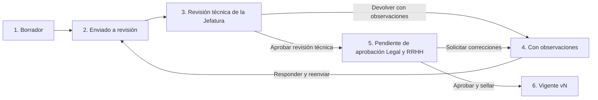
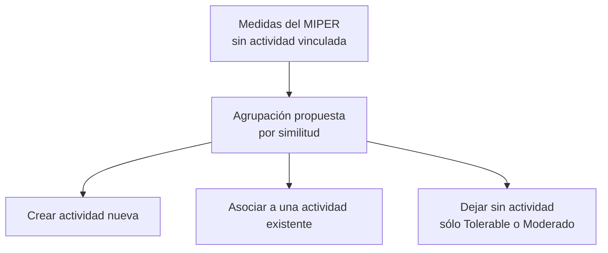

# Capítulo 04: Matriz IPER, Controles Críticos y Mapa de Riesgos

> **Marco Normativo:** Decreto Supremo 44 (DS 44), Artículos 7 (Matriz IPER) y 62 (Mapa de Riesgos).  
> **Rutas en Plataforma:**  
> *   Matriz IPER (MIPER): `/prevencion/miper`  
> *   Espacio de trabajo de una MIPER: `/prevencion/miper/[id]`  
> *   Verificación de un control: `/prevencion/miper/controles/[id]`  
> *   Mapa de Riesgos: `/prevencion/cgrd/mapa` (se opera en el capítulo 17)  
> **Permisos del Sistema:** `prevention:risk:view`, `prevention:risk:edit`, `prevention:risk:review`, `prevention:risk:approve_legal` y `prevention:risk:catalog:manage`.  
> **Actividades PDTP Asociadas:** N° 35 ("Mantener y actualizar inventario de riesgos MIPER") y N° 36 (Acuse de difusión MIPER-DIF).

---

## 1. Conceptos Fundamentales: MIPER vs. Mapa de Riesgos

El Decreto Supremo 44 exige que toda faena cuente con dos instrumentos distintos y complementarios para el control de peligros:

| Instrumento | Exigencia Legal | ¿Qué contiene? | ¿Para qué lo usa el PRF en Terreno? |
|---|---|---|---|
| **Matriz IPER (MIPER)** | DS 44 Art. 7 | Inventario tabular de procesos, actividades, tareas y puestos, con los peligros, la evaluación **Probabilidad × Consecuencia** y las cuatro bandas del RE-04, y las medidas de control con jerarquía, responsable y plazo. | Base técnica para elaborar los Procedimientos Seguros (PTS), las charlas y definir los EPP de la faena. Es también el origen de los marcadores del mapa de riesgos. |
| **Mapa de Riesgos** | DS 44 Art. 62 | Representación gráfica o plano espacial de la faena que localiza dónde están los mayores peligros físicos. | Inducción visual para visitas, transportistas y personal nuevo al ingresar al centro de trabajo. |

La MIPER ya no se piensa como una planilla que se sube una vez al año, sino como un **documento vivo**: se mantiene durante todo el período, se revisa, se aprueba y cada aprobación deja una versión sellada.

---

## 2. La MIPER es un Documento Vivo por Faena y Período

Cada faena tiene **una MIPER por período**, entendiendo por período el año (2026, 2027, …). Al abrir una MIPER encontrarás su espacio de trabajo con cuatro pestañas: **Matriz · Programa · Revisión · Historial**, y la acción **"Ficha del documento"** en el encabezado, donde se completan los antecedentes.

### Cómo crear la MIPER de un período nuevo

1. Entra a `/prevencion/miper` y presiona **"Nueva MIPER"**.
2. Elige la **Faena** (solo las que están dentro de tu alcance) y el **Período**.
3. Elige el **punto de partida**:
   *   **Copiar la MIPER vigente:** se traen sus filas, medidas y antecedentes. Es lo normal al renovar el año.
   *   **Matriz vacía:** para una faena que se incorpora o cuando el documento anterior no sirve de base.
4. Escribe el **Motivo** (por ejemplo: elaboración inicial, renovación anual, cambio de proceso). Queda en el historial.

> [!IMPORTANT]
> **UNA SOLA MIPER POR FAENA Y PERÍODO:** no se puede crear un segundo documento de la misma faena y año. La MIPER del período nuevo **no reemplaza a la vigente al crearse**: la vigente sigue siéndolo hasta que la nueva se aprueba, y en ese momento pasa a **Reemplazado** y se conserva como historia. Así una faena acumula sus MIPER por año, cada una con sus versiones.

Un borrador que nunca se envió a revisión se puede **descartar** desde su espacio de trabajo (queda auditado, no desaparece del registro). Una MIPER **Reemplazada** o rotulada **"metodología anterior"** es de solo lectura: no admite el flujo nuevo. Las MIPER creadas antes del rediseño RE-04 aparecen con la leyenda *"Vigente · metodología anterior"* y sirven solo para consultar el modelo antiguo (sin Probabilidad × Consecuencia).

### Importar el RE-04 desde el Excel real

Desde el mismo encabezado de la portada, **"Importar"** lee la hoja **«RE-04 IPER»** de un Excel del formato real y carga sus riesgos en el MIPER. Son **dos pasos explícitos**:

1. **Revisar el archivo.** Se elige la **Faena**, el **Período del borrador** y el archivo `.xlsx`. La vista previa muestra **una fila por riesgo** con la fila del Excel, la actividad, el peligro/riesgo, la **evaluación que calcula la plataforma** y, si hay algo que mirar, el **problema por fila**: por ejemplo una Probabilidad o Consecuencia **fuera de la escala** (sólo valen **1, 2 y 4**) o un **factor de riesgo que el catálogo todavía no tiene**.
2. **Cargar.** Con el lote ya revisado se elige el destino: **"Cargar en borrador"** (un borrador nuevo del período) o **"Agregar al vigente"**. Cada fila con un problema que impide cargar dice por qué y ese destino queda bloqueado; las que sólo avisan de un MR distinto **sí se cargan**.

> [!IMPORTANT]
> **MANDA LA PLATAFORMA, NO EL EXCEL.** La matriz y la clasificación que trae el archivo se **informan**, pero el valor que se guarda es el que calcula la plataforma (`P × C`). Una fila cuya Probabilidad o Consecuencia no esté en 1, 2 ó 4 **no se carga**, aunque se apriete el botón: la escritura vuelve a validarse en el servidor.

Si el archivo usa **factores de riesgo que el catálogo no tiene**, la vista previa los lista y ofrece crearlos para poder cargar esas filas; quien no administra el catálogo lee el aviso de pedirlo.

### Antecedentes: los datos que se completan solos

En la **"Ficha del documento"** (botón del encabezado, que abre un panel lateral) se completa el encabezado del formato RE-04. Todo valor prellenado se muestra con su origen ("Desde perfil de empresa: …", "Desde trabajadores activos de la faena: …") y se puede volver a traer con **"Restaurar valor prellenado"**:

*   **Identificación:** Código IPER, Período (fijo al crear), Fecha de elaboración, Fecha de actualización, Razón social, RUT empleador, Dirección, Comuna, Actividad económica principal, N° de adherente y Centro de trabajo.
*   **Dotación:** N° total de trabajadores y desglose en **hombres, mujeres y otro**. Hombres + mujeres + otro debe sumar el total declarado; al costado se muestra el conteo real de trabajadores activos como referencia.
*   **Responsables:** el campo **"Representante de la empresa en la faena (Administrador de contrato)"**, que se propone desde el Administrador de Contrato asignado a la faena. En la plataforma este campo **no se llama "representante legal"**: es el representante de la empresa en la faena.
*   **Participación:** resumen de participación y consulta, y referencia de su evidencia.
*   **Elaboró / revisó / aprobó:** no se escriben. Se registran solos con el flujo de revisión y quedan congelados en cada versión sellada.

Si sales de la ficha sin guardar —por ejemplo, con el botón Atrás del navegador—, lo escrito no se pierde: al volver a abrirla en la misma pestaña aparece **"Recuperar lo que no guardaste"** (o **"Descartar esos cambios"**). Mientras se guarda, los campos quedan bloqueados.

Los cambios de un MIPER vigente se aplican de inmediato y quedan marcados como *cambios pendientes de revisión* hasta el próximo sellado (ver sección 8).

---

## 3. Cómo Consultar la MIPER de tu Faena

1. Ingresa a `/prevencion/miper`.
2. La pestaña **"Por hacer"** (por defecto) te muestra lo que te corresponde según tu rol: tus borradores, las MIPER con observaciones por responder y las vigentes con cambios sin enviar; a la Jefatura, su bandeja de revisión; a Legal y RRHH, las que esperan su firma.
3. La pestaña **"Resumen"** reúne el tablero del MIPER para tu alcance (ver abajo).
4. La pestaña **"Todas"** lista las MIPER con filtros por **Faena**, **Período**, **Estado** y **Responsable** (quién tiene trabajo asignado: una actividad del programa o una medida).
5. La tabla muestra **Faena · Período · Estado · N° de riesgos · Distribución por clasificación · Última modificación** (y **Avance** cuando llegas desde el tile del tablero). Al hacer clic en una fila entras a su espacio de trabajo.
6. Dentro de la MIPER, la pestaña **Matriz** se filtra por clasificación, factor de riesgo, "¿está controlado?", **observadas** y **modificadas**, y se puede agrupar por actividad, puesto o clasificación.

### La pestaña «Resumen»: el tablero del MIPER

La pestaña **Resumen** mira todo el MIPER de tu alcance de una vez. Arriba hay **cuatro tiles** —cada uno es un enlace al subconjunto que resume, nunca una cifra suelta— y bajo ellos una **franja** con las cifras secundarias en texto:

| Tile | Qué cuenta | Al hacer clic |
|---|---|---|
| **Por hacer** | Lo que espera tu revisión, tu firma o tu respuesta | abre tu bandeja «Por hacer» |
| **Intolerables e Importantes** | Los riesgos en las dos bandas más graves | filtra «Todas» por esas dos bandas |
| **Sin controlar** | Los riesgos no tolerables sin control declarado | filtra «Todas» por «Sin controlar» |
| **Avance del programa** | Las ocurrencias realizadas del programa | abre «Todas» con la columna **Avance** |

La **franja** informa *MIPER vigentes*, *Con observaciones*, *Tolerables*, *Moderados*, *Medidas pendientes* y *Actividades vencidas*. Debajo, la tabla por faena muestra el estado, la versión, la distribución por clasificación, los riesgos **sin controlar**, el **avance** y cuántas **alertas** (riesgos Intolerables/Importantes y ocurrencias vencidas o «No se hizo») tiene.

> [!NOTE]
> El avance del tablero es el **mismo** que deriva el Programa de Trabajo de las ocurrencias (ver "El avance", sección 9). Nunca se ingresa a mano.

### La cola «Mi trabajo»

Además de la portada del MIPER, tus pendientes aparecen en la **cola "Mi trabajo"** (`/dashboard?vista=trabajo` y `/pendientes`), junto a Solicitudes, Compras, PDTP y los demás módulos:

*   **Revisar la MIPER {período}** (Jefatura de Prevención) mientras una MIPER espera la revisión técnica, y **Firmar la MIPER {período}** (Legal y RRHH) mientras espera la firma.
*   **Registrar ejecución** de una ocurrencia del programa **vencida** o marcada **«No se hizo»**, para quien tiene el permiso de ejecución del programa o es su responsable nominal.

El inicio de Prevención (`/prevencion`) lista los mismos hechos del MIPER —lo que espera firma, la ocurrencia vencida y la banda sin medida con responsable y plazo— bajo **"Atención requerida"**, en la primera sección de la pantalla.

### Cómo se leen las bandas en pantalla

| Clasificación | Tratamiento visual | Lectura en terreno |
|---|---|---|
| **Tolerable** | Verde, ícono check | El riesgo está en un nivel aceptable; no exige nuevos esfuerzos. |
| **Moderado** | Ámbar, ícono de información | Hay que reducir el riesgo en un plazo determinado. |
| **Importante** | Rojo con borde, ícono de advertencia | No se debe comenzar ni continuar el trabajo hasta reducirlo. |
| **Intolerable** | Rojo sólido, texto blanco, ícono de alerta | No debe comenzar ni continuar el trabajo hasta que se reduzca; si no es posible, se prohíbe. |

> [!WARNING]
> **RIESGO INTOLERABLE A LA VISTA:** mientras existan riesgos Intolerables, la matriz y la revisión muestran una alerta crítica con el texto del criterio y el conteo. No es una advertencia que se apague sola: la banda cambia cuando vuelves a evaluar el riesgo con otra Probabilidad o Consecuencia.

---

## 4. La Evaluación RE-04: Probabilidad × Consecuencia

La MIPER usa la metodología del formato **RE-04**. Solo se eligen **Probabilidad** y **Consecuencia**, cada una en tres niveles:

| Nivel | Valor | Probabilidad | Consecuencia |
|---|---|---|---|
| Baja | **1** | El daño ocurrirá rara vez o en contadas ocasiones. | Ligeramente dañino: cortes superficiales, magulladuras, molestias con recuperación rápida. |
| Media | **2** | El daño ocurrirá en varias ocasiones. | Dañino: laceraciones, quemaduras, torceduras o intoxicaciones con incapacidad temporal. |
| Alta | **4** | El daño ocurrirá siempre o casi siempre. | Extremadamente dañino: amputaciones, lesiones múltiples con incapacidad permanente o lesiones fatales. |

La **Magnitud del Riesgo (MR)** es el resultado de multiplicar Probabilidad × Consecuencia. La plataforma lo calcula al instante y lo clasifica en una de las cuatro bandas del RE-04:

| MR | Clasificación | Criterio del RE-04 | Qué exige |
|---|---|---|---|
| 1–2 | **Tolerable** | "No se necesita mejorar la acción preventiva. Sin embargo, se deben considerar soluciones más rentables o mejoras que no supongan una carga económica importante. Se requieren comprobaciones periódicas para asegurar que se mantiene la eficacia de las medidas de control." | Mantener las medidas y comprobar su eficacia. |
| 4 | **Moderado** | "Se deben hacer esfuerzos para reducir el riesgo, determinando las inversiones precisas. Las medidas para reducir el riesgo se deben implementar en un período determinado…" | Reducir el riesgo en un plazo determinado. |
| 8 | **Importante** | "No se debe comenzar ni continuar el trabajo hasta que se haya reducido el riesgo… se debe remediar el problema en un tiempo inferior al de los riesgos moderados." | Medida de control y, si no está controlado, responsable y plazo. |
| 16 | **Intolerable** | "No debe comenzar ni continuar el trabajo hasta que se reduzca el riesgo. Si no es posible reducirlo, incluso con recursos ilimitados, se debe prohibir el trabajo." | Medida con responsable y plazo; advertencia crítica permanente. |

> [!IMPORTANT]
> **MR Y CLASIFICACIÓN NO SE ESCRIBEN A MANO:** eliges Probabilidad y Consecuencia, y la plataforma calcula MR y clasificación. Por eso no pueden quedar incoherentes con lo evaluado, ni en la matriz ni en el libro Excel. Los criterios completos del RE-04 viajan en la hoja *Criterios de Evaluación IPER* del libro descargable.

---

## 5. La matriz: actividades, tareas y el editor del riesgo

La pestaña **Matriz** ya no es una planilla de 19 columnas: se recorre por niveles y funciona igual en computador y en celular.

### Cómo se organiza

La matriz tiene tres niveles: **actividad › tarea › riesgo**.

1.  **Estructura.** Es la vista de entrada: una tarjeta por actividad (con su número de tareas, de riesgos y el conteo por clasificación) y, debajo, una fila por tarea con sus puestos, su número de riesgos y cuántos están completos (por ejemplo, "3/5 completos"). Actividades y tareas siguen el orden del documento original.
2.  **Tarea.** Al hacer clic en una tarea se abre la lista de sus riesgos: peligro, riesgo y daño, la clasificación con su MR, si está controlado, cuántas medidas tiene y si está "Completo" o con "N pendientes". "Volver a la matriz" (o el botón Atrás del navegador) te devuelve con tus filtros intactos, a la misma altura de la página y con las actividades que habías plegado. Cambiar de pestaña o volver a abrir una tarea, en cambio, te lleva arriba de la página.
3.  **Editor del riesgo.** Al hacer clic en un riesgo se abre a pantalla completa para editarlo (ver más abajo).

Sobre la lista, una franja resume el centro de trabajo, la dotación, las tareas, los riesgos y cuántos están completos; los conteos por clasificación funcionan como filtros.

### Buscar y filtrar

*   El buscador **"Buscar en la matriz"** mira actividad, tarea, puesto, lugar, peligro, riesgo, daño y medidas.
*   El botón **"Más filtros"** (con el número de filtros activos) abre el cajón **"Filtros avanzados"**, que reúne clasificación, completitud, "¿Está controlado?", factor de riesgo y marcas (observados, modificados).
*   Los filtros viven en la dirección de la página: sobreviven a recargar, y puedes copiar el enlace para compartir la vista. Bajo la barra aparecen como **chips** que se quitan de a uno, o todos con **"Limpiar filtros"**. La búsqueda no lleva chip: ya se ve en su campo.
*   Con algún filtro activo, las tarjetas se expanden y bajo cada tarea aparecen solo los riesgos que coinciden; los conteos pasan a "x de y". Si ningún riesgo coincide, la matriz lo dice y ofrece **"Ver todos los riesgos"**, que quita la búsqueda y todos los filtros.
*   **"Contraer todo" / "Expandir todo"** pliega o despliega las actividades.

### Agregar una tarea o un peligro

*   **"Nueva tarea"** (en el encabezado de la página) pide actividad y tarea, y crea el primer riesgo ya dentro de ellas; el editor se abre de inmediato en el paso Identificación.
*   **"Agregar peligro"** (en la vista de una tarea) crea un riesgo nuevo que hereda actividad, tarea, puesto, lugar y si es rutinaria.
*   Desde el editor, el menú **"Más"** permite **duplicar** o **eliminar** el riesgo (la eliminación pide confirmación). Si eliminas el único riesgo de una tarea, vuelves a la matriz.

### Editar un riesgo

El editor tiene **cuatro pasos**, que se eligen arriba y se recuerdan en la dirección de la página. Cada paso indica una marca de listo o "N pendientes", y al abrir el riesgo entras al primer paso con pendientes.

| Paso | Qué se completa |
|---|---|
| **1. Identificación** | Factor de riesgo, si es rutinaria o no, peligro, riesgo, daño probable, puesto, lugar específico y personas expuestas (F, M, otro). Un desplegable permite mover el riesgo a otra actividad o tarea. |
| **2. Evaluación** | Eliges una de tres tarjetas de **Probabilidad** y una de tres de **Consecuencia**; la plataforma muestra el MR y la clasificación con su criterio. |
| **3. Medidas de control** | "¿Está controlado?" y las medidas (tipo I–V, descripción, responsable, plazo), con "Agregar medida". Se edita una medida a la vez. Si el servidor rechaza guardar o eliminar una medida, el motivo queda escrito en el formulario o en el diálogo. Si la medida está vinculada al programa, se indica la actividad. En una MIPER vigente, cada medida tiene el enlace **"Verificar eficacia del control"**. |
| **4. Seguimiento** | Actividades del programa vinculadas, observaciones del riesgo y cambios contra la versión anterior. |

A un costado (o debajo, en pantallas chicas) está el **chequeo del riesgo**: un ítem por bloque con una marca de listo, o con el mensaje de lo que falta y un enlace al paso donde se corrige. También muestra el contexto del riesgo y su clasificación.

**Guardado automático.** No hay botón "Guardar": los textos se guardan al salir del campo y las selecciones, al elegirlas. Arriba del editor, un estado indica **Guardando…**, **Guardado** (con la hora) o el error del riesgo que tienes abierto. Si un guardado falla, el mensaje aparece bajo el campo y el campo vuelve a su último valor guardado. Si el riesgo cambió en el servidor mientras lo editabas, el aviso dice "Recarga el riesgo para ver el cambio de la otra persona" y trae el botón **"Recargar riesgo"**; la plataforma no pisa lo que escribió otra persona.

### Recorrer los pendientes

En el pie del editor, **"‹ Anterior"** y **"Siguiente ›"** recorren los riesgos de la tarea, y **"Siguiente pendiente"** salta al próximo riesgo con datos faltantes (dando la vuelta al final). Si hay filtros activos, recorre solo los riesgos filtrados. La tarjeta **"Siguiente paso"**, bajo el encabezado de la página, tiene el mismo botón **"Siguiente pendiente"** y parte por el pendiente más grave. A quien revisa le ofrece **"Empezar la revisión"**.

### En el celular

La matriz **se puede editar desde el celular**: la estructura, la tarea y el editor usan una sola columna, sin desplazamiento lateral, y el chequeo del riesgo baja bajo el contenido. Los pasos y la navegación del pie funcionan igual que en el computador. En pantallas angostas, los pasos del editor muestran su número y el paso activo, su nombre.

> **EL ORDEN DEL RE-04 VIVE EN EL EXCEL:** la pantalla se organiza por niveles; las columnas en el orden del formato RE-04 solo existen en el libro Excel descargable.

### ¿Qué significa "¿Está controlado?"

Es la evaluación de si las medidas registradas alcanzan para el riesgo tal como está hoy:

| Valor | Cuándo se usa | Efecto en la plataforma |
|---|---|---|
| **Sí** | El riesgo está controlado con las medidas vigentes. | Exige al menos una medida registrada. |
| **Parcialmente** | Hay medidas, pero no alcanzan a cubrir el riesgo: queda trabajo por hacer. | Exige al menos una medida registrada. |
| **No** | El riesgo no está controlado (no hay medidas suficientes). | Un riesgo Importante exige medida con responsable y plazo; un Intolerable siempre. |

### El detalle de un riesgo

El paso **Seguimiento** del editor y su panel lateral reúnen las medidas, las observaciones y la comparación contra lo que ya estaba (nueva, modificada o eliminada). Es el mismo panel que usa la Jefatura para observar un riesgo concreto y el que enlaza a la verificación de un control.

---

## 6. Medidas de Control: Jerarquía I–V, Responsable y Plazo

Cada riesgo puede tener **varias medidas**. Cada medida se registra con su **descripción**, su **jerarquía** y, según la banda, su **responsable** y su **plazo**:

| Jerarquía | Tipo de medida | Ejemplo |
|---|---|---|
| **I** | Eliminación | Suprimir la tarea o el peligro en su origen. |
| **II** | Sustitución | Cambiar el producto o el equipo por uno menos peligroso. |
| **III** | Controles de ingeniería | Guardas, extracción local, enclavamientos, bloqueo LOTO. |
| **IV** | Controles administrativos | Procedimiento, permiso de trabajo, señalización, capacitación. |
| **V** | Elementos de protección personal | Arnés, protección auditiva, respirador, guantes. |

Siempre se prefiere la jerarquía más alta posible: eliminar o sustituir antes que administrar, y la protección personal es la última barrera, no la primera.

### Reglas que la plataforma exige antes de dejar enviar a revisión

| Condición | Regla |
|---|---|
| Todo riesgo | Actividad, Tarea, Puesto, Factor de riesgo, Peligro, Riesgo, Daño probable, Probabilidad, Consecuencia y "¿Está controlado?" completos. |
| **Sí** o **Parcialmente** controlado | Al menos una medida registrada. |
| **Importante** | Al menos una medida; si no está controlado, una medida **con responsable y plazo**. |
| **Intolerable** | Al menos una medida con responsable y plazo, y advertencia crítica permanente mientras siga en esa banda. |
| Toda medida | Descripción, tipo (I–V) y plazo. El responsable es obligatorio salvo en riesgos Tolerables. |

> [!TIP]
> **CONSEJO DE TERRENO:** estas reglas bloquean el **envío a revisión**, no el guardado de un campo. Un riesgo se completa de a poco: la matriz te va indicando qué falta, y el botón "Enviar a revisión" lista los bloqueos por riesgo (#N°) para corregirlos de una pasada.

El editor del riesgo también permite registrar la **verificación segregada de un control** en `/prevencion/miper/controles/[id]` (MIPER-08), cuando la MIPER está vigente: se anota el resultado (eficaz, parcialmente eficaz o ineficaz) con evidencia, y no puede verificar la misma persona que creó la versión ni quien responde por el control, salvo una excepción fundamentada.

---

## 7. El Flujo: Envío, Revisión Técnica y Aprobación Legal y RRHH

La MIPER es un instrumento legal auditable y no puede quedar "aprobada por quien la escribió". Por eso la firma está segregada en tres actores distintos: quien elabora y envía, la **Jefatura del Departamento de Prevención** que revisa técnicamente, y **Legal y RRHH** que aprueba y sella.

```mermaid
graph LR
    A[1. Borrador] --> B[2. Enviado a revisión]
    B --> C[3. Revisión técnica de la Jefatura]
    C -->|Devolver con observaciones| D[4. Con observaciones]
    D -->|Responder y reenviar| B
    C -->|Aprobar revisión técnica| E[5. Pendiente de aprobación Legal y RRHH]
    E -->|Solicitar correcciones| D
    E -->|Aprobar y sellar| F[6. Vigente vN]
```

### Rótulos que verás en la plataforma

| Situación | Rótulo |
|---|---|
| Borrador nunca aprobado | Borrador |
| Enviada, aún sin abrir por la Jefatura | Enviado a revisión |
| La Jefatura la abrió y está revisando | En revisión por Prevención |
| Devuelta con observaciones | Con observaciones |
| Revisión técnica aprobada, falta la firma de Legal y RRHH | Revisión técnica aprobada · Pendiente de aprobación Legal y RRHH |
| Vigente sin cambios pendientes | Vigente · vN |
| Vigente con cambios aplicados aún no sellados | Vigente vN · cambios pendientes de revisión |
| Reemplazada por la MIPER de otro período | Reemplazado |

### Paso 1: Enviar a revisión

*   **Quién lo hace:** el Prevencionista de Faena o el Administrador de Contrato de la faena.
*   **En la plataforma:** en el espacio de trabajo, presiona **"Enviar a revisión"**. Si falta algo, se abre **"Faltan N datos para enviar"** con la lista de qué corregir; cada bloqueo te lleva a donde se corrige.
*   **Qué pasa después:** se congela una **foto** de lo enviado. A partir de ahí, lo que se revisa es esa foto: si sigues editando, tus cambios quedan para la ronda siguiente.

### Paso 2: Revisión técnica de la Jefatura

*   **Quién lo hace:** la Jefatura del Departamento de Prevención (rol `prevencionista`).
*   **En la plataforma:** abre la MIPER desde su bandeja. Verás una franja de resumen con faena, quién envió, versión, dotación, total de riesgos, distribución por clasificación, no controlados, medidas sin responsable, medidas sin plazo, Importantes e Intolerables.
*   **Observar:** escribe una **observación por riesgo** (sobre el riesgo que corresponde) o una observación general en la pestaña **Revisión**. Los riesgos observados quedan marcados en la matriz.
*   **Decidir:** **"Devolver con observaciones"** (vuelve a la prevencionista) o **"Aprobar revisión técnica"** (pasa a Legal y RRHH). También distingue lo nuevo, lo modificado y lo eliminado respecto de la ronda anterior.

### Paso 3: Responder y reenviar

*   **Quién lo hace:** quien elaboró la MIPER.
*   **En la plataforma:** la pestaña **Revisión** es tu bandeja: cada observación muestra el riesgo enlazado y su respuesta. Al responder, la observación pasa a **respondida**. No se puede reenviar con observaciones abiertas: si queda alguna sin responder, **"Reenviar a revisión"** no envía y el aviso dice cuántas faltan.

### Paso 4: Aprobación de Legal y RRHH y sellado

*   **Quién lo hace:** el rol `gerente_legal_rrhh` (Gerencia de Legal y RRHH) o el Administrador.
*   **En la plataforma:** puede **"Solicitar correcciones"** (la MIPER vuelve a la prevencionista, y el reenvío pasa otra vez por la revisión técnica) o **"Aprobar (Legal y RRHH)"**. Al aprobar, se pide el **resumen de cambios** que irá a la hoja *Modificaciones* y se **sella la versión** (v1, v2, …).

> [!NOTE]
> **REGLA DE SEGREGACIÓN:** quien elabora y envía la ronda no puede revisarla ni aprobarla, y quien hizo la revisión técnica no puede firmar la aprobación de Legal y RRHH: son tres personas distintas. Si enviaste la MIPER, verás el aviso "Enviaste esta ronda: la revisa otra persona". La plataforma revalida esta regla en el servidor en cada acción.

Al aprobarse la primera versión del período, la MIPER queda **Vigente**, el período anterior pasa a Reemplazado y se disparan los efectos que ya conoce el programa preventivo: se acredita la actividad **N° 35** del PDTP, se abre el plazo de actualización del programa y se archiva el libro aprobado.

### Permisos del flujo

| Acción | Quién puede | Permiso |
|---|---|---|
| Crear, editar, responder observaciones y enviar | Prevencionista de faena, Administrador de contrato y Jefatura de Prevención (en sus faenas) | `prevention:risk:edit` |
| Revisar técnicamente, observar y aprobar la revisión técnica | Jefatura del Departamento de Prevención (`prevencionista`) y `jefa_chome` | `prevention:risk:review` |
| Aprobar como Legal y RRHH o solicitar correcciones | Gerencia de Legal y RRHH (`gerente_legal_rrhh`) y Administrador | `prevention:risk:approve_legal` |
| Administrar el catálogo de factores de riesgo | Jefatura de Prevención y Administrador | `prevention:risk:catalog:manage` |

### Los avisos del flujo (la campana)

El flujo avisa por sí solo en la **campana** de notificaciones, con el **destinatario derivado del permiso y la faena** —nunca a todo el mundo— y **una sola vez por hecho**: volver a pasar por el mismo estado no duplica el aviso.

*   **Por riesgo:** cuando un riesgo queda clasificado como **Intolerable**, avisa a quien edita la faena y a la Jefatura. El aviso enlaza directo a ese riesgo en la matriz.
*   **Por paso del flujo:** *"MIPER enviada a revisión"* al siguiente responsable (la Jefatura en la revisión técnica, Legal y RRHH en la firma) y *"MIPER devuelta con observaciones"* a quien la elaboró. Cada **ronda** que vuelve a pasar es un paso nuevo y trae su propio aviso.
*   **Por el calendario (barrido diario):** *"Actividad del Programa de Trabajo vencida"* (a la ocurrencia pendiente cuya fecha ya pasó) y *"Actividad del Programa registrada como «No se hizo»"* (a la Jefatura). Estos dos no nacen al guardar, sino del barrido diario del programa, porque dependen del calendario.

El aviso queda en la campana; además, si la persona tiene activadas las **notificaciones por correo**, el mismo aviso puede llegar a su correo (ver *Perfil → Notificaciones*).

---

## 8. Versiones Selladas, Cambios Pendientes e Historial

*   **Cada aprobación sella una versión inmutable.** La versión guarda la foto exacta que se revisó (encabezado, riesgos y medidas), su firma técnica, la de Legal y RRHH, la fecha y el resumen de cambios. No se puede editar ni borrar: es la constancia de lo que estaba aprobado ese día.
*   **La lista de versiones es la hoja *Modificaciones*.** En la pestaña **Historial** están la cadena de MIPER de la faena por período, las versiones selladas de cada una (con enlace y descarga) y la línea de tiempo de los eventos con actor, rol, fecha y hora.
*   **El MIPER vigente es mutable.** Puedes corregirlo o agregar riesgos sin esperar al año siguiente: el cambio **aplica de inmediato** y queda rotulado como *cambio pendiente de revisión* hasta el próximo sellado. Cuando lo envías, se revisa y se aprueba, se sella la versión siguiente (vN+1) y la anterior sigue consultable.
*   **Descargar la versión aprobada.** El botón **"Descargar vN (Excel)"** genera el libro RE-04 desde la foto sellada —no desde los datos vivos— con las hojas *RE-04 IPER*, *Programa de Trabajo*, *Modificaciones* y *Criterios de Evaluación IPER*. El mismo libro es el que queda archivado al aprobar.
*   **Exportar el estado vivo.** El mismo libro tiene un modo **"estado vivo"**: la matriz sale del estado **actual** (con los cambios aplicados aún no sellados) y cada hoja lleva bien visible la leyenda **"Incluye cambios no aprobados"**, con el sufijo `-vivo` en el nombre del archivo para no confundirlo con la copia sellada. El **modo por defecto sigue siendo el sellado** —es lo que se archiva al aprobar—; el modo vivo se activa con el parámetro `estado=vivo` de la misma descarga.
*   **Programa de Trabajo (RE-04.1):** el programa de actividades derivado de las medidas de la MIPER no se sella con la versión, pero **se pone en marcha con ella**: la primera aprobación es la que lo habilita a ejecutarse (ver «El Programa de Trabajo Preventivo (RE-04.1)», sección 9).

---

## 9. El Programa de Trabajo Preventivo (RE-04.1)

> **Marco Normativo:** Decreto Supremo 44 (DS 44), Artículo 8 (Programa de Trabajo Preventivo).  
> **Rutas en Plataforma:**  
> *   Pestaña **Programa** del espacio de trabajo de una MIPER: `/prevencion/miper/[id]`  
> **Permisos del Sistema:** `prevention:risk:edit` (administrar el programa) y `prevention:risk:program:execute` (registrar la ejecución).  
> **Actividad PDTP Asociada:** N° 35 ("Mantener y actualizar inventario de riesgos MIPER").

El **Programa de Trabajo Preventivo** es el formato **RE-04.1**: la lista de actividades concretas —con responsable y fecha— con que se llevan a la práctica en terreno las medidas de control de la matriz. Es **propio del MIPER**: hay **uno por faena y período**, nace con la matriz y se reemplaza con ella cuando entra el período siguiente. No debe confundirse con el **PDTP corporativo** (el programa anual de 81 actividades, que se opera en `/prevencion/pdtp`).

La relación con el PDTP es **sólo de cobertura y acreditación**: una medida del MIPER puede declararse como fuente que cubre una actividad PDTP, y cada sellado de la matriz tiene sus dos efectos ya conocidos del programa anual.

> [!IMPORTANT]
> **QUÉ DISPARA EL SELLADO:** al aprobarse una versión de la MIPER (Legal y RRHH) (1) se **acredita la actividad N° 35** del PDTP —"Mantener y actualizar inventario de riesgos MIPER"— y (2) se **abre el plazo de 30 días** para actualizar el inventario. Ese mismo sellado es lo que **pone en marcha el programa**: un borrador tiene actividades, pero **no genera ocurrencias ejecutables** hasta la primera aprobación.

### La pestaña «Programa» y sus permisos

El programa vive en la pestaña **Programa** del espacio de trabajo de la MIPER, junto a Matriz, Revisión e Historial. Allí se ve el **encabezado RE-04.1** (título, período, datos de empresa, representante, N° de centros de trabajo —calculado—, fecha de la última revisión sellada y encargado del programa) y la **tabla de actividades** con su avance.

| Acción | Quién puede | Permiso |
|---|---|---|
| Ver el programa | Todo el que ve la MIPER de la faena | `prevention:risk:view` |
| Administrar el programa: encabezado, actividades, vínculos, generar y retirar | Prevencionista de faena, Administrador de contrato y Jefatura de Prevención (en sus faenas) | `prevention:risk:edit` |
| Registrar «Se hizo» / «No se hizo» y su evidencia | Prevencionista de faena, Prevencionista, Jefes y Supervisores de terreno, Administrador de contrato y Administrador (en sus faenas) | `prevention:risk:program:execute` |

> [!NOTE]
> **EL RESPONSABLE REGISTRA SIN EL PERMISO DE EJECUCIÓN:** quien figura como **responsable nominal** de una actividad puede registrar sus ocurrencias con solo ver la faena (`prevention:risk:view`), aunque no tenga `prevention:risk:program:execute`. Cualquier otra persona recibe el mismo aviso de "fuera de alcance" que ante un registro ajeno.

### Las actividades del programa

Cada actividad del RE-04.1 se registra con estas columnas:

| Columna | Contenido |
|---|---|
| **N°** | Correlativo de la actividad en el programa. No se recicla: retirar una actividad no libera su número. |
| **Proceso** | El proceso del **diccionario de actividades del MIPER** (no es texto libre). |
| **Medida de control / actividad a realizar** | La descripción de lo que hay que ejecutar. |
| **Responsable** | La persona a cargo; su nombre queda congelado en la actividad. |
| **Centro de trabajo** | Por defecto, el nombre de la faena. |
| **Fecha programada o frecuencia** | Una fecha única, o una frecuencia: **mensual, trimestral, semestral o anual**. |
| **Fecha de ejecución efectiva** | La de la ocurrencia registrada. |
| **Indicador de avance** | Calculado, nunca editado (ver «El avance»). |

Una frecuencia mensual vence el **último día del mes**; el ancla es el mes de la fecha programada y de ahí se avanza por la frecuencia hasta el 31 de diciembre del período. Retirar una actividad exige **motivo**, detiene sus ocurrencias futuras y conserva intacto lo ya registrado con su evidencia.

### Generar actividades desde el MIPER

El botón **"Generar actividades"** recorre las medidas que aún **no tienen actividad** y **propone** agrupaciones: las medidas que describen lo mismo —comparadas por su descripción normalizada (minúsculas, sin tildes, sin puntuación ni palabras vacías) y agrupadas por similitud— caen juntas en una propuesta. El sistema **sólo propone**; la decisión siempre es de la persona:

```mermaid
graph TD
    A[Medidas del MIPER<br/>sin actividad vinculada] --> B[Agrupación propuesta<br/>por similitud]
    B --> C[Crear actividad nueva]
    B --> D[Asociar a una actividad existente]
    B --> E[Dejar sin actividad<br/>sólo Tolerable o Moderado]
```

El vínculo entre medidas y actividades es **N:M**: una actividad puede nacer de varias medidas, y varias medidas pueden colgar de una misma actividad, sin duplicar el vínculo. Desde una actividad se llega a los riesgos que la originaron, y desde un riesgo a sus medidas, actividades, ocurrencias y evidencias.

> [!WARNING]
> **INTOLERABLE E IMPORTANTE NO QUEDAN SIN PROGRAMA:** «dejar sin actividad» **no se ofrece** para una medida de un riesgo **Intolerable** o **Importante**: ambos exigen una medida con responsable y plazo, y la plataforma rechaza la decisión nombrando el riesgo. Además, un riesgo **Intolerable** exige que **al menos una de sus medidas esté vinculada a una actividad del programa** para que la MIPER pueda **enviarse a revisión**.

### Las ocurrencias: la agenda de cada actividad

Una ocurrencia es **una fecha en que la actividad debe ejecutarse**, nacida de su frecuencia. Nacen **sólo cuando la MIPER tiene una versión sellada**: un borrador no se ejecuta. Registrar tiene dos resultados:

| Resultado | Exige | Efecto |
|---|---|---|
| **Se hizo** | Fecha de ejecución efectiva (**no futura**) y **al menos una evidencia**. Observación opcional. | Cuenta como realizada. Si la fecha es posterior al vencimiento, queda marcada como **fuera de plazo**. |
| **No se hizo** | Un **motivo** (al menos 10 caracteres). La evidencia es opcional. | La ocurrencia queda **Incumplida** y cuenta 0. |

> [!IMPORTANT]
> **NADA SE BORRA:** un registro no se edita ni se elimina. Corregir es **anular con motivo** y volver a registrar: la ocurrencia retoma el resultado del registro vigente anterior (o vuelve a Pendiente) y el registro anulado permanece en el historial. Así, un «No se hizo» seguido de un «Se hizo (fuera de plazo)» son **dos registros visibles**, y no hay conversión automática de uno en otro.

### El avance

El avance se **deriva** de las ocurrencias; **nunca se ingresa a mano**:

*   **Avance del período** = ocurrencias **realizadas ÷ planificadas** del período.
*   Las **fuera de plazo** cuentan como realizadas pero quedan **marcadas**; las **vencidas** (pendientes cuya fecha ya pasó) se informan **aparte**.
*   Cada actividad muestra su propio cociente sobre sus ocurrencias. Si no hay nada planificado, no hay porcentaje.
*   Las ocurrencias de un programa reemplazado que quedan **«reemplazadas»** dejan de contar: salen del numerador y del denominador.

### La evidencia

Cada registro de ejecución se acredita con archivos. Se admiten **PDF, imágenes (JPEG y PNG), Word y Excel**. La evidencia **no se reemplaza**: se agrega al registro vigente, y **retirarla exige un motivo**. El archivo **no se borra** —puede ser necesario para una fiscalización—: la acreditación queda marcada y el retiro, auditado.

### Integración con el PDTP corporativo

Sin cambios en el programa anual: el MIPER **no reemplaza** al PDTP. La relación es la de siempre —una medida del MIPER puede declararse como **fuente de cobertura** de una actividad PDTP— y el sellado de la matriz sigue acreditando la **N° 35** y abriendo el reloj de **30 días** para actualizar el inventario. Las **ocurrencias** del programa MIPER son su propia agenda de ejecución, no actividades del catálogo PDTP.

---

## 10. Difusión de la MIPER a los Trabajadores (Actividad PDTP N° 36)

El Artículo 7 del DS 44 exige que cada trabajador conozca los riesgos específicos de su puesto y firme la toma de conocimiento:

1. Ve a `/prevencion/documentacion`.
2. Busca el documento tipo **MIPER-DIF** correspondiente a tu faena.
3. Puedes registrar la difusión por dos vías:
   *   **Firma Digital en Plataforma:** El trabajador ingresa con su RUT y confirma la lectura.
   *   **Carga de Acta Escaneada:** Imprimes la planilla de difusión, los trabajadores firman de puño y letra, y subes el PDF firmado como evidencia en `/prevencion/documentacion`.
4. Al completar la cobertura requerida de la dotación, se acredita la actividad **N° 36** en el programa preventivo anual.

---

## 11. El Mapa de Riesgos

El mapa de riesgos (DS 44 Art. 62) se documenta en el **capítulo 17 — Gestión del
Riesgo de Desastres** (`/prevencion/cgrd/mapa`).

Vive allá, pero sus marcadores salen de la matriz IPER que describe este
capítulo: al sellarse una versión nueva de la MIPER, cada marcador se reubica sobre el
peligro equivalente de la versión nueva, y el marcador de un peligro que
desaparece se elimina. Si trabajas la MIPER, ése es el efecto que tu aprobación
tiene sobre el mapa.
