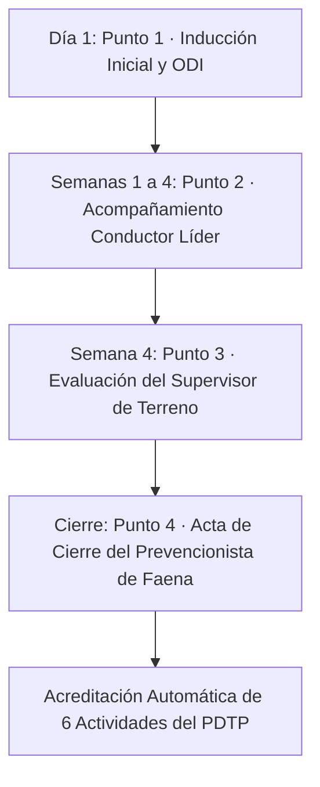

# Capítulo 08: Evaluaciones SST en Personas (Nuevo, Antiguo y RE-28)

> **Marco Normativo:** Decreto Supremo 40 (DS 40, Art. 21), Decreto Supremo 44 (DS 44/2024), DS 594, Ley 16.744 y Ley 21.719 (Protección de Datos Personales).  
> **Rutas en Plataforma:**  
> *   Bandeja General: `/prevencion/evaluaciones`  
> *   Ficha del Trabajador: `/prevencion/trabajador/[workerId]`  
> *   Creación de Evaluación: `/prevencion/nueva`  
> **Actividades PDTP Asociadas:** N° 15, 17, 18, 19, 23, 52 y 63.

---

## 1. Los 3 Instrumentos de Evaluación en Personas (`/prevencion/nueva`)

En la plataforma CHOME, las evaluaciones SST están estrictamente separadas de las inspecciones de áreas e instalaciones: **las evaluaciones tienen como sujeto a una persona específica (trabajador con RUT)**. 

Al presionar **"Nueva Evaluación"** en `/prevencion/nueva`, el sistema despliega el selector de instrumentos según los permisos del usuario conectado:

| Código Técnico | Nombre del Instrumento | Quién lo puede Iniciar | Frecuencia / Propósito |
| :--- | :--- | :--- | :--- |
| `trabajador_nuevo` | **Programa 4 Semanas Trabajador Nuevo** | Conductor Líder (`sst:evaluate_acompanamiento`) y Prevencionista/Supervisor (`sst:create`) | Ingreso de todo nuevo conductor u operador a la faena (4 hitos). |
| `trabajador_antiguo` | **Control de Seguimiento / Post-Incidente** | Supervisor y Prevencionista (`sst:create`) | Evaluación semestral/anual, post-incidente (7, 15, 30 días) o tras reincorporación/cambio operacional. |
| `identificacion_sensibles` | **Ficha RE-28: Trabajador con Condición Sensible** | Prevencionista de Faena (`sst:create`) | Registro confidencial de aptitud laboral y restricciones funcionales (meta 95% cobertura). |

> [!NOTE]
> **Segregación de Vistas por Rol:** Si ingresa un **Conductor Líder** (que solo tiene permiso para acompañar en terreno `sst:evaluate_acompanamiento`), la plataforma filtrará automáticamente el listado y solo le permitirá acceder al instrumento `trabajador_nuevo`. Las fichas de salud confidenciales (`identificacion_sensibles`) y de seguimiento formal (`trabajador_antiguo`) quedan reservadas exclusivamente para la línea de mando y prevención (`sst:create`).

---

## 2. Instrumento 1: Programa de 4 Semanas del Trabajador Nuevo (`trabajador_nuevo`)

El ingreso de un nuevo conductor, operador o mecánico a la faena es el momento de mayor vulnerabilidad operacional. En CHOME, la habilitación no es una simple firma: es un **programa integral de 4 semanas de inducción, tutoría y evaluación práctica en terreno**.

### Los 4 Hitos del Proceso:

1. **Hito 1 (Punto 1): Inducción General y Entrega de Reglamento**  
   * *Responsable:* Prevencionista de Faena (PRF).  
   * *Acciones:* Entrega formal del RIOHS, charla ODI (Obligación de Informar Riesgos), entrega de EPP inicial según cargo y prueba teórica de inducción.  
   * *Registro:* En `/prevencion/nueva`, selecciona al trabajador, elige `trabajador_nuevo` y registra el Punto 1 con el comprobante firmado adjunto.
2. **Hito 2 (Punto 2): Acompañamiento del Conductor Líder / Tutor (4 semanas)**  
   * *Responsable:* Conductor Líder o Tutor asignado.  
   * *Evaluación semanal:*  
     * *Semana 1:* Inspección preoperacional del camión/equipo y conocimiento de mandos.  
     * *Semana 2:* Conducción a la defensiva, radios de giro y distancias de frenado.  
     * *Semana 3:* Procedimientos de carga, estiba, amarre y descarga segura.  
     * *Semana 4:* Respuesta ante emergencias en ruta, uso de cadenas y comunicación de turno.  
   * *Registro:* El tutor ingresa a `/prevencion/trabajador/[workerId]` y califica semana a semana en terreno.
3. **Hito 3 (Punto 3): Evaluación de la Línea de Mando (Actividad PDTP N° 52)**  
   * *Responsable:* Supervisor de Terreno o Jefe de Terreno.  
   * *Acciones:* Al cumplir las 4 semanas, evalúa en terreno la actitud preventiva, uso de EPP y apego a los procedimientos de trabajo seguro (PTS).
4. **Hito 4 (Punto 4): Acta de Cierre y Habilitación Definitiva**  
   * *Responsable:* Prevencionista de Faena (PRF).  
   * *Acción:* Ingresa a `/prevencion/trabajador/[workerId]`, verifica las calificaciones y presiona **"Cerrar Acta de Habilitación"**.

> [!IMPORTANT]
> **Impacto Masivo en el PDTP:**  
> Al cerrar el acta del Hito 4, el motor de cumplimiento de la plataforma acredita automáticamente **6 actividades anuales de una sola vez**:  
> *   **N° 15:** Evaluación práctica y acompañamiento en terreno.  
> *   **N° 18:** Inducción hombre nuevo y entrega de RIOHS.  
> *   **N° 19:** Habilitación operacional del trabajador.  
> *   **N° 23:** Evaluación de desempeño preventivo.  
> *   **N° 52:** Evaluación y firma del supervisor.  
> *   **N° 63:** Evaluación teórica final del programa.

---

## 3. Instrumento 2: Control de Seguimiento y Post-Incidente (`trabajador_antiguo`)

Este instrumento aplica a trabajadores antiguos, conductores con reincidencia en desviaciones, operadores tras reincorporación de licencias prolongadas o **involucrados en incidentes operacionales** (cuasi-accidente, daño a equipos, daño ambiental o lesión).

### Criterios y Ciclo de Evaluación:
*   **Protocolo Post-Incidente:** Evaluación inmediata al retomar funciones, con seguimiento obligatorio a los **7 días, 15 días y 30 días**.
*   **Evaluación Periódica:** Aplicación semestral o anual para personal antiguo en cargos críticos (Ampliroll, Batea, Grúas Masisa/Santa Fe).
*   **Criterio de Aprobación:**
    *   *Eficaz:* $\ge 90\%$ de cumplimiento y sin desviaciones críticas.
    *   *Parcialmente Eficaz:* $70\% - 89\%$ (requiere plan de acción inmediato).
    *   *No Eficaz:* $< 70\%$ o presencia de falta crítica / reincidencia (suspensión preventiva de operación autónoma).

### Dictamen en Acta de Cierre:
Al finalizar la evaluación en la plataforma, el supervisor y el prevencionista emiten el dictamen formal:
1. **Habilitado para continuar operando en forma autónoma.**
2. **Habilitado con restricciones** (ej. solo turno diurno o rutas locales).
3. **Requiere reforzamiento adicional** (reasignación a tutoría técnica).
4. **No habilitado temporalmente para operar** (reentrenamiento formal o reubicación).

Firmantes requeridos en plataforma: Trabajador, Supervisor de Terreno, Prevencionista de Faena y Jefe de Área.

---

## 4. Instrumento 3: Ficha RE-28 Trabajadores con Condiciones Sensibles (`identificacion_sensibles`)

El formulario **RE-28** registra la aptitud laboral y las restricciones físicas o de salud de trabajadores que requieren cuidados operacionales especiales (hipertensión arterial, diabetes, restricciones de altura física, intolerancia a polvos, uso de marcapasos, etc.):

1. En `/prevencion/nueva`, selecciona **"Ficha RE-28: Identificación Sensibles"**.
2. Selecciona al trabajador por nombre o RUT.
3. Registra el estado de aptitud emitido por la Mutualidad (*Apto*, *Apto con restricciones* o *No apto temporalmente*).
4. Detalla las **restricciones laborales funcionales** (ej. *"No apto para trabajos en altura sobre 1.8 m"*, *"No realizar sobreesfuerzo físico > 25 kg"* o *"No conducir en turnos nocturnos"*).
5. **Impacto en PDTP:** Alimenta directamente la meta de la **Actividad PDTP N° 17**, la cual exige una cobertura mínima del **95% de la dotación activa de faena** evaluada y vigente.

> [!WARNING]
> **Privacidad Estricta (Ley 21.719 y Secreto Médico):**  
> En la ficha RE-28 está estrictamente prohibido ingresar diagnósticos clínicos específicos, recetas médicas o antecedentes de salud íntimos. Solo se deben asentar las **restricciones preventivas de aptitud funcional** que la jefatura debe respetar para resguardar la vida y salud del trabajador en faena.
