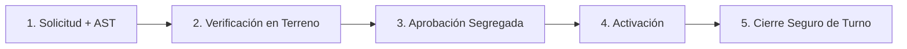

# Capítulo 10: Permisos de Trabajo de Alto Riesgo, AST y Bloqueo LOTO

> **Marco Normativo:** Decreto Supremo 594 (Condiciones ambientales y de seguridad), Decreto Supremo 44 y Estándar Corporativo de Trabajos Críticos.  
> **Ruta en Plataforma:** Menú > En terreno > **Permisos de trabajo** (`/prevencion/permisos`).  
> **Permisos del Sistema:** `prevention:permits:request`, `verify`, `approve`, `activate`, `suspend` y `close`.

---

## 1. ¿Cuándo es Obligatorio un Permiso de Trabajo Especial (PTE)?

Ninguna tarea considerada de **alto riesgo o peligro crítico** puede ejecutarse sin un Permiso de Trabajo emitido y activado en la plataforma. 

Aplica obligatoriamente en cualquiera de los siguientes casos:
1. **Trabajos en Altura Física:** Toda labor a más de 1.80 metros sobre el nivel del suelo o piso de trabajo.
2. **Trabajos en Caliente:** Soldadura, oxicorte o esmerilado que genere chispas en zonas con presencia de aserrín, madera, solventes o combustibles.
3. **Espacios Confinados:** Ingreso al interior de tolvas, silos, estanques de combustible o ductos.
4. **Bloqueo y Aislamiento de Energías (LOTO):** Mantenimiento o limpieza de equipos con energía eléctrica, hidráulica, neumática o mecánica residual.
5. **Izajes Críticos:** Maniobras complejas con grúas de alto tonelaje cerca de líneas de alta tensión o sobre instalaciones activas.

---

## 2. El Ciclo de Vida del Permiso: Cadena Segregada

Para evitar que una misma persona se "autocertifique", el sistema exige la participación de roles diferenciados:

---

## 3. Paso a Paso: Cómo Gestionar un Permiso de Trabajo

### Paso 1: Solicitud y Elaboración del AST (Análisis Seguro de Trabajo)
*   **Quién lo hace:** El Supervisor de Terreno o el líder de la cuadrilla ejecutante.
*   **En la plataforma:** Entra a `/prevencion/permisos` y presiona **"Nuevo permiso de trabajo"**.
*   **Información requerida:**
    *   Faena, sector exacto y equipo a intervenir.
    *   Vigencia del permiso (fecha y horario de inicio y término del turno).
    *   Nómina de los trabajadores autorizados a ingresar a la zona crítica.
    *   **Análisis Seguro de Trabajo (AST):** Paso a paso de la tarea, peligros identificados en cada paso y medidas de control obligatorias.

### Paso 2: Verificación de Controles en Terreno
*   **Quién lo hace:** El Prevencionista de Faena (PRF).
*   **En terreno:** Tú acudes al lugar exacto y compruebas físicamente:
    *   **Si es LOTO:** Que cada trabajador haya colocado su propio **candado personal y tarjeta roja de bloqueo** en la caja o pinza múltiple, y que se haya realizado la prueba de "energía cero" (intentar encender el equipo sin éxito).
    *   **Si es Espacio Confinado:** Realizar la **medición de atmósfera** con el detector de gases calibrado (registrar en la plataforma: Oxígeno entre 19.5% y 23.5%, CO < 25 ppm, H2S < 10 ppm, LEL 0%).
    *   **Si es Altura:** Inspección visual de arneses con doble cabo de vida, absorbedor de impacto y puntos de anclaje certificados.
*   **En la plataforma:** Abre el permiso en `/prevencion/permisos/[id]`, marca los controles verificados y haz clic en **"Confirmar verificación en terreno"**.

### Paso 3: Aprobación y Activación
*   **Aprobación:** El Jefe de Terreno o la Jefa de Prevención revisa el permiso y lo aprueba formalmente.
*   **Activación:** Una vez aprobado, el Prevencionista presiona **"Habilitar / Activar permiso"**. Solo a partir de ese segundo los trabajadores tienen autorización legal para comenzar la tarea.

### Paso 4: Cierre al Finalizar la Tarea
Al terminar la jornada o concluir el trabajo:
1. Verifica que todo el personal haya salido del área crítica.
2. Comprueba que se hayan retirado todas las herramientas y candados LOTO.
3. En la plataforma, presiona **"Cerrar permiso de trabajo"**.

---

## 4. ¿Qué Hacer si Cambian las Condiciones? (Suspensión Inmediata)

> [!WARNING]
> Si durante la ejecución del trabajo se levanta viento superior a 35 km/h, comienza una tormenta eléctrica, se detecta olor a gas o se altera el área de trabajo:
> 1. Ordena la paralización inmediata y el descenso/evacuación del personal.
> 2. Abre el permiso en la plataforma y presiona el botón rojo **"Suspender permiso"**.
> 3. El trabajo queda formalmente cancelado hasta que las condiciones climáticas o del entorno vuelvan a ser 100% seguras y se emita una nueva verificación.
