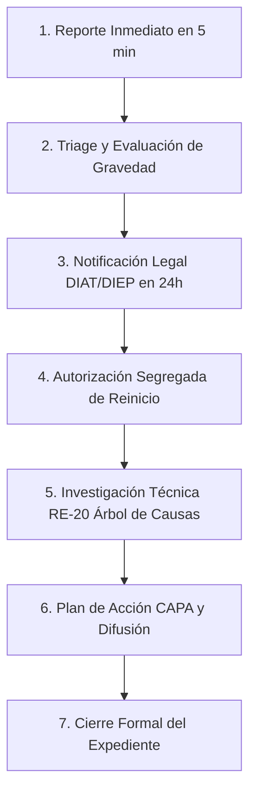

# Capítulo 12: Gestión de Incidentes, Accidentes y Expediente RE-20

> **Marco Normativo:** Ley 16.744, Circular SUSESO 3331 (Accidentes del Trabajo Graves o Fatales), Decreto Supremo 44 y Formato Corporativo RE-20.  
> **Rutas en Plataforma:**  
> *   Bandeja de Incidentes: `/prevencion/incidentes`  
> *   Reporte Inmediato: `/prevencion/incidentes/reportar`  
> *   Expediente del Caso: `/prevencion/incidentes/[id]`  
> **Actividades PDTP Asociadas:** N° 66 a 78 (13 actividades que componen el ciclo RE-20).

---

## 1. Clasificación de Eventos

Ante la ocurrencia de cualquier suceso no deseado en la faena o en el trayecto, la plataforma distingue las siguientes categorías:

| Tipo de Evento | Definición Legal / Operativa | Ejemplo Habitual en Faena |
|---|---|---|
| **Accidente del Trabajo (CTP)** | Lesión a causa o con ocasión del trabajo que produce incapacidad temporal (días perdidos). | Fractura por caída de carga, esguince de tobillo al descender de cabina. |
| **Accidente sin Tiempo Perdido (STP)** | Lesión leve que recibe atención de primeros auxilios y el trabajador se reintegra en el mismo turno. | Corte superficial en dedo curado en botiquín de faena. |
| **Accidente de Trayecto** | Ocurre en el trayecto directo de ida o regreso entre la casa y la faena. | Choque de bus de traslado o vehículo particular en ruta habitual. |
| **Incidente Peligroso (Cuasi-accidente)** | Suceso que no causó lesión pero que tuvo el potencial real de causar un daño grave. | Rotura de eslinga de izaje sin personas bajo la carga; volcamiento de camión sin lesionados. |
| **Sospecha de Enfermedad Profesional** | Síntomas crónicos atribuibles a agentes físicos o químicos de la faena. | Hipoacusia por ruido, tendinitis de hombro, sospecha de silicosis. |
| **Daño Material / Derrame Ambiental** | Daño a equipos o infraestructura sin personas lesionadas, o derrame de hidrocarburos. | Choque contra poste en patio de maniobras; rotura de estanque con derrame de diésel. |

---

## 2. El Flujo de las 7 Compuertas del Expediente RE-20

El sistema guía al equipo de faena a través de un flujo estructurado y secuencial:

---

## 3. Paso a Paso para la Gestión del Incidente

### Paso 1: Reporte Inmediato (Menos de 5 minutos - Actividad PDTP N° 66)
*   **Quién lo hace:** El Prevencionista de Faena, Jefe de Terreno o Supervisor que tomó conocimiento del hecho.
*   **En `/prevencion/incidentes/reportar`:**
    1. Selecciona la **Faena** y fecha/hora exacta del suceso.
    2. Elige el **Tipo de Evento**:
       * *Incidente o suceso peligroso (cuasi-accidente)*
       * *Accidente del trabajo*
       * *Accidente de trayecto*
       * *Presunta enfermedad profesional*
       * *Daño material*
       * *Daño ambiental o derrame*
       * *Evento vehicular*
       * *Contratista o tercero*
    3. Identifica al trabajador lesionado (o marca *"Sin lesionados"* si es cuasi-accidente o daño material).
    4. Describe brevemente qué ocurrió (hechos objetivos: qué, dónde y cómo).
    5. Presiona **"Crear Reporte de Incidente"**.

> [!TIP]
> **Captura Móvil sin Señal (Cola Offline):**  
> Si el accidente ocurre en un camino forestal o sector sin cobertura de internet, abre `/prevencion/incidentes/reportar` y envía el reporte normalmente. El sistema lo almacenará de inmediato en la cola local de tu dispositivo (`chome-prevention-offline`). En cuanto el teléfono o tablet detecte señal de red, el reporte se sincronizará automáticamente con el servidor sin duplicar registros.

### Paso 2: Triage y Alerta de Accidente Grave o Fatal (Actividad PDTP N° 67)
*   Abre el incidente creado en `/prevencion/incidentes/[id]`.
*   En el panel de triage, responde las preguntas de la **Circular SUSESO 3331**:
    *   *¿Hubo fallecimiento?*
    *   *¿Hubo amputación o pérdida de parte del cuerpo?*
    *   *¿Hubo caída de altura superior a 1.8 metros?*
    *   *¿Exigió maniobras de rescate o reanimación?*
    *   *¿Ocurrió en un espacio confinado?*
*   **Si respondes SÍ a cualquiera de ellas:**
    > [!WARNING]
    > **ALERTA CRÍTICA SUSESO 3331:**
    > El sistema activará el protocolo de emergencia legal:
    > 1. **Paralización Inmediata:** Toda la faena o el área afectada debe detenerse por ley.
    > 2. **Aviso Telefónico Obligatorio:** Comunica de inmediato a la **Inspección del Trabajo (DT)** y a la **SEREMI de Salud**.
    > 3. El sistema bloqueará el reinicio de las faenas hasta que se cumpla la compuerta 4.

### Paso 3: Notificación Legal (DIAT ante la Mutual - Actividad PDTP N° 72)
*   **Quién lo hace:** El **Administrador de Contrato** (con apoyo del PRF).
*   **Plazo Legal:** Máximo **24 horas** desde ocurrido el accidente.
*   **En la plataforma:** En el carril de notificación DIAT, ingresa el número de folio entregado por la Mutual (Mutual de Seguridad, ACHS o IST) y sube el PDF del comprobante de ingreso.
*   *Impacto:* Se acredita la actividad N° 72 en el PDTP.

### Paso 4: Autorización Segregada de Reinicio de Operación (Actividad PDTP N° 74)
Si la operación fue suspendida por orden legal o preventiva, **no puede reiniciarse hasta que se corrijan las causas inmediatas**:
*   El Prevencionista de Faena y el Jefe de Terreno verifican en terreno que las condiciones son seguras.
*   **Segregación:** Quien reportó el accidente no puede autorizar el reinicio. La autorización formal la suscribe la Jefa de Prevención o la Administración de Contrato en `/prevencion/incidentes/[id]`.

### Paso 5: Investigación Técnica RE-20 (Actividades PDTP N° 68, 69 y 73)
En la pestaña **"Investigación RE-20"**:
1. **Informe Preliminar (N° 68):** Primer análisis de las primeras 24 horas.
2. **Declaraciones (N° 69):** Registra las declaraciones individuales del trabajador accidentado y de los testigos presenciales.
3. **Árbol de Causas y 5 Porqués (N° 73):**
   *   *Causas Inmediatas:* Acciones inseguras (ej. no usar arnés) y condiciones inseguras (ej. piso con aceite).
   *   *Causas Básicas:* Factores personales (ej. falta de instrucción) y factores del trabajo (ej. mantenimiento deficiente de frenos).
   *   *Fallas en el Sistema de Gestión:* Qué procedimiento o control faltó en la planificación.

### Paso 6: Acciones Correctivas y Difusión (Actividades PDTP N° 71, 75 y 76)
1. **Plan de Acción CAPA (N° 76):** Genera las medidas para evitar que el accidente vuelva a repetirse.
2. **Difusión al Turno (N° 71 y 75):** Realiza una charla de seguridad a toda la dotación de la faena explicando lo ocurrido y las medidas adoptadas. En la plataforma, confirma la fecha y número de asistentes a la difusión.

### Paso 7: Cierre Formal del Expediente (Actividad PDTP N° 77)
Una vez que todas las compuertas están completas (DIAT adjunta, investigación terminada, difusión confirmada y acciones CAPA verificadas), el Prevencionista o Jefa de Prevención presiona **"Cerrar Expediente RE-20"**, acreditando el cumplimiento final del caso.
