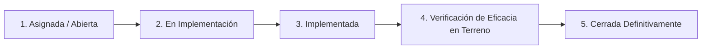

# Capítulo 13: Acciones Correctivas y Preventivas (CAPA)

> **Marco Normativo:** Decreto Supremo 44, Artículos 8 y 21 (Planes de Acción y Mejora Continua SG-SST).  
> **Ruta en Plataforma:** Menú > Cumplimiento del programa > **Acciones correctivas** (`/prevencion/capa`).  
> **Permisos del Sistema:** `prevention:capa:manage`, `complete`, `verify` y `close`.

---

## 1. ¿Qué es una Acción Correctiva (CAPA)?

Una **Acción Correctiva o Preventiva (CAPA)** es el compromiso formal de resolver una desviación de seguridad detectada en la faena, asignando un **responsable directo con nombre y apellido** y una **fecha límite de cumplimiento**.

Las acciones CAPA pueden nacer de diversas fuentes en la plataforma:
*   Un hallazgo de "No Cumple" durante una inspección en terreno.
*   Una medida correctiva derivada de la investigación de un accidente (RE-20).
*   Una tarjeta PPA que requirió una modificación permanente de infraestructura o equipos.
*   Una observación de una auditoría interna o fiscalización de la Inspección del Trabajo.
*   Una creación directa por parte del Prevencionista de Faena.

---

## 2. El Ciclo de Vida de una Acción Correctiva

Para garantizar que los problemas no se queden en simples promesas, cada acción recorre 4 etapas obligatorias:

---

## 3. Paso a Paso: Cómo Gestionar una CAPA

### Paso 1: Creación y Asignación de la Acción
Si creas una CAPA directamente o la derivas desde una inspección:
1. En `/prevencion/capa`, presiona **"Nueva acción correctiva"**.
2. **Origen:** Selecciona de dónde proviene (Inspección, Incidente RE-20, Fiscalización, PPA).
3. **Descripción de la No Conformidad:** Explica con claridad la falla (ej. *Fuga de aceite hidráulico en manguera principal de grúa horquilla patente GH-55-12*).
4. **Acción Comprometida:** Detalla qué se debe hacer (ej. *Reemplazar manguera y empaquetaduras por repuestos originales certificados*).
5. **Responsable Asignado:** Selecciona al Jefe de Mantención, Jefe de Terreno o Pañolero.
6. **Fecha de Compromiso:** Define el plazo máximo (ej. *3 días hábiles*).

### Paso 2: Declaración de Implementación
Cuando el responsable físico ejecuta la tarea en terreno:
1. Abre la acción en `/prevencion/capa/[id]`.
2. Presiona **"Declarar implementación completada"**.
3. Sube la evidencia de respaldo obligatoria:
   * Fotografía del equipo reparado o del área corregida.
   * Orden de trabajo de mantención o factura del repuesto nuevo.
4. El estado cambiará a **`en verificación`**.

### Paso 3: Verificación de Eficacia en Terreno (Rol del PRF)
> [!NOTE]
> **Regla de Segregación Técnica:**  
> Quien ejecutó o implementó la acción **no puede validarse a sí mismo**. Tú como Prevencionista de Faena eres la contraparte técnica encargada de acudir a terreno y verificar la eficacia.

*   **¿Qué es evaluar la Eficacia?**  
    No basta con ver que cambiaron la pieza: debes comprobar que la solución **realmente eliminó el peligro y que la falla no volvió a ocurrir**.
*   **En la plataforma:**
    1. Abre la acción en estado `en verificación`.
    2. Responde la pregunta: *¿La acción implementada fue eficaz para eliminar la condición insegura?*
    3. Si confirmas que la reparación es segura, presiona **"Verificar Eficacia y Cerrar Acción"**.
    4. La acción pasa al estado **`cerrada`** con trazabilidad auditable.

---

## 4. Alertas de Vencimiento y Escalamiento

El sistema monitorea diariamente los plazos de todas las acciones CAPA:
*   🟡 **Próxima a vencer (7 días):** Envía un recordatorio al responsable asignado.
*   🔴 **Vencida:** La acción se destaca en rojo en el panel de **"Atención requerida"** del inicio de Prevención y se notifica al Administrador de Contrato y a la Jefa de Prevención para su escalamiento inmediato.
