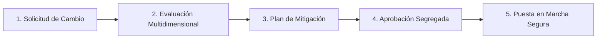

# Capítulo 18: Gestión del Cambio (MOC)

> **Marco Normativo:** Decreto Supremo 44 y Estándar de Gestión del Cambio Operacional (Management of Change - MOC).  
> **Ruta en Plataforma:** Menú > En terreno > **Gestión del cambio** (`/prevencion/gestion-cambio`).  
> **Permisos del Sistema:** `prevention:change:manage` (solicitar), `evaluate` (evaluar) y `approve` (aprobar).

---

## 1. ¿Por qué es Crítica la Gestión del Cambio?

Muchos accidentes graves no ocurren en la rutina de todos los días, sino **cuando algo cambia en la faena y nadie analizó los nuevos riesgos con anticipación**:
*   Llega un modelo nuevo de camión o grúa con dimensiones o puntos ciegos distintos.
*   Se modifica la ruta interna de tránsito o se cambia de lugar el patio de carga.
*   Se introduce un nuevo producto químico o lubricante en el taller.
*   Se contrata una nueva empresa de servicios o se altera el régimen de turnos de la dotación.

El módulo de **Gestión del Cambio (MOC)** asegura que ninguna modificación operacional se implemente sin una evaluación previa de sus impactos en la seguridad.

---

## 2. El Flujo de Trabajo MOC en la Plataforma

---

## 3. Paso a Paso: Cómo Tramitar una Gestión del Cambio

### Paso 1: Levantar la Solicitud
*   Cualquier supervisor, jefe de terreno o prevencionista puede iniciar la solicitud en `/prevencion/gestion-cambio` > **"Nueva solicitud de cambio"**.
*   **Tipo de Cambio:** Maquinaria/Equipos, Instalaciones/Infraestructura, Métodos de Trabajo, Proveedor o Personal.
*   **Justificación:** Explica el motivo operacional del cambio y la fecha estimada de implementación.

### Paso 2: Evaluación Multidimensional de Impactos
El Prevencionista de Faena y el equipo técnico evalúan el impacto del cambio en **6 dimensiones críticas**:

1. **Impacto en MIPER:** *¿El cambio introduce nuevos peligros no evaluados en la matriz actual?*
2. **Impacto en Procedimientos (PTS):** *¿Es necesario redactar un nuevo procedimiento seguro o modificar uno existente?*
3. **Impacto en Capacitación:** *¿Los operadores o mecánicos requieren una inducción especial antes de operar el equipo nuevo?*
4. **Impacto en EPP:** *¿Se requieren elementos de protección diferentes a los habituales?*
5. **Impacto en Emergencias:** *¿El nuevo equipo o sustancia exige un extintor distinto o brigadistas especializados?*
6. **Impacto Legal / Permisos:** *¿Se requiere autorización sectorial de la SEREMI o revisión técnica especial?*

### Paso 3: Plan de Mitigación Previo
Por cada impacto detectado, se definen las acciones previas obligatorias (ej. *Antes de operar la nueva grúa: 1) Capacitar a los 4 operadores; 2) Pintar demarcación en el piso; 3) Actualizar la matriz IPER*).

### Paso 4: Aprobación Segregada y Cierre
> [!NOTE]
> Quien solicita el cambio no puede aprobarlo. La aprobación formal la firma el Administrador de Contrato o la Jefa de Prevención una vez que todas las medidas de mitigación están completas.
