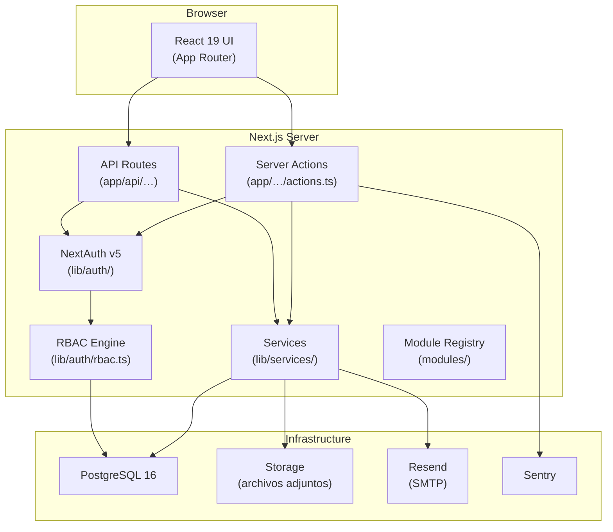
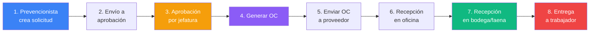

# Plataforma Chome — Documentación del Proyecto

> **Nombre interno:** `plataforma-chome`
> **Dominio:** Sistema ERP interno para gestión de adquisiciones, bodega, prevención de riesgos y flota vehicular de la empresa Chome.

---

## 1. Stack Tecnológico

| Capa | Tecnología | Versión |
|---|---|---|
| **Framework** | Next.js (App Router) | 16.x |
| **Runtime** | Node.js | ≥ 20.19 |
| **Lenguaje** | TypeScript | 5.x |
| **UI / Frontend** | React 19 + Radix UI + Phosphor Icons | 19.2.4 |
| **Estilos** | Tailwind CSS 4 + CSS Variables (design tokens) | 4.x |
| **ORM** | Drizzle ORM + drizzle-kit | 0.45.x |
| **Base de datos** | PostgreSQL 16 (Alpine, Docker) | 16 |
| **Autenticación** | NextAuth.js v5 (beta) + bcryptjs | 5.0.0-beta.31 |
| **Estado global** | TanStack React Query | 5.x |
| **Validación** | Zod | 4.x |
| **Gráficos** | Recharts | 3.x |
| **Exportaciones** | ExcelJS + xlsx (formato XLSX) | — |
| **Emails** | Resend API | 6.x |
| **QR** | qrcode | 1.x |
| **PDF** | Playwright (renderizado headless) | 1.60 |
| **Observabilidad** | Sentry (client + server) | 10.x |
| **Testing** | Vitest (unit) + Playwright (E2E) | 4.x / 1.60 |
| **Contenedores** | Docker + Docker Compose | — |
| **CI/CD** | GitHub Actions → GHCR | — |

---

## 2. Arquitectura General



### Estructura de directorios principal

```
bodega/
├── app/                    # Next.js App Router
│   ├── (app)/              # Rutas protegidas (requieren sesión)
│   ├── (auth)/             # Login, registro, recuperación
│   ├── (print)/            # Vistas de impresión/PDF
│   ├── (public)/           # Rutas públicas (PPA digital)
│   └── api/                # API Routes (REST endpoints)
├── components/             # Componentes React reutilizables
│   ├── ui/                 # Primitivos (Button, Card, Table, Select…)
│   ├── layout/             # Shell, navegación, top bar
│   └── …/                  # Componentes por dominio
├── db/                     # Base de datos
│   ├── schema/             # Tablas Drizzle (23 archivos)
│   ├── migrations/         # Migraciones versionadas
│   └── seed.ts             # Seed de roles, permisos, catálogo base
├── lib/                    # Lógica de negocio
│   ├── auth/               # Autenticación y RBAC
│   ├── services/           # Servicios por dominio (29 archivos)
│   ├── validation/         # Schemas Zod
│   ├── reports/            # Generación de reportes
│   └── …/                  # Utilidades compartidas
├── modules/                # Registro modular (manifests, permisos, nav)
│   ├── registry.ts         # Registro central de módulos
│   ├── permissions.ts      # Tipo Permission derivado del registry
│   └── <módulo>/manifest.ts # Manifiesto por módulo
└── scripts/                # Herramientas de desarrollo y operación
```

---

## 3. Sistema de Autenticación y RBAC

### Autenticación
- **NextAuth v5** con estrategia de credenciales (email + contraseña bcrypt).
- Primer usuario creado vía `/registro` recibe el rol **Administrador**.
- Usuarios posteriores requieren **invitación** desde `/admin/usuarios`.
- Soporte para **reset de contraseña** vía email (Resend).

### Roles del sistema

| Rol | Slug | Alcance | Descripción |
|---|---|---|---|
| Administrador | `administrador` | Global | Acceso total al sistema |
| Jefa Chome | `jefa_chome` | Global | Jefatura — aprueba, gestiona compras |
| Secretaría | `secretaria` | Global | Gestión administrativa, compras, OC |
| Prevencionista Oficina | `prevencionista` | Global | Prevención central — aprueba productos |
| Prevencionista Faena | `prevencionista_faena` | Faena | Prevención en terreno — crea solicitudes y evaluaciones SST |
| Jefe Mantención | `jefe_mantencion` | Global | Gestión de repuestos y mantenciones |

### RBAC

- Los permisos se derivan **automáticamente** del registry de módulos ([permissions.ts](file:///home/allopze/dev/chome/bodega/modules/permissions.ts)).
- Se soportan permisos por **rol** y permisos **directos por usuario**.
- El snapshot RBAC se cachea en memoria con TTL de 5s y LRU de 1000 entradas.
- Cada módulo declara `defaultGrants` que el seed aplica automáticamente.
- Scoping por **faena (worksite)**: usuarios no globales solo ven datos de sus faenas asignadas.

---

## 4. Módulos del Sistema

El sistema tiene **18 módulos** registrados en [registry.ts](file:///home/allopze/dev/chome/bodega/modules/registry.ts), organizados en 6 áreas de navegación:

### Áreas de navegación

| Área | Icono | Módulos incluidos |
|---|---|---|
| 🏗️ **Adquisiciones** | Stack | Solicitudes, Aprobaciones, Compras, Recepción |
| 🚗 **Vehículos** | Car | Combustibles, Flota, Mantenciones |
| 🏭 **Bodega** | Warehouse | Bodega/Stock, Entregas, Trazabilidad |
| 📊 **Reportes** | ChartBar | Reportes, Analítica |
| 🛡️ **Prevención** | ShieldCheck | Evaluaciones SST, PPA Digital |
| 🆘 **Soporte** | Lifebuoy | Soporte/Feedback |

---

### 4.1 Módulo: Administración (`admin`)

> **Ruta:** `/admin` · **Permisos:** `admin:users`, `admin:manage_admins`, `admin:worksites`, `admin:workers`, `admin:products`, `admin:suppliers`, `admin:config`, `admin:smtp`, `admin:email_templates`, `admin:audit_log`

Panel de configuración del sistema. Accesible desde el dropdown del TopBar (no desde sidebar).

| Submódulo | Ruta | Función |
|---|---|---|
| **Usuarios** | `/admin/usuarios` | CRUD de usuarios, asignación de roles, invitaciones |
| **Faenas** | `/admin/faenas` | Gestión de faenas (worksites) y centros de costo |
| **Proveedores** | `/admin/proveedores` | Catálogo de proveedores |
| **Productos** | `/admin/productos` | Catálogo de productos EPP, categorías, atributos |
| **Trabajadores** | `/admin/trabajadores` | Registro de trabajadores (RUT, empresa, cargo) |
| **Configuración** | `/admin/configuracion` | Ajustes generales del sistema |
| **Correo SMTP** | `/admin/correo-smtp` | Configuración de envío de emails |
| **Plantillas Email** | `/admin/plantillas` | Templates de correos transaccionales |
| **Auditoría** | `/admin/auditoria` | Log de auditoría del sistema |

---

### 4.2 Módulo: Solicitudes (`requests`)

> **Ruta:** `/solicitudes` · **Permisos:** `requests:create`, `requests:view_own`, `requests:view_all`, `requests:submit`, `requests:delete`

Gestión del ciclo de vida de solicitudes de compra de EPP por faena.

| Item | Descripción |
|---|---|
| **Lista de solicitudes** | Tabla paginada con filtros por estado, faena, fecha |
| **Crear solicitud** | Formulario con selector de productos, cantidades, tallas |
| **Detalle** | Vista del estado de la solicitud, ítems, adjuntos |
| **Enviar a aprobación** | Cambia estado de `borrador` → `submitted` |
| **Eliminar** | Solo solicitudes no aprobadas |

**Flujo:** Prevencionista faena crea solicitud → la envía a aprobación → se aprueba por jefatura/prevencionista oficina → se genera OC.

---

### 4.3 Módulo: Solicitudes de Repuestos (`repuestos`)

> **Ruta:** `/repuestos` · **Permisos:** `repuestos:create`, `repuestos:view_own`, `repuestos:view_all`, `repuestos:submit`, `repuestos:approve`

Similar a Solicitudes pero para **repuestos de maquinaria/vehículos**.

| Item | Descripción |
|---|---|
| **Lista** | Solicitudes de repuestos con filtros |
| **Crear solicitud** | Formulario con detalle de repuestos necesarios |
| **Aprobación de cotización** | Flujo separado de aprobación por cotización |

---

### 4.4 Módulo: Solicitudes de Servicios (`servicios`)

> **Ruta:** `/servicios` · **Permisos:** `servicios:create`, `servicios:view_own`, `servicios:view_all`, `servicios:submit`, `servicios:approve`

Gestión de solicitudes de servicios externos (mantención, arriendo, etc.).

| Item | Descripción |
|---|---|
| **Lista** | Solicitudes de servicios con filtros |
| **Crear solicitud** | Formulario con detalle del servicio requerido |
| **Aprobación de cotización** | Autorización de cotizaciones recibidas |

---

### 4.5 Módulo: Aprobaciones (`approvals`)

> **Ruta:** `/aprobaciones` · **Permisos:** `approvals:approve`

Cola de ítems pendientes de aprobación (de solicitudes de EPP, no de repuestos ni servicios).

| Item | Descripción |
|---|---|
| **Cola de aprobación** | Ítems pendientes filtrados por faenas visibles |
| **Aprobar/rechazar** | Aprobación por ítem individual |
| **Badge** | Contador en la navegación de ítems pendientes |

---

### 4.6 Módulo: Compras (`purchasing`)

> **Ruta:** `/compras` · **Permisos:** `purchasing:view`, `purchasing:create_order`, `purchasing:send_order`, `purchasing:manage_suppliers`, `purchasing:delete_order`

Gestión de órdenes de compra (OC).

| Item | Descripción |
|---|---|
| **Lista de OC** | Tabla con todas las órdenes de compra |
| **Crear OC** | Genera OC a partir de ítems aprobados |
| **Enviar OC** | Cambia estado a "enviada al proveedor" |
| **Facturas** | Anexar facturas a la OC |
| **Impresión** | Vista print-friendly de la OC (`(print)/compras/`) |
| **Eliminar** | Solo OC no recibidas |

**Estados OC:** `borrador` → `issued` → `sent` → `partially_office_received` → `office_received` → `partially_received` → `received`

---

### 4.7 Módulo: Recepción (`receiving`)

> **Ruta:** `/recepcion` · **Permisos:** `receiving:view`, `receiving:register_office`, `receiving:register_faena`

Registro de recepción de mercadería en dos etapas.

| Item | Descripción |
|---|---|
| **Recepción en oficina** | Registro de llegada física a oficina central |
| **Recepción en faena/bodega** | Confirmación de recepción en destino final → genera stock |
| **Lista de recepciones** | Historial de recepciones con detalle por ítem |

> [!IMPORTANT]
> La recepción en oficina **no** genera stock disponible. Solo la recepción en bodega/faena registra stock contra la faena de la OC.

---

### 4.8 Módulo: Bodega / Stock (`warehouse`)

> **Ruta:** `/bodega` · **Permisos:** `warehouse:view_stock`, `warehouse:register_movement`, `warehouse:adjust_stock`

Control de inventario por faena.

| Item | Descripción |
|---|---|
| **Stock actual** | Vista de stock por producto y faena |
| **Kardex** | Historial de movimientos (entradas, salidas, ajustes) |
| **Ajustes de stock** | Correcciones manuales de inventario |
| **Devoluciones** | Registro de devoluciones de EPP |
| **Exportación** | Descarga XLSX del stock y kardex |

---

### 4.9 Módulo: Entregas (`deliveries`)

> **Ruta:** `/entregas` · **Permisos:** `deliveries:view`, `deliveries:create`

Entrega de EPP recibido a trabajadores individuales.

| Item | Descripción |
|---|---|
| **Registro de entrega** | Formulario vinculado a stock disponible y trabajador |
| **Historial** | Tabla de entregas realizadas con filtros |

> La entrega a trabajador cierra el seguimiento operativo de los ítems recibidos.

---

### 4.10 Módulo: Trazabilidad (`traceability`)

> **Ruta:** `/trazabilidad` · **Permisos:** `traceability:view`

Seguimiento end-to-end de cada ítem desde la solicitud hasta la entrega.

| Item | Descripción |
|---|---|
| **Matriz de trazabilidad** | Vista completa del avance por ítem |
| **Detalle por ítem** | Timeline con estados: solicitado → aprobado → comprado → recibido oficina → recibido faena → entregado |
| **Exportación** | XLSX con detalle completo |

---

### 4.11 Módulo: Reportes (`reports`)

> **Ruta:** `/reportes` · **Permisos:** `reports:view`

Reportes operacionales consolidados.

| Item | Descripción |
|---|---|
| **Pendientes** | Ítems pendientes por etapa del flujo |
| **Consolidados** | Resúmenes por faena, proveedor, producto |
| **Exportación XLSX** | Todos los reportes son descargables en formato Excel |

---

### 4.12 Módulo: Analítica (`analytics`)

> **Ruta:** `/analitica` · **Permisos:** `analytics:view`, `analytics:export`

Dashboard analítico transversal con gráficos interactivos.

| Item | Descripción |
|---|---|
| **Gráficos** | Recharts: tendencias, distribución, comparativas |
| **Filtros** | Por faena, periodo, categoría |
| **KPIs** | Métricas clave del sistema |
| **Exportación** | Descarga XLSX de datos analíticos |

---

### 4.13 Módulo: Evaluaciones SST (`sst`)

> **Ruta:** `/prevencion` · **Permisos:** `sst:view`, `sst:create`, `sst:close`, `sst:manage`, `sst:evaluate_acompanamiento`

Evaluaciones de Seguridad y Salud en el Trabajo para trabajadores nuevos y seguimiento post-incidente.

| Item | Descripción |
|---|---|
| **Lista de evaluaciones** | Tabla con filtros por faena, trabajador, estado |
| **Crear evaluación** | Checklist digital configurable (trabajador nuevo / antiguo) |
| **Evaluación por rol** | Prevencionista faena, admin contrato, conductor líder |
| **Acompañamiento en terreno** | Punto 3: evaluación in situ del trabajador |
| **Plan de acción** | Acciones correctivas derivadas de no-conformidades |
| **Cierre** | Calcula porcentaje de cumplimiento y resultado de eficacia |
| **Impresión/PDF** | Vista print via Playwright headless (`(print)/sst/`) |
| **Alertas** | Notificaciones de evaluaciones pendientes |

**Tipos:** `nuevo` (trabajador nuevo) | `seguimiento` (post-incidente)
**Estados:** `borrador` → `cerrado`

---

### 4.14 Módulo: PPA Digital (`ppa`)

> **Ruta:** `/prevencion/ppa` · **Ruta pública:** `(public)/ppa` · **Permisos:** `ppa:view`, `ppa:review`, `ppa:manage`

**Para, Piensa y Actúa** — Formulario preventivo que los trabajadores completan (sin login, vía QR) antes de iniciar una tarea crítica.

| Item | Descripción |
|---|---|
| **Formulario público** | Accesible sin login vía token/QR |
| **Evaluación automática** | Resultado: `autorizado_auto` o `detenido` |
| **Revisión** | Supervisor revisa PPAs detenidos |
| **Dashboard PPA** | Indicadores y tendencias |
| **Exportación** | Descarga XLSX de envíos PPA |

**Estados PPA:** `aprobado_auto` | `detenido` | `en_correccion` | `autorizado` | `rechazado` | `cerrado`

---

### 4.15 Módulo: Combustibles (`combustibles`)

> **Ruta:** `/combustibles` · **Permisos:** `combustibles:view`, `combustibles:create`, `combustibles:delete`, `combustibles:import`, `combustibles:export`, `combustibles:manage_vehicles`, `combustibles:manage_suppliers`

Control de consumo de combustible por vehículo y faena.

| Item | Descripción |
|---|---|
| **Registros de carga** | CRUD de cargas individuales de combustible |
| **Importación masiva** | Carga desde planillas Excel |
| **Vehículos** | Gestión de vehículos de combustible (`/combustibles/vehiculos`) |
| **Proveedores** | Proveedores de combustible (`/combustibles/proveedores-combustible`) |
| **Cuenta corriente** | Estado de cuenta mensual con proveedores (`/combustibles/cuenta-corriente`) |
| **Reportes** | Gráficos y KPIs de consumo (`/combustibles/reportes`) |
| **Filtros** | Por mes, faena, vehículo, tipo de servicio (TCT/TAE) |
| **Exportación** | Descarga XLSX de registros y reportes |

**Campos clave:** litros, IEC fijo/variable, monto base, IVA, total, odómetro, horómetro.

---

### 4.16 Módulo: Flota (`flota`)

> **Ruta:** `/flota` · **Permisos:** `flota:view`

Vista consolidada de la flota vehicular de la empresa.

| Item | Descripción |
|---|---|
| **Lista de vehículos** | Catálogo completo de vehículos con patente, marca, modelo |

---

### 4.17 Módulo: Mantenciones (`mantenciones`)

> **Ruta:** `/mantenciones` · **Permisos:** `mantenciones:view`, `mantenciones:create`, `mantenciones:edit`

Registro de mantenciones preventivas y correctivas de vehículos.

| Item | Descripción |
|---|---|
| **Lista** | Historial de mantenciones con filtros |
| **Registrar** | Formulario de nueva mantención |
| **Editar/cancelar** | Modificación de mantenciones existentes |

---

### 4.18 Módulo: Soporte / Feedback (`feedback`)

> **Ruta:** `/soporte` · **Permisos:** `feedback:create`, `feedback:view_own`, `feedback:view_all`, `feedback:manage`

Sistema interno de tickets de soporte.

| Item | Descripción |
|---|---|
| **Crear reporte** | Bug, consulta o sugerencia |
| **Mis reportes** | Reportes propios del usuario |
| **Gestión** | Cambio de estado, notas internas (admin) |

---

## 5. Esquema de Base de Datos

La base de datos tiene **23 archivos de schema** organizados por dominio:

| Archivo | Tablas principales | Dominio |
|---|---|---|
| [users.ts](file:///home/allopze/dev/chome/bodega/db/schema/users.ts) | `users`, `roles`, `permissions`, `user_roles`, `role_permissions`, `user_permissions`, `worksite_users`, `user_invitations`, `password_reset_tokens` | Autenticación y RBAC |
| [worksites.ts](file:///home/allopze/dev/chome/bodega/db/schema/worksites.ts) | `worksites`, `workers` | Faenas y trabajadores |
| [products.ts](file:///home/allopze/dev/chome/bodega/db/schema/products.ts) | `categories`, `products`, `product_attributes`, `product_suppliers` | Catálogo de productos |
| [requests.ts](file:///home/allopze/dev/chome/bodega/db/schema/requests.ts) | `purchase_requests`, `purchase_request_items`, `request_attachments` | Solicitudes de compra |
| [repuestos.ts](file:///home/allopze/dev/chome/bodega/db/schema/repuestos.ts) | Solicitudes de repuestos | Repuestos |
| [servicios.ts](file:///home/allopze/dev/chome/bodega/db/schema/servicios.ts) | Solicitudes de servicios | Servicios |
| [purchasing.ts](file:///home/allopze/dev/chome/bodega/db/schema/purchasing.ts) | `purchase_orders`, `purchase_order_items`, `purchase_order_invoices` | Órdenes de compra |
| [receiving.ts](file:///home/allopze/dev/chome/bodega/db/schema/receiving.ts) | `receiving_records`, `receiving_items` | Recepciones |
| [stock.ts](file:///home/allopze/dev/chome/bodega/db/schema/stock.ts) | `stock_levels`, `stock_movements` | Inventario |
| [sst.ts](file:///home/allopze/dev/chome/bodega/db/schema/sst.ts) | `sst_evaluations`, `sst_responses`, `sst_action_plans`, `sst_evidences` | Evaluaciones SST |
| [ppa.ts](file:///home/allopze/dev/chome/bodega/db/schema/ppa.ts) | `ppa_submissions` | PPA Digital |
| [fuel-invoices.ts](file:///home/allopze/dev/chome/bodega/db/schema/fuel-invoices.ts) | `fuel_loads`, `fuel_monthly_statements`, `fuel_statement_payments` | Combustibles |
| [fuel-vehicles.ts](file:///home/allopze/dev/chome/bodega/db/schema/fuel-vehicles.ts) | `fuel_vehicles` | Vehículos de combustible |
| [fuel-suppliers.ts](file:///home/allopze/dev/chome/bodega/db/schema/fuel-suppliers.ts) | `fuel_suppliers` | Proveedores de combustible |
| [maintenance.ts](file:///home/allopze/dev/chome/bodega/db/schema/maintenance.ts) | `maintenance_records` | Mantenciones |
| [cost-centers.ts](file:///home/allopze/dev/chome/bodega/db/schema/cost-centers.ts) | `cost_centers` | Centros de costo |
| [feedback.ts](file:///home/allopze/dev/chome/bodega/db/schema/feedback.ts) | `feedback_reports` | Soporte |
| [audit.ts](file:///home/allopze/dev/chome/bodega/db/schema/audit.ts) | `audit_log` | Auditoría |
| [email-templates.ts](file:///home/allopze/dev/chome/bodega/db/schema/email-templates.ts) | `email_templates` | Plantillas de email |
| [system-settings.ts](file:///home/allopze/dev/chome/bodega/db/schema/system-settings.ts) | `system_settings` | Configuración del sistema |
| [code-sequences.ts](file:///home/allopze/dev/chome/bodega/db/schema/code-sequences.ts) | `code_sequences` | Secuencias para códigos (SOL-xxxx, OC-xxxx) |
| [rate-limits.ts](file:///home/allopze/dev/chome/bodega/db/schema/rate-limits.ts) | `rate_limits` | Limitación de tasa |

---

## 6. API Routes

| Ruta | Función |
|---|---|
| `/api/auth/…` | NextAuth endpoints (login, session, signout) |
| `/api/health` | Health check para Docker/monitoreo |
| `/api/attachments/…` | Subida y descarga de archivos adjuntos |
| `/api/notifications/…` | Consulta de notificaciones del usuario |
| `/api/bodega/…` | Endpoints de stock y bodega |
| `/api/purchase-orders/…` | Endpoints de órdenes de compra |
| `/api/trazabilidad/…` | Endpoints de trazabilidad |
| `/api/reportes/…` | Endpoints de reportes |
| `/api/combustibles/…` | Endpoints de combustibles |
| `/api/repuestos/…` | Endpoints de repuestos |
| `/api/servicios/…` | Endpoints de servicios |
| `/api/prevencion/…` | Endpoints de SST y PPA |
| `/api/cron/…` | Jobs programados |

---

## 7. Servicios de negocio (`lib/services/`)

| Servicio | Archivo | Responsabilidad |
|---|---|---|
| **Dashboard** | [dashboard.ts](file:///home/allopze/dev/chome/bodega/lib/services/dashboard.ts) | KPIs y métricas del dashboard principal |
| **Analítica** | [analytics.ts](file:///home/allopze/dev/chome/bodega/lib/services/analytics.ts) | Consultas analíticas transversales |
| **Solicitudes** | [requests-draft.ts](file:///home/allopze/dev/chome/bodega/lib/services/requests-draft.ts) | Borradores de solicitudes |
| **Eliminación** | [requests-delete.ts](file:///home/allopze/dev/chome/bodega/lib/services/requests-delete.ts) | Eliminación segura de solicitudes |
| **Compras** | [purchasing.ts](file:///home/allopze/dev/chome/bodega/lib/services/purchasing.ts) | Lógica de OC, emisión, envío |
| **Recepción** | [receiving.ts](file:///home/allopze/dev/chome/bodega/lib/services/receiving.ts) | Registro de recepciones |
| **Stock** | [stock.ts](file:///home/allopze/dev/chome/bodega/lib/services/stock.ts) | Movimientos de inventario |
| **Alertas stock** | [stock-alerts.ts](file:///home/allopze/dev/chome/bodega/lib/services/stock-alerts.ts) | Notificaciones de stock bajo |
| **Entregas** | [deliveries.ts](file:///home/allopze/dev/chome/bodega/lib/services/deliveries.ts) | Entrega de EPP a trabajadores |
| **Estado de ítems** | [item-state.ts](file:///home/allopze/dev/chome/bodega/lib/services/item-state.ts) | Máquina de estados del ítem |
| **Trazabilidad** | [trazabilidad-item.ts](file:///home/allopze/dev/chome/bodega/lib/services/trazabilidad-item.ts) | Consulta de trazabilidad por ítem |
| **Exportación traza** | [trazabilidad-export.ts](file:///home/allopze/dev/chome/bodega/lib/services/trazabilidad-export.ts) | Exportación XLSX de trazabilidad |
| **SST** | [sst.ts](file:///home/allopze/dev/chome/bodega/lib/services/sst.ts) | Evaluaciones SST completas |
| **Alertas SST** | [sst-alerts.ts](file:///home/allopze/dev/chome/bodega/lib/services/sst-alerts.ts) | Alertas de evaluaciones pendientes |
| **PPA** | [ppa.ts](file:///home/allopze/dev/chome/bodega/lib/services/ppa.ts) | Lógica PPA Digital |
| **Flota** | [fleet.ts](file:///home/allopze/dev/chome/bodega/lib/services/fleet.ts) | Consulta de flota vehicular |
| **Mantención** | [maintenance.ts](file:///home/allopze/dev/chome/bodega/lib/services/maintenance.ts) | Registro de mantenciones |
| **Repuestos** | [repuestos.ts](file:///home/allopze/dev/chome/bodega/lib/services/repuestos.ts) | Lógica de solicitudes de repuestos |
| **Servicios** | [servicios.ts](file:///home/allopze/dev/chome/bodega/lib/services/servicios.ts) | Lógica de solicitudes de servicios |
| **Notificaciones** | [notifications.ts](file:///home/allopze/dev/chome/bodega/lib/services/notifications.ts) | Sistema de notificaciones in-app |
| **Feedback** | [feedback.ts](file:///home/allopze/dev/chome/bodega/lib/services/feedback.ts) | Tickets de soporte |
| **Email templates** | [email-templates.ts](file:///home/allopze/dev/chome/bodega/lib/services/email-templates.ts) | Gestión de templates de correo |
| **Password reset** | [password-reset.ts](file:///home/allopze/dev/chome/bodega/lib/services/password-reset.ts) | Flujo de reset de contraseña |
| **SMTP settings** | [smtp-settings.ts](file:///home/allopze/dev/chome/bodega/lib/services/smtp-settings.ts) | Configuración SMTP |
| **System settings** | [system-settings.ts](file:///home/allopze/dev/chome/bodega/lib/services/system-settings.ts) | Configuración general |
| **Rate limit** | [rate-limit.ts](file:///home/allopze/dev/chome/bodega/lib/services/rate-limit.ts) | Limitación de tasa |

---

## 8. Flujo Operativo Principal



1. **Solicitud:** Prevencionista de faena crea solicitud en `/solicitudes/nueva`
2. **Aprobación:** Jefatura, secretaría o prevencionista oficina aprueba ítems en `/aprobaciones`
3. **Orden de compra:** Se genera OC en `/compras/nueva` con ítems aprobados
4. **Envío:** Se emite y envía la OC al proveedor
5. **Recepción oficina:** Se registra llegada a oficina central (no genera stock)
6. **Recepción bodega:** Se confirma recepción en faena (genera stock disponible)
7. **Entrega:** Se entrega EPP al trabajador (descuenta stock, cierra seguimiento)
8. **Trazabilidad:** Todo el flujo es visible en `/trazabilidad`

---

## 9. Infraestructura y Deploy

### Docker Compose
- **`app`**: Contenedor Next.js standalone (puerto 3001 → 3000)
- **`db`**: PostgreSQL 16 Alpine con volumen persistente
- **`migrate`**: One-shot que aplica migraciones Drizzle antes de iniciar app
- **`seed`**: Profile manual para seed inicial (roles, permisos, catálogo)

### Observabilidad
- **Sentry**: Error tracking client y server
- **Health check**: `/api/health` para Docker/load balancer
- **Audit log**: Tabla `audit_log` con todas las acciones del sistema
- **Logger**: [logger.ts](file:///home/allopze/dev/chome/bodega/lib/logger.ts) estructurado

### Seguridad
- Headers: HSTS, X-Frame-Options DENY, CSP, Referrer-Policy
- Contraseñas: bcrypt con hash
- RBAC cacheado con TTL corto (5s)
- Rate limiting en endpoints sensibles
- Validación con Zod en todos los inputs
- File validation para adjuntos
- Scoping por faena en queries

---

## 10. Scripts y herramientas

| Script | Comando | Función |
|---|---|---|
| **Dev server** | `npm run dev` | Next.js en puerto 3001 |
| **Generate migration** | `npm run db:generate` | Genera migración Drizzle |
| **Apply migrations** | `npm run db:migrate` | Aplica migraciones pendientes |
| **Seed** | `npm run db:seed` | Carga roles, permisos y datos base |
| **Studio** | `npm run db:studio` | Drizzle Studio (UI visual de BD) |
| **Tests** | `npm test` | Vitest (unitarios) |
| **E2E** | `npm run test:e2e` | Playwright (end-to-end) |
| **Screenshots** | `npm run screenshots` | Captura screenshots de todas las rutas |
| **Coverage** | `npm run test:coverage` | Cobertura de tests |
| **Release** | `npm run release` | Script de release |
| **Typecheck** | `npm run typecheck` | Verificación de tipos TS |
| **Lint** | `npm run lint` | ESLint |
| **Secrets check** | `npm run check:secrets` | Verifica que no hay secrets en `.env` |
| **Query perf** | `npm run perf:queries` | Mide rendimiento de queries operacionales |
| **Backups** | `scripts/backup-pg.sh` | Backup de PostgreSQL |
| **Rotate secrets** | `scripts/rotate-secrets.sh` | Rotación de secrets |

---

## 11. Componentes UI

### Primitivos ([components/ui/](file:///home/allopze/dev/chome/bodega/components/ui))

| Componente | Descripción |
|---|---|
| `Button` | Botón con variantes (primary, secondary, ghost, destructive) |
| `Card` | Contenedor con sombra y bordes |
| `Table` | Tabla de datos con headers y cuerpo |
| `Select` | Selector con búsqueda (Radix) |
| `Dialog` | Modal de diálogo (Radix) |
| `Input` / `Textarea` | Campos de formulario |
| `Field` | Wrapper de campo con label y error |
| `Badge` | Etiqueta de estado con colores |
| `Tabs` | Pestañas (Radix) |
| `DatePicker` | Selector de fecha (react-day-picker) |
| `Pagination` | Paginación client y server |
| `Tooltip` | Tooltip (Radix) |
| `Skeleton` | Loading placeholder |
| `EmptyState` | Estado vacío con icono y acción |
| `ConfirmDialog` | Diálogo de confirmación |
| `DropdownMenu` | Menú contextual (Radix) |
| `SummaryBar` | Barra de resumen con métricas |
| `PageHeader` | Encabezado de página con título y acciones |
| `PageContainer` | Contenedor de página con max-width |
| `HeaderSignals` | Señales de estado en el header |

### Layout ([components/layout/](file:///home/allopze/dev/chome/bodega/components/layout))

| Componente | Descripción |
|---|---|
| `AppShell` | Shell principal (sidebar + content) |
| `TopBar` | Barra superior con usuario, notificaciones |
| `DesktopNav` | Navegación lateral desktop (rail + panel) |
| `MobileNav` | Navegación móvil (drawer) |
| `CommandPalette` | Paleta de comandos (⌘K) |
| `NavigationProgress` | Barra de progreso de navegación |
| `NotificationBell` | Campana de notificaciones |
| `BrandMark` | Logo de la aplicación |
