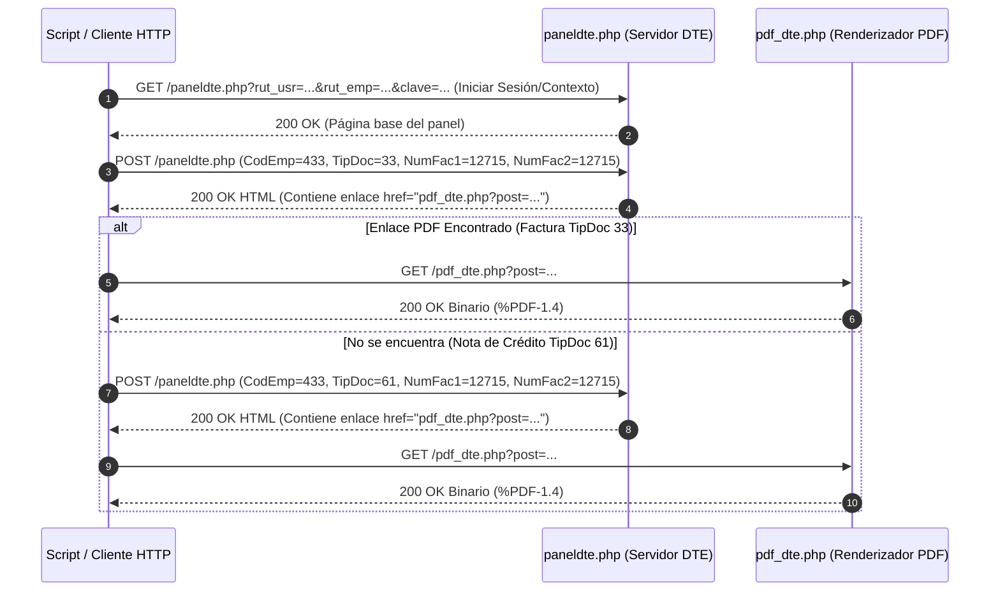
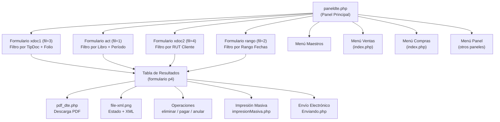
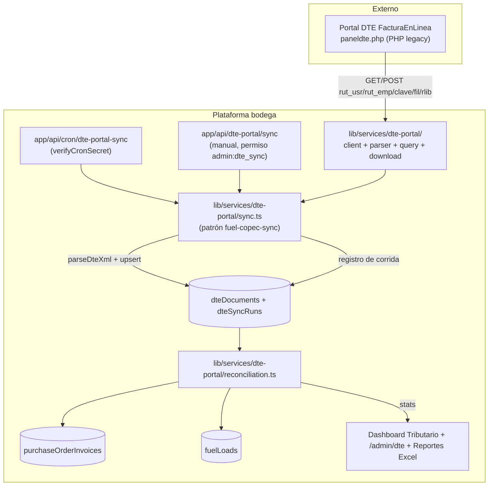

# Explicación Técnica Integral del Portal DTE Factura en Línea

> **Dominio de Servicio**: `clientes.dtefacturaenlinea.cl`  
> **Motor Backend**: PHP / Apache (DTE Chile)  
> **Protocolos**: HTTP / HTTPS (Peticiones GET y POST)  
> **Codificación**: `iso-8859-1`  
> **Librerías Frontend**: DHTML Goodies (menú desplegable), dhtmlxWindows (ventanas modales), CalendarPopup (selector de fechas)

---

## 1. Arquitectura General de la Plataforma

`dtefacturaenlinea.cl` es un sistema Web de Facturación Electrónica (DTE) normado por el **Servicio de Impuestos Internos (SII)** de Chile. Funciona como un portal centralizado donde las empresas pueden emitir, consultar, administrar y descargar los documentos tributarios emitidos o recibidos.

El sistema opera bajo un esquema tradicional de aplicaciones web en PHP, donde **las sesiones y contextos de consulta se validan a través de parámetros en las peticiones HTTP (GET y POST)** sin requerir navegación basada en Javascript complejo ni cookies de sesión persistentes de tipo Single Page Application (SPA).

La interfaz principal (`paneldte.php`) concentra la consulta y gestión de documentos. Las credenciales viajan en cada petición como parámetros de la URL.

---

## 2. Autenticación y Contexto de Sesión (Peticiones GET)

El acceso al portal de consultas se gestiona dinámicamente mediante el script principal `paneldte.php`. El servidor valida la identidad del usuario y de la empresa en cada llamada pasando las credenciales directamente en los parámetros de la URL:

```text
https://clientes.dtefacturaenlinea.cl/facturaenlinea/paneldte.php?fil=3&rlib=ven&rut_usr={RUT_USR}&rut_emp={RUT_EMP}&clave={CLAVE}
```

### Componentes de la URL:
- **`rut_usr`**: RUT del usuario individual habilitado en el sistema (ej: `6466452-2`).
- **`rut_emp`**: RUT de la empresa contribuyente titular de los documentos (ej: `78023530-6`).
- **`clave`**: Contraseña asignada al usuario para la plataforma DTE (ej: `12jean`).
- **`rlib`**: Identificador del Registro de Libro (ver sección 3).
- **`fil`**: Parámetro de filtrado/vista del panel que determina qué formulario de búsqueda se procesa (ver sección 5).

---

## 3. Tipos de Libro (`rlib`) — Radio Buttons de Selección

El panel principal presenta un grupo de radio buttons que define el tipo de libro o contexto documental. El valor seleccionado se transmite como parámetro `rlib`:

| Valor `rlib` | Etiqueta | Descripción |
| :---: | :--- | :--- |
| **`ven`** | Venta | Libro de Ventas — documentos emitidos por la empresa. |
| **`com`** | Compra | Libro de Compras — documentos recibidos de proveedores. |
| **`guia`** | Guía | Guías de Despacho Electrónicas. |
| **`bol`** | Boleta | Boletas Electrónicas (afectas y exentas). |
| **`otro`** | Otros | Documentos no tributarios (cotizaciones, órdenes de compra, vales). Al seleccionar este radio, se habilita un dropdown secundario `OtroDoc`. |

### Dropdown secundario `OtroDoc` (habilitado solo con `rlib=otro`):

| Valor | Nombre |
| :---: | :--- |
| `99` | Doc. Genérico |
| `94` | Cotización |
| `93` | Orden Compra |
| `90` | Vale Ingreso |
| `91` | Vale Salida |
| `FAC` | Factoring |
| `89` | Dec. Ingreso |
| `100` | Aviso Cargo PAC |

---

## 4. Estructura de Documentos Tributarios (Codificación SII)

La plataforma trabaja con los tipos de documentos normalizados por el SII en Chile. El dropdown `TipDoc` del formulario de búsqueda por folio contiene los siguientes tipos:

### 4.1 Documentos Electrónicos (principales)

| Código `TipDoc` | Nombre | Descripción |
| :---: | :--- | :--- |
| **`00`** | Tipo de Documento | Opción "Todos" — no filtra por tipo. |
| **`33`** | Factura Electrónica | Documento estándar de venta/servicio afecto a IVA. |
| **`34`** | Factura Exenta Electrónica | Documento de venta/servicio no afecto a IVA. |
| **`61`** | Nota de Crédito Electrónica | Documento de anulación o rebaja de montos. |
| **`56`** | Nota de Débito Electrónica | Documento de incremento de valor en facturas previas. |
| **`43`** | Liquidación Factura Electrónica | Liquidación factura en formato electrónico. |

### 4.2 Documentos de Exportación

| Código `TipDoc` | Nombre |
| :---: | :--- |
| **`110`** | Factura Exportación Electrónica |
| **`111`** | Nota Débito Exportación Electrónica |
| **`112`** | Nota Crédito Exportación Electrónica |
| **`88`** | Factura Exportación |
| **`104`** | Nota de Débito Exportación |
| **`106`** | Nota de Crédito Exportación |

### 4.3 Documentos Manuales y Otros

| Código `TipDoc` | Nombre |
| :---: | :--- |
| **`30`** | Factura Afecta |
| **`32`** | Factura Exenta |
| **`60`** | Nota de Crédito |
| **`55`** | Nota de Débito |
| **`92`** | Factura de Compra |
| **`87`** | Factura de Compra Electrónica |
| **`40`** | Liquidación Factura |
| **`103`** | Liquidación |
| **`102`** | Fac. Venta Exenta a Z.Franca |

### 4.4 Documentos accesibles desde el menú de Ventas (emisión vía `index.php`)

Estos tipos no aparecen en el dropdown de búsqueda, sino en el menú de emisión de documentos nuevos:

| Código URL (`Tipo_Doc`) | Nombre |
| :---: | :--- |
| `33e` | Factura Afecta Electrónica |
| `34e` | Factura Exenta Electrónica |
| `52` | Guía de Despacho Electrónica |
| `61` | Nota de Crédito Electrónica |
| `56` | Nota de Débito Electrónica |
| `41` | Boleta Exenta Electrónica |
| `39` | Boleta Afecta Electrónica |
| `110e` | Factura Exportación Electrónica |
| `112e` | Nota de Crédito Exportación Electrónica |
| `111e` | Nota de Débito Exportación Electrónica |
| `43` | Liquidación Factura Electrónica |

> **Nota sobre Guías de Despacho (TipDoc 52)**: Las guías se consultan seleccionando `rlib=guia` en el radio button principal, no a través del dropdown `TipDoc` del formulario de búsqueda por folio.

---

## 5. Parámetro `fil` — Modos de Filtrado

El parámetro `fil` en la URL determina qué formulario de búsqueda está procesando el servidor. Cada valor corresponde a un formulario distinto del panel:

| Valor `fil` | Formulario | Descripción |
| :---: | :--- | :--- |
| **`1`** | `act` | Filtro principal: por libro (radio `rlib`) + período (mes/año) + empresa (`CodEmp`). |
| **`2`** | `rango` | Filtro por rango de fechas (Desde/Hasta con calendar picker) + empresa. |
| **`3`** | `xdoc1` | Filtro por tipo de documento (`TipDoc`) + rango de folios (`NumFac1`/`NumFac2`). |
| **`4`** | `xdoc2` | Filtro por RUT del cliente receptor (`RutClien`). |

---

## 6. Formularios del Panel (Detalle de los 4 formularios)

### 6.1 Formulario `act` — Filtro Principal (fil=1)

```html
<form method="post" name="act" action="paneldte.php?fil=1&rut_usr=...&rut_emp=...&clave=...">
```

**Campos ocultos:**
- `CodEmp` (id=`CodEmp`, value=`433`)
- `rut_usr` (id=`rut_usr`, value=`6466452-2`)
- `rut_emp` (value=`78023530-6`)

**Campos visibles:**
- **Radio `rlib`**: Venta / Compra / Guía / Boleta / Otros (ver sección 3).
- **Select `diat`**: Día del mes (01-31) o `00` para "Todos".
- **Select `mes`**: Mes (01=Enero a 12=Diciembre, default: mes actual).
- **Select `anio`**: Año (2007 a 2026, default: año actual).
- **Hidden `peri`**: Período compuesto en formato `YYYY-MM` (ej: `2026-08`).
- **Select `CodEmp`**: Dropdown de empresa (puede contener múltiples empresas asociadas al usuario).
- **Checkbox `FchCon`**: Activar búsqueda por Fecha Contable en lugar de Fecha de Emisión.
- **Submit `Filtrar`**: Envía el formulario.

### 6.2 Formulario `xdoc1` — Búsqueda por Folio (fil=3)

```html
<form method="post" name="xdoc1" action="paneldte.php?fil=3&rlib=ven&rut_usr=...&rut_emp=...&clave=...">
```

**Payload del formulario POST (`application/x-www-form-urlencoded`):**

```text
rlib=ven&CodEmp=433&TipDoc=33&NumFac1=12715&NumFac2=12715&unosolo=on&hdnOtroDoc3=
```

**Desglose de parámetros POST:**
1. **`rlib`**: Hidden, valor del libro actual (`ven`).
2. **`CodEmp`**: Hidden, código identificador asignado internamente por la plataforma DTE a la empresa (ej: `433`). Es un id numérico de base de datos interno.
3. **`TipDoc`**: Select, especifica el tipo de documento a consultar (ej: `33` para Facturas, `61` para Notas de Crédito, `00` para todos).
4. **`NumFac1` y `NumFac2`**: Inputs de texto, rango de folios a buscar. Para un folio único, ambos llevan el mismo número.
5. **`unosolo`**: Checkbox. Cuando está marcado (`on`), JavaScript copia el valor de `NumFac1` a `NumFac2` automáticamente para buscar un solo folio.
6. **`hdnOtroDoc3`**: Hidden, recibe el valor del dropdown `OtroDoc` al hacer click en Filtrar (para cuando `rlib=otro`).

### 6.3 Formulario `xdoc2` — Búsqueda por RUT Cliente (fil=4)

```html
<form method="post" name="xdoc2" action="paneldte.php?fil=4&rlib=ven&rut_usr=...&rut_emp=...&clave=...">
```

**Campos:**
- `rlib`: Hidden, valor del libro actual.
- `CodEmp`: Hidden, código de empresa.
- `hdnOtroDoc`: Hidden, valor de `OtroDoc`.
- `RutClien`: Input de texto, RUT del cliente receptor para filtrar documentos emitidos a ese cliente.

### 6.4 Formulario `rango` — Búsqueda por Rango de Fechas (fil=2)

```html
<form method="post" name="rango" action="paneldte.php?fil=2&rut_usr=...&rut_emp=...&clave=...">
```

**Campos:**
- `rlib`: Hidden, se llena dinámicamente con JavaScript según el radio button seleccionado en el formulario `act`.
- `FchCon`: Hidden, refleja el estado del checkbox de Fecha Contable.
- `hdnOtroDoc2`: Hidden, valor de `OtroDoc`.
- `date13`: Input de texto readonly, fecha "Desde" en formato `yyyy-MM-dd` (seleccionada con CalendarPopup).
- `date14`: Input de texto readonly, fecha "Hasta" en formato `yyyy-MM-dd` (seleccionada con CalendarPopup).
- `CodEmp`: Select, dropdown de empresa.

### 6.5 Formulario `p4` — Tabla de Resultados

```html
<form method="post" name="p4" action="asignar.php?fil=3&CodEmp=433&rlib=com&rut_usr=...&rut_emp=...&mes=08&anio=2026&clave=...">
```

Este formulario envuelve la tabla de documentos resultantes. Contiene:
- `rut_usr`, `rut_emp`, `clave`, `peri`: Campos hidden de sesión.
- `tbxIdsDocumentos`: Hidden, acumula los IDs de documentos seleccionados (separados por `@`).
- `tbxTotalDocumentos`: Hidden, total de documentos seleccionados.
- `pagina`: Select para paginación.
- Checkboxes individuales por documento (id=`mail_N`) para selección múltiple.

---

## 7. Selector de Empresa (`CodEmp`)

Una misma cuenta de usuario puede tener acceso a múltiples empresas. El dropdown `CodEmp` aparece en los formularios `act` y `rango`:

| CodEmp | Nombre (truncado en UI) |
| :---: | :--- |
| `433` | Servicios Industri... |
| `434` | Aseos Industriales... |

Al cambiar de empresa, los documentos, folios y datos son completamente distintos. Los scripts Python actuales usan `CodEmp=433` de forma fija.

---

## 8. Tabla de Resultados — Estructura y Columnas

Tras aplicar un filtro, la tabla de documentos (`id="tabla"`) muestra las siguientes columnas:

| Columna | Contenido |
| :--- | :--- |
| **Opciones** | Iconos de acción: imagen PDF, incluir en libro, modificar documento, enviar por email, adjuntar archivo. |
| **Aceptación SII** | Estado de aceptación del documento por el Servicio de Impuestos Internos. |
| **Fecha** | Fecha del documento (ordenable). |
| **Documento** | Tipo de documento (ordenable). |
| **Folio** | Número de folio del documento (ordenable). |
| **Razón Social** | Nombre del receptor/emisor (ordenable). |
| **Estado** | Estado actual del documento en la plataforma. |
| **Total Neto** | Monto neto del documento (ordenable). |
| **Total** | Monto total del documento (ordenable). |

### Leyenda de iconos:
- `file-xml.png`: Estado y XML del documento.
- `pdf_buttonCED.png`: Copia cedible del documento.
- `modi.png`: Modificar el documento.
- `emailButton.png`: Enviar documento por correo.
- `atta.png`: Adjuntar archivos al documento.

---

## 9. Paginación

El panel implementa paginación para manejar grandes volúmenes de documentos:

- **Parámetro URL**: `pagina=N` (basado en 1).
- **Navegación**:
  - `<<`: Primera página.
  - `<`: Página anterior.
  - Dropdown `pagina`: Selector directo de página.
  - `>`: Página siguiente.
  - `>>`: Última página.

La función JavaScript `envfor()` maneja el cambio de página a través del formulario `p4`.

---

## 10. Ordenamiento de la Tabla

Los encabezados de columna son enlaces que permiten reordenar los resultados mediante el parámetro `or`:

| Valor `or` | Columna ordenada |
| :---: | :--- |
| `1` | Fecha |
| `3` | Documento (tipo) |
| `5` | Folio |
| `7` | Razón Social |
| `9` | Total Neto |
| `11` | Total |

URL de ejemplo para ordenar por folio:
```text
paneldte.php?rut_usr=...&rlib=ven&mes=08&anio=2026&rut_emp=...&clave=...&or=5&fil=3
```

---

## 11. Operaciones sobre Documentos

Además de la consulta, el portal permite operaciones sobre documentos individuales a través de funciones JavaScript que construyen URLs con el parámetro `op`:

| Parámetro `op` | Función JS | Acción |
| :---: | :--- | :--- |
| `eli` | `confirmar(nif, Folio)` | Eliminar un documento. Abre una ventana modal via dhtmlxWindows. |
| `pag` | `TotPag(num)` | Marcar un documento como pagado (total). |
| `brp` | `CanPag(num)` | Cancelar el pago de un documento. |
| `anul` | `guias(num)` | Anular una guía de despacho. Solo aplica a `rlib=guia`. |

### Operaciones Masivas:
- **`EnviarDocumentos(CodEmp)`**: Envío electrónico masivo de documentos seleccionados (checkboxes). Usa `Enviando.php?CODIGOEMPRESA=...`.
- **`ImpresionMasiva(CodEmp)`**: Impresión masiva de documentos filtrados. Usa `impresionMasiva.php?CODEMP=...&TD=...&FD=...&FA=...`.

---

## 12. Procesamiento del Servidor y Renderizado del PDF (`pdf_dte.php`)

Una vez que el servidor backend de `dtefacturaenlinea.cl` recibe la petición POST:

1. **Validación de Datos**: Consulta la base de datos interna de DTE para comprobar si existe el folio `NumFac1` correspondiente al `CodEmp` y `TipDoc` solicitados.
2. **Respuesta HTML**: Retorna un código HTML que contiene la vista previa o tabla de resultados del documento.
3. **Generación del Enlace PDF**:
   Dentro del código HTML devuelto, la plataforma genera un enlace dinámico codificado hacia el script de renderizado de PDF:
   ```html
   <a href="pdf_dte.php?post=aW52b2ljZV9pZD0xMjcxNSZ0b2tlbj14eXo...">Descargar PDF</a>
   ```
4. **Obtención del Binario PDF**:
   Al realizar una petición HTTP GET a la dirección completa:
   ```text
   https://clientes.dtefacturaenlinea.cl/facturaenlinea/pdf_dte.php?post=aW52b2ljZV9pZD0xMjcxNSZ0b2tlbj14eXo...
   ```
   El script PHP `pdf_dte.php` lee la información tributaria, procesa la firma electrónica y entrega directamente la transmisión binaria del documento (iniciando con el encabezado `%PDF-1.4`).

### Diferenciación de Copias PDF:
- **Copia Impresa Tributaria**: Enlace normal a `pdf_dte.php?post=...`.
- **Copia Cedible / Factoring**: El enlace incluye el parámetro `Ced=1` (ej: `pdf_dte.php?post=...&Ced=1`).

---

## 13. Descarga de XML

Cada documento en la tabla de resultados tiene un icono `file-xml.png` que permite acceder al **estado SII y al XML** del documento. El XML contiene la estructura tributaria completa del DTE firmado electrónicamente, según el formato normado por el SII.

---

## 14. Lógica de Manejo de Excepciones y Tipos de Documento

Cuando se busca un documento únicamente por el número de folio (por ejemplo, desde un listado o reporte interno):

- **Si el folio es una Factura estándar (`TipDoc 33`)**: La consulta enviando `TipDoc=33` retorna la respuesta exitosa con el enlace `pdf_dte.php`.
- **Si el folio corresponde a una Nota de Crédito (`TipDoc 61`)**: La consulta con `TipDoc=33` no encuentra resultados. Por lo tanto, el sistema requiere probar el código `TipDoc=61` para obtener la respuesta correcta.
- **Estrategia de fallback en los scripts**: Si el monto neto del documento es negativo, se intenta primero con `TipDoc=61` y luego con `TipDoc=33`. Si es positivo, el orden se invierte.
- **Opción `TipDoc=00`**: Se puede enviar el valor `00` para buscar sin filtrar por tipo de documento. Esto puede simplificar la lógica de fallback.

---

## 15. Menú de Navegación Principal

El portal incluye un menú horizontal desplegable con 4 secciones principales:

### 15.1 Maestros
Gestión de datos maestros de la empresa:

| Endpoint | Descripción |
| :--- | :--- |
| `lispro.php?rut_emp=...&mas=1&op=1&or=1` | Productos |
| `lis.php?rut_emp=...` | Clientes / Proveedores |
| `lisven.php?rut_emp=...&rut_usr=...` | Personal |
| `cencos.php?rut_emp=...` | Centro de Costo |
| `formp.php?ox=1&rut_emp=...` | Formas de Pago |
| `conccont.php?rut_emp=...` | Concepto |
| `auxiliar.php?rut_emp=...` | Auxiliares |
| `bod.php?rut_emp=...` | Bodega |
| `liscue.php?rut_emp=...` | Bancos |
| `lisfac.php?ar=1&rut_emp=...` | Factoring |
| `lisuc.php?rut_emp=...` | Sucursales |
| `listaip.php?rut_emp=...` | Lista IP |

### 15.2 Ventas
Emisión de documentos nuevos (abre `index.php` con el tipo de documento):

```text
index.php?Tipo_Doc={TIPO}&Rut_empre={RUT_EMP}&Rut_user={RUT_USR}&clave={CLAVE}
```

Tipos disponibles: `33e`, `34e`, `52`, `61`, `56`, `41`, `39`, `110e`, `112e`, `111e`, `43`, y "Otros Documentos" vía `otrodoc.php`.

### 15.3 Compras
Registro manual de documentos de compra (abre `index.php` con el tipo):

Tipos disponibles: `45m` (Factura Afecta Manual), `13` (Factura a Tercero), `10m` (Factura Exenta Manual), `21m` (Nota de Crédito Manual), `22m` (Nota de Débito Manual), `89` (Declaración de Ingreso), y "Otros Documentos" vía `otrodocc.php`.

### 15.4 Panel
Accesos a paneles de gestión:

| Endpoint | Descripción |
| :--- | :--- |
| `paneldte.php?rlib=ven&...` | Panel Documentos (vista actual) |
| `panelcorreo.php?fil=1&...` | Panel Correos |
| `libroenlinea/menu1.php?CodEmp=433&Rut_user=...` | Panel Importación |
| `libroenlinea/menu.php?rut_emp=...&rut_usr=...&clave=...` | Panel Contador |
| `panelinf.php?rlib=ven&...` | Panel Informes |
| `panelcons.php?rut_usr=...&rut_emp=...&clave=...` | Panel Consultas |
| `panelfor.php?rlib=ven&...` | Panel Formatos |

### Otros endpoints descubiertos:
- `panelnotificacion.php`: Panel de notificaciones (acceso desde icono de bandera).
- `panelAceptacionSii.php?CODEMP=...&Nreguist=...`: Panel de aceptación SII por documento.
- `datosEjecutivo.php?codEmp=433`: Datos del ejecutivo asignado.
- `Stock/STK_IngresoSalida.php?CODIGOEMPRESA=...&RUTUSUARIO=...&NREGUIST=...&TD=...&FL=...`: Ingreso/salida de stock.

---

## 16. Funciones JavaScript Relevantes

| Función | Propósito |
| :--- | :--- |
| `unfolio()` | Cuando el checkbox `unosolo` está marcado, copia `NumFac1` a `NumFac2`. Si se desmarca, limpia `NumFac2` y le da foco. |
| `Fcon()` | Copia el estado del checkbox `FchCon` (Fecha Contable) al formulario `rango`. |
| `libroa()` | Copia el valor del radio button `rlib` seleccionado al formulario `rango`. |
| `desblo()` | Habilita/deshabilita el dropdown `OtroDoc` según si el radio `rlib=otro` está seleccionado. |
| `envfor()` | Maneja el cambio de página: lee la página seleccionada, reconstruye la URL y envía el formulario `p4`. |
| `peris()` | Construye el valor del período (`YYYY-MM`) concatenando año y mes seleccionados. |
| `confirmar(nif, Folio)` | Confirmación para eliminar un documento. |
| `TotPag(num)` | Confirmación para marcar como pagado. |
| `CanPag(num)` | Confirmación para cancelar pago. |
| `guias(num)` | Confirmación para anular guía de despacho. |
| `ImpresionMasiva(CodEmp)` | Abre ventana modal para impresión masiva. |
| `EnviarDocumentos(CodEmp)` | Envío electrónico de documentos seleccionados. |
| `AceptacionSii(CodEmp, Nreg)` | Abre panel de aceptación SII. |
| `IngresoSalida(Nreg, TipoDoc, Folio)` | Abre ventana de ingreso/salida de stock. |
| `datosEjecutivo()` | Muestra datos del ejecutivo asignado. |
| `EnviarMarcarTodos(ObjChk)` | Marca/desmarca todos los checkboxes de envío. |
| `Selecciona(Obj)` | Agrega/quita un documento de la lista de seleccionados. |

---

## 17. Diagrama de Flujo Técnico del Sistema



---

## 18. Diagrama de Estructura del Portal



---

## 19. Estados de Documentos (SII e Intercambio Electrónico)

Cada documento en la tabla de resultados tiene indicadores visuales de su estado. El HTML del portal contiene una leyenda (actualmente comentada en el código fuente pero funcional en los datos) que define los siguientes estados:

### Estados SII (Servicio de Impuestos Internos):

| Icono | Estado |
| :--- | :--- |
| `SiiPen.png` | Documento pendiente de envío al SII. |
| `SiiEnv.png` | Documento enviado al SII. |
| `SiiEnvRec.png` | Documento aceptado por el SII. |
| `SiiMan.png` | Documento manual (no electrónico). |
| `SiiAnu.png` | Documento anulado. |
| `SiiEnvPen.png` | Documento rechazado por el SII. |

### Estados de Intercambio Electrónico (entre emisor y receptor):

| Icono | Estado |
| :--- | :--- |
| `flag_blue.png` | Intercambio electrónico enviado. |
| `flag_green.png` | Intercambio electrónico aceptado. |
| `flag_red.png` | Intercambio electrónico rechazado. |

### Estados de Envío Comercial:

| Icono | Estado |
| :--- | :--- |
| `CorrPen.png` | Envío comercial pendiente. |
| `CorrEnv.png` | Envío comercial enviado. |
| `enviaentre.png` | Envío comercial leído. |

---

## 20. Impresión de Originales (`phpdf.php`)

El panel contiene un botón (actualmente oculto con `visibility:hidden`) que permite imprimir los documentos originales en formato PDF a través del endpoint `phpdf.php`:

```javascript
this.form.action='phpdf.php';
this.form.target='_Blank';
this.form.submit();
```

Este botón redirige el formulario `p4` a `phpdf.php` abriendo el resultado en una pestaña nueva. Tras el envío, la función `actua()` recarga la página automáticamente después de 2 segundos.

---

## 21. Página de Login (`acceso.php`)

El punto de entrada al sistema es la página de login ubicada en:

```text
https://clientes.dtefacturaenlinea.cl/acceso.php
```

El botón "Salir" del panel (`btnSalir`) redirige a esta página con una confirmación previa:

```javascript
if (confirm('¿Realmente desea Salir?')) {
    window.location.href = '../acceso.php';
}
```

La ruta relativa `../acceso.php` indica que `acceso.php` se encuentra un nivel arriba del directorio `/facturaenlinea/` donde reside `paneldte.php`.

---

*Documento de explicación técnica integral sobre el funcionamiento del portal DTE Factura en Línea. Última actualización basada en el análisis directo del HTML de `paneldte.php`.*

---
---

# Reporte de Análisis: Integración DTE FacturaEnLinea × Plataforma Bodega

> **Fecha del análisis**: 2026-08-03  
> **Analizado por**: Antigravity (Claude Opus 4.6) — verificación contra el código: Buffy (Freebuff), 2026-08-03  
> **Repositorio**: `bodega` — Plataforma de gestión operacional (Next.js + Drizzle + PostgreSQL)  
>
> **Estado de esta sección**: verificada línea por línea contra el repo. Las afirmaciones confirmadas se mantienen tal cual; las imprecisas se corrigen en su lugar y quedan registradas en la sección "Verificación de supuestos contra el código". El plan de implementación integral se desarrolla en la sección "Plan de Implementación Integral".

---

## Resumen Ejecutivo

La plataforma **ya tiene infraestructura parcial** para procesar documentos tributarios chilenos:

- Un **parser de XML DTE** (`lib/services/purchasing-module/dte-parser.ts`) que extrae folio, fecha, RUT emisor, montos netos/IVA/total e ítems de línea desde facturas electrónicas (tipos 33, 34, 61, 56).
- Un **extractor multi-formato** (`invoice-extractor.ts`) que orquesta DTE XML → PDF texto → OCR → manual, con métricas de calidad.
- Un **sistema de facturas de OC** (`purchaseOrderInvoices` + `purchaseOrderInvoiceItems`) con conciliación ítem-a-ítem entre factura y OC.
- Un **módulo de combustible** con cargas individuales, cuentas corrientes mensuales por proveedor, y pagos.

Sin embargo, **todos estos datos se capturan manualmente o por carga de archivos**. No hay conexión directa con el portal DTE de FacturaEnLinea. La integración automática del portal DTE agregaría valor significativo en los siguientes módulos.

---

## Verificación de supuestos contra el código (2026-08-03)

Revisión de cada afirmación del reporte contra el estado actual del repositorio (rama `fix/capture-script-resilience`):

| # | Afirmación del reporte | Verificación en el repo | Estado |
|:---:|---|---|:---:|
| V1 | Parser DTE `lib/services/purchasing-module/dte-parser.ts` que extrae folio, fecha, RUT emisor, montos neto/IVA/total e ítems (33, 34, 61, 56). | Existe `parseDteXml()`: lee `Folio`/`FchEmis`, `RUTEmisor`/`RznSoc`, `MntNeto`/`IVA`/`MntTotal`, `Detalle` con items (código, nombre, qty, precio, monto, descuento). Soporta envoltura `EnvDTE/SetDTE` y prefijos de namespace. Tipos comentados: 33, 34, 61, 56. | ✅ Confirmado |
| V2 | Extractor multi-formato `invoice-extractor.ts` (DTE XML → PDF texto → OCR → manual) con métricas de calidad. | Existe `extractInvoiceData()` con `ExtractionQuality` {coverage, engineConfidence, totalsConsistent} y warnings no bloqueantes. Rutas: `dte_xml`, `pdf_text`, `pdf_text_ocr`, `ocr`, `manual`. | ✅ Confirmado |
| V3 | `purchaseOrderInvoices` + `purchaseOrderInvoiceItems` con conciliación ítem-a-ítem. | Existe; `reconcileOrderInvoices()` en `invoices.ts` compara cantidades por ítem y totales; `matchInvoiceItemsToPurchaseOrderItems()` en `invoice-item-matching.ts`. **Nota**: la tabla solo guarda `amount` (total); no hay neto/IVA/tipo de documento. | ✅ Confirmado (con nota) |
| V4 | Módulo de combustible: cargas, cuentas corrientes mensuales y pagos. | `db/schema/fuel-invoices.ts`: `fuelLoads` (con `receiptNumber`, `iecFixed`, `iecVariable`, `iecTotal`, `ivaAmount`, `totalAmount`, `statementId`), `fuelMonthlyStatements`, `fuelPayments`. Página `/combustibles/facturas` existe. | ✅ Confirmado |
| V5 | Reporte `oc_cerradas_sin_factura` en `reports-export-menu.tsx`. | El reporte está registrado en `lib/reports/export-module/dispatcher.ts` (`getReportData`) y en la UI `app/(app)/reportes/reports-export-menu.tsx`; permisos mapeados en `app/api/reportes/export/route.ts`. | ✅ Confirmado |
| V6 | `oc-reconciliation.ts` compara cantidades recibidas vs. ordenadas. | `getOcReconciliation()` suma `receiptItems.quantityReceived` por ítem de OC. No cruza con el libro de compras SII. | ✅ Confirmado |
| V7 | La infraestructura `settle()` para consultas resilientes. | Existe `lib/async-settle.ts` (Promise.allSettled tipado con fallback y log server-side). | ✅ Confirmado |
| V8 | Componentes de chart propuestos (Donut, ThresholdRanking, StatusShareBar, SummaryBar, KpiCard). | Todos existen y se reutilizan: `CompositionDonutChart`, `ThresholdRankingChart`, `StatusShareBar` en `app/(app)/dashboard/dashboard-charts.tsx`; `SummaryBar` en `components/ui/summary-bar.tsx`; `KpiCard` en `components/ui/`. | ✅ Confirmado |
| V9 | Infraestructura de cron/worker a construir "desde cero". | **Impreciso**: el repo ya tiene `app/api/cron/*` (13 rutas) protegidas con `verifyCronSecret` (CRON_SECRET), y el precedente exacto `fuel-copec-sync` → `lib/combustibles/copec-sync.ts` con tabla `fuelImportBatches` (dedupe por hash, importer resuelto por env, transaccional). El plan (sección Plan de Implementación) reutiliza este patrón. | ✏️ Corregido |
| V10 | El manejo de ISO-8859-1 vive en `dte-parser.ts`. | **Impreciso**: el parser asume el string ya decodificado; quien detecta la declaración y decodifica como latin1 es `decodeXmlBuffer()` en `invoice-extractor.ts`. El scraper HTTP debe preservar el buffer crudo y aplicar el mismo tratamiento. | ✏️ Corregido |
| V11 | Estados SII propuestos: pendiente/aceptado/rechazado/anulado. | **Incompleto**: la leyenda del portal (sección 19 de este documento) incluye además `enviado` y `manual`, más estados de intercambio electrónico (flag azul/verde/rojo). Además el estado SII se lee de la columna "Aceptación SII" del panel, **no** del XML. | ✏️ Corregido |
| V12 | Dashboard con 6 dominios (Adquisiciones, Bodega, Prevención, Flota, Terreno, Gobernanza). | Confirmado en `app/(app)/dashboard/dashboard-domains.ts` (`DASHBOARD_DOMAIN_KEYS`); títulos canónicos: "Adquisiciones", "Bodega y entregas", "Prevención y SST", "Flota y combustible", "Control preventivo en terreno", "Cumplimiento y gobernanza". | ✅ Confirmado (títulos afinados) |
| V13 | No existe código de conexión al portal DTE. | Sin coincidencias de `dte-portal|facturaenlinea` en `lib/`, `app/` ni `db/`. Pendiente de construir. | ✅ Confirmado |

---

## 1. Módulo de Compras (`/compras`)

### Estado actual
- Las facturas se adjuntan manualmente a cada OC: el operador sube un PDF/XML/imagen → el extractor parsea folio, montos e ítems → se vinculan a ítems de la OC.
- El reporte `oc_cerradas_sin_factura` (`reports-export-menu.tsx`) ya identifica OCs sin factura adjunta, pero requiere revisión manual.
- La conciliación (`oc-reconciliation.ts`) compara cantidades recibidas vs. ordenadas, pero **no cruza contra el libro de compras del SII**.

### Valor de la integración
| Capacidad DTE | Beneficio concreto |
|---|---|
| **Libro de Compras (`rlib=com`)** — listado automático de todas las facturas recibidas | Detectar facturas del proveedor que la empresa aún no ha vinculado a ninguna OC ("facturas huérfanas"). |
| **Búsqueda por RUT (`fil=4`)** — filtrar por RUT proveedor | Cruzar automáticamente: dado un `supplier.rut`, traer todas las facturas emitidas por ese proveedor y compararlas con las `purchaseOrderInvoices` ya registradas. |
| **Descarga de XML (`file-xml.png`)** — XML DTE completo | Alimentar directamente al `parseDteXml()` existente sin que el operador descargue y suba el archivo manualmente. |
| **Búsqueda por folio (`fil=3`)** — verificar un folio específico | Validar que un `invoiceNumber` ingresado manualmente realmente existe en el SII y que sus montos coinciden. |
| **Estado SII** — aceptado/rechazado/anulado | Alertar si una factura adjuntada a una OC fue rechazada o anulada en el SII. |

### Indicadores / Charts propuestos

1. **🔴 Facturas sin vincular** (KPI Card)  
   `Facturas en libro de compras DTE que no tienen match con ninguna purchaseOrderInvoice`  
   → Tile en dashboard de Adquisiciones: "N facturas sin OC · período"

2. **📊 Conciliación DTE vs. OC** (Donut Chart)  
   Segmentos: Conciliadas | Parciales (monto difiere >5%) | Sin vincular | Anuladas SII  
   → Composición del período, reemplaza la actual falta de visibilidad financiera.

3. **📈 Evolución mensual del gasto facturado** (Line/Bar Chart con eje doble)  
   Eje izquierdo: Monto total de facturas del libro de compras DTE ($ CLP)  
   Eje derecho: Cantidad de facturas  
   → Tendencia de gasto real según SII, no solo lo que el operador sube.

4. **⚠️ Discrepancias de monto** (Ranking Chart / ThresholdRankingChart)  
   Top 10 OC donde `|purchaseOrderInvoices.amount - DTE.MntTotal| > umbral`  
   → Señala errores de digitación o facturación parcial.

5. **🏷️ Estado SII de facturas adjuntadas** (StatusShareBar)  
   Barras: Aceptadas SII | Pendientes | Rechazadas | Anuladas  
   → Visibilidad del riesgo tributario.

---

## 2. Módulo de Combustibles (`/combustibles`)

### Estado actual
- Las cargas (`fuelLoads`) registran `receiptNumber` (Nro boleta/factura), montos con desglose de IEC fijo/variable, IVA y total.
- Las cuentas corrientes mensuales (`fuelMonthlyStatements`) agregan por proveedor-mes.
- Existe la página `/combustibles/facturas` con KPIs (litros, monto, cargas) y charts de evolución mensual, por producto, faena y vehículo.
- **No hay verificación cruzada** contra el portal DTE: los montos los ingresa el operador o se importan por Excel.

### Valor de la integración
| Capacidad DTE | Beneficio concreto |
|---|---|
| **Libro de Compras filtrado por proveedor** | Dado un `fuelSupplier.rut`, traer todas las facturas del período y comparar contra `fuelLoads.totalAmount` agrupado por `receiptNumber`. |
| **Notas de Crédito (`TipDoc=61`)** | Detectar NC emitidas por el proveedor de combustible que no se han descontado de la cuenta corriente. |
| **Monto total del DTE vs. suma de cargas** | Conciliar: la factura X del proveedor dice $1.500.000 pero la suma de cargas vinculadas a ese `receiptNumber` da $1.480.000 → discrepancia de $20.000. |
| **IVA / IEC del XML** | El XML DTE tiene desglose exacto de impuestos; comparar contra los campos `iecTotal`, `ivaAmount` de `fuelLoads` para detectar errores de captura. |

### Indicadores / Charts propuestos

6. **🔴 Brecha Factura DTE vs. Cargas registradas** (KPI Card + SummaryBar)  
   `Σ DTE.MntTotal (proveedor, mes) − Σ fuelLoads.totalAmount (mismo proveedor, mes)`  
   → Similar a la actual "Brecha TAE vs. facturado" pero contra el dato tributario real.

7. **📊 Notas de Crédito pendientes de aplicar** (KPI Card)  
   NC del libro de compras del proveedor de combustible que no están reflejadas en `fuelPayments` ni en ajustes de cuenta corriente.

8. **📈 Evolución de IEC vs. facturado** (Line Chart, eje doble)  
   Serie 1: IEC total real desde DTE (dato tributario)  
   Serie 2: IEC total capturado en `fuelLoads.iecTotal`  
   → Detecta sub/sobre-registro del Impuesto Específico al Combustible.

---

## 3. Módulo de Recepción (`/recepcion`)

### Estado actual
- Cada recepción (`receipts`) se vincula a una OC y registra cantidades recibidas/rechazadas/dañadas por ítem.
- La calidad de recepción se muestra como KPI en el dashboard ("Rechazo en recepción: X%").
- **No hay vínculo con la guía de despacho del proveedor**.

### Valor de la integración
| Capacidad DTE | Beneficio concreto |
|---|---|
| **Guías de Despacho (`rlib=guia`, `TipDoc=52`)** | Verificar que la guía de despacho declarada por el proveedor existe en el SII y que los ítems coinciden con lo recibido. |
| **Cruce Guía ↔ Factura** | Rastrear el flujo completo: Guía 52 → Factura 33 → Recepción en sistema. Detectar guías sin factura asociada. |

### Indicadores / Charts propuestos

9. **📋 Recepciones sin guía verificada** (KPI Card)  
   Recepciones donde no se encontró guía de despacho coincidente en el portal DTE.

10. **⏱️ Lead time Guía → Factura** (Box Plot o Histogram)  
    Días entre la fecha de la guía de despacho y la fecha de la factura asociada por proveedor  
    → Identifica proveedores que tardan en facturar (riesgo de acumulación de deuda).

---

## 4. Dashboard Principal (`/dashboard`)

### Estado actual
El dashboard tiene 6 dominios (definidos en `app/(app)/dashboard/dashboard-domains.ts`): **Adquisiciones**, **Bodega y entregas**, **Prevención y SST**, **Flota y combustible**, **Control preventivo en terreno** y **Cumplimiento y gobernanza**. La sección de **Adquisiciones** ya muestra:
- Gasto total y variación porcentual
- Monto promedio por OC
- Rechazo en recepción
- Tendencia operacional (solicitudes, órdenes, recepciones)
- Top proveedores por gasto
- Gasto por módulo (donut)

La sección de **Flota** muestra costo de combustible, deuda vencida, documentos por vencer.

### Valor de la integración
Agregar una **capa de verificación tributaria** que hoy no existe: el dashboard muestra lo que el sistema registra, pero no lo que el SII confirma.

### Indicadores / Charts propuestos

11. **🛡️ Salud tributaria** (SummaryBar en Adquisiciones)  
    `"X% de las facturas registradas están aceptadas por el SII · Y pendientes · Z rechazadas"`

12. **💰 Gasto real vs. registrado** (Comparison Bar en Adquisiciones)  
    Barra comparativa: Monto total del libro de compras DTE vs. Σ purchaseOrderInvoices.amount  
    → Si difieren, hay facturas que no se subieron al sistema o que se subieron con monto incorrecto.

13. **🔔 Alerta de NC no aplicadas** (KPI Card en Flota)  
    Notas de crédito del libro de compras que no se han descontado de las cuentas corrientes de combustible.

---

## 5. Módulo de Analítica (`/analitica`)

### Estado actual
Provee filtros por fecha/faena y muestra rankings de gasto por proveedor/producto.

### Valor de la integración

14. **📊 Análisis de precio unitario: OC vs. Factura DTE** (Scatter Chart)  
    Eje X: precio unitario en la OC  
    Eje Y: precio unitario en el DTE  
    Puntos sobre la diagonal = el proveedor facturó más de lo pactado.

15. **📈 Concentración de proveedores por volumen tributario** (Pareto Chart)  
    Basado en el libro de compras real del SII, no solo en las OC internas.

---

## 6. Módulo de Reportes (`/reportes`)

### Estado actual
Ya exporta: "Ítems sin OC", "Gasto por faena", "OC cerradas sin factura", "OC por estado".

### Reportes nuevos posibles

16. **📑 Libro de Compras Electrónico** (Export Excel)  
    Descarga directa del libro de compras desde el portal DTE en formato Excel, con todas las columnas del SII.

17. **📑 Conciliación OC-Factura-DTE** (Export Excel)  
    Cruce triple: OC interna ↔ Factura subida ↔ DTE del SII, con columnas de discrepancia.

18. **📑 Facturas sin OC** (Export Excel)  
    Facturas del libro de compras DTE que no tienen correspondencia con ninguna OC del sistema.

---

## Resumen de Módulos Impactados

| Módulo | Prioridad | Motivo |
|---|:---:|---|
| **Compras** | 🔴 Alta | Conciliación automática factura↔OC, detección de facturas huérfanas, verificación de estado SII |
| **Combustibles** | 🔴 Alta | Conciliación DTE↔cargas, detección de NC pendientes, verificación de IEC/IVA |
| **Dashboard** | 🟡 Media | Capa de salud tributaria que hoy no existe |
| **Recepción** | 🟡 Media | Verificación de guías de despacho |
| **Analítica** | 🟢 Baja | Análisis de precios OC vs. facturado real |
| **Reportes** | 🟢 Baja | Nuevos reportes de conciliación (se beneficia de todo lo anterior) |

---

## 7. Consideraciones Técnicas (verificadas)

### Lo que ya existe y se reutiliza (confirmado en el código)
- `parseDteXml()` (`lib/services/purchasing-module/dte-parser.ts`) para parsear XML del portal DTE.
- `extractInvoiceData()` (`invoice-extractor.ts`) como orquestador de extracción; `decodeXmlBuffer()` ya resuelve la codificación ISO-8859-1 declarada.
- Schema `purchaseOrderInvoices` + `purchaseOrderInvoiceItems` para almacenar facturas conciliadas (único por OC+folio; solo guarda `amount` = total).
- `fuelMonthlyStatements` / `fuelLoads` para conciliar contra cuentas corrientes de combustible.
- `settle()` (`lib/async-settle.ts`) para consultas resilientes del dashboard.
- **Infraestructura cron existente**: `app/api/cron/*` con `verifyCronSecret` (CRON_SECRET). Precedente directo de sync externo: `app/api/cron/fuel-copec-sync` + `lib/combustibles/copec-sync.ts` (dedupe por hash en `fuelImportBatches`, importer resuelto por env, corridas transaccionales).
- Componentes de visualización: `KpiCard`, `SummaryBar`, `CompositionDonutChart`, `ThresholdRankingChart`, `StatusShareBar` (todos existentes).
- Exportación Excel: `lib/reports/export-module/dispatcher.ts` + `exceljs` + `ExportButton`/`ExportDialog` (regla del repo: nunca CSV).
- Cifrado reutilizable: `lib/security/prevention-field-encryption.ts` (AES-256-GCM con versionado de llave) por si las credenciales se guardan en `system_settings`.

### Lo que hay que construir (resumen, detallado en el Plan de Implementación Integral)
1. **Cliente HTTP del portal** (`lib/services/dte-portal/`): los 4 formularios (secciones 6.1–6.4), autenticación por GET (sección 2), paginación (sección 9), descarga de XML/PDF, multi-empresa `CodEmp` (sección 7), parseo HTML defensivo.
2. **Esquema nuevo** (`db/schema/dte.ts`): `dteDocuments` + `dteSyncRuns` (corridas), con clave única **(tipoDte, folio, rutEmisor, codEmp)** — el folio NO es único global: la serie 12715 puede ser una Factura 33 y una NC 61 a la vez.
3. **Sincronización y conciliación** (`sync.ts`, `reconciliation.ts`) siguiendo el patrón Copec (`fuelImportBatches`), idempotente, con dedupe por hash del XML.
4. **API + Cron** (`app/api/dte-portal/sync/route.ts` manual + `app/api/cron/dte-portal-sync/route.ts` protegido por CRON_SECRET) y permiso nuevo `admin:dte_sync` (registrado en `modules/permissions.ts` + seed RBAC + `scripts/sync-rbac.ts`).
5. **Credenciales seguras**: variables de entorno como `RESEND_API_KEY` (precedente en `lib/services/smtp-settings.ts`); si se requiere multi-empresa en runtime, `system_settings` + helper de cifrado. Nunca en logs.

### Riesgos (actualizados)
- **Fragilidad del portal**: PHP legacy con formularios GET/POST y sin API REST. Cualquier cambio de HTML rompe el scraping → mitigación: parser defensivo, fixtures HTML congelados en tests, y modo "descarga asistida" como primer entregable (el operador baja el XML/PDF desde el panel y la plataforma lo importa) antes de automatizar todo.
- **Credenciales en URL**: el portal transmite contraseñas por GET (sección 2). Mitigación: almacenamiento cifrado/env, rotación, nunca en logs ni en URLs de terceros.
- **Rate limiting**: sin documentación de límites. Mitigación: throttle configurable (`DTE_SYNC_DELAY_MS`), corridas manuales y cron de baja frecuencia.
- **Codificación ISO-8859-1**: la maneja `decodeXmlBuffer()` de `invoice-extractor.ts` (no `dte-parser.ts`); el scraper debe conservar el buffer crudo y aplicar el mismo tratamiento.
- **Estado SII no está en el XML**: el estado (aceptado/rechazado/anulado) vive en la columna "Aceptación SII" del panel (iconos de la sección 19); la sincronización debe capturarlo de la tabla de resultados, no del XML.
- **Términos de servicio / legal**: validar con el operador del portal si el acceso automatizado está permitido antes de operar un cron (go/no-go de la Fase 0).

---

## Plan de Implementación Integral

> Alcance: integración **de lectura y conciliación** del libro de compras del portal DTE FacturaEnLinea con la plataforma `bodega`. NO se emiten DTEs desde esta plataforma (los folios tributarios los otorga el SII; ver nota en `lib/code-sequences.ts`). El plan respeta las reglas de `AGENTS.md`: lógica en `lib/` + `app/`, migraciones solo con `drizzle-kit generate`/`db:migrate`, exports siempre en Excel, permisos vía `modules/permissions.ts` + seed RBAC.

### Arquitectura objetivo



### Fase 0 — Go/no-go y validación del proveedor (pre-requisito, P0)
- Confirmar con el operador de `clientes.dtefacturaenlinea.cl` si existe API, credenciales de servicio o autorización para acceso automatizado; documentar la decisión aquí.
- Decidir el modo de operación inicial: **descarga asistida** (entregable 1, sin scraping: el usuario sube el XML/PDF descargado desde el panel y se reutiliza el flujo de extracción actual) y **sincronización automática** (entregable 2, condicionada al go/no-go).
- Acordar multi-empresa: ¿una sola `CodEmp` (como hoy, `433`) o N empresas? Define si las credenciales van por env o por `system_settings` cifrado.

### Fase 1 — Cliente HTTP del portal (S, P0)
Nuevo `lib/services/dte-portal/`:
- `types.ts`: `DtePortalCredentials`, `DtePortalConfig`, `DteQueryFilters`, `DteDocumentRow` (folio, tipoDte, fecha, razón social, estadoSii, montos, enlace XML/PDF).
- `client.ts`: transporte HTTP (fetch con timeout y manejo de errores tipados), credenciales en query string (sección 2), manejo de cookie/redirect si aplica, decodificación ISO-8859-1 (patrón `decodeXmlBuffer` de `invoice-extractor.ts`).
- `parser.ts`: parseo **defensivo** del HTML de `paneldte.php` — tabla `id="tabla"`, columnas de la sección 8, iconos de estado (sección 19), enlace `pdf_dte.php?post=...`, paginación `pagina=N` (sección 9), orden `or` (sección 10).
- `query.ts`: los 4 formularios — `queryByPeriod` (fil=1, sección 6.1), `queryByRange` (fil=2, 6.4), `queryByFolio` (fil=3, 6.2), `queryByRut` (fil=4, 6.3).
- `download.ts`: XML (vía `file-xml.png`) y PDF (`pdf_dte.php?post=...`, opcional `Ced=1`).
- `__tests__/fixtures/`: HTML congelado de cada formulario + XML DTE (reutilizar el fixture `SII_DTE` de `lib/services/purchasing-module/dte-parser.test.ts`).
- **Criterios de aceptación**: los 4 queries retornan filas tipadas sin acoplarse a un layout puntual; la falla de parseo produce error explícito (no silencio); ninguna credencial aparece en logs ni en errores; tests verdes.

### Fase 2 — Esquema y migración (S, P0)
Nuevo `db/schema/dte.ts`:
- `dteDocuments`: `id`, `tipoDte` (33/34/61/56/52/…), `folio`, `rutEmisor`, `razonSocialEmisor`, `fechaEmision`, `montoNeto`, `iva`, `montoTotal`, `estadoSii` (`pendiente_envio | enviado | aceptado | rechazado | anulado | manual` — set completo de la sección 19), `estadoIntercambio` (`pendiente | aceptado | rechazado | null`), `codEmp`, `periodo` (`YYYY-MM`), `xmlPath`/`pdfPath` (storage, patrón `filePath` de `purchaseOrderInvoices`), `rawHash` (dedupe), `purchaseOrderInvoiceId` (FK nullable), `fuelLoadId` (FK nullable), `syncedAt`, `createdAt`.
- `dteSyncRuns`: `id`, `periodo`, `codEmp`, `trigger` (`manual | cron`), `status` (`running | success | partial | failed`), `rowsSeen`, `rowsInserted`, `error`, `startedAt`, `finishedAt`. Patrón: `fuelImportBatches` + `db/schema/backups.ts`.
- Índices: unique `(tipoDte, folio, rutEmisor, codEmp)`; por `periodo`, `estadoSii`, `purchaseOrderInvoiceId`, `fuelLoadId`.
- **Reglas de migración (AGENTS.md)**: crear el archivo de schema, `npm run db:generate` (nunca editar `_journal.json`), aplicar con `npm run db:migrate` (nunca `db:push`), y verificar que la siguiente `db:generate` diga "No schema changes".
- **Criterios de aceptación**: migración aplica limpia en dev/e2e; checks de montos ≥ 0; `db/schema-consistency.test.ts` y `npm run typecheck` verdes.

### Fase 3 — Sincronización y conciliación (M, P0)
- `lib/services/dte-portal/sync.ts` — patrón `lib/combustibles/copec-sync.ts`:
  - Resolver el "importer" técnico vía env (`DTE_SYNC_IMPORTER_EMAIL`), registrar la corrida en `dteSyncRuns` (running → success/partial/failed), todo en una transacción.
  - Por período (default: mes actual): `queryByPeriod` (o `queryByRange` para retroactivo) → para cada fila, descargar XML → `parseDteXml()` (parser existente) → validar contra la fila del panel (folio/tipo/montos) → upsert `dteDocuments` con dedupe por `rawHash`.
  - Respetar throttle (`DTE_SYNC_DELAY_MS`, default ~500ms) y límite de filas por corrida; `partial` cuando solo una parte falla, con detalle en `error`.
- `lib/services/dte-portal/reconciliation.ts`:
  - `matchToPurchaseOrderInvoices()`: cruza `rutEmisor` → `suppliers.rut` y `(folio, tipoDte)` → `purchaseOrderInvoices.invoiceNumber`; compara `MntTotal` vs `amount` (la tabla solo guarda el total; migración opcional posterior para neto/IVA). Detecta facturas huérfanas y discrepancias de monto.
  - `matchToFuelLoads()`: cruza `rutEmisor` → `fuelSuppliers.rut` y `folio` → `fuelLoads.receiptNumber`; compara `MntTotal` vs Σ cargas del período; detecta NC 61 sin aplicar.
  - `computeHealthStats()`: estados SII, brechas, NC pendientes → alimenta indicadores y dashboard (con `settle()`).
- **Criterios de aceptación**: el sync es idempotente (dos corridas = mismos datos, sin duplicados); una NC con monto negativo se detecta y no rompe la corrida; tests unitarios con fixtures reales.

### Fase 4 — API y Cron (S, P1)
- `app/api/dte-portal/sync/route.ts`: POST autenticado (permiso nuevo `admin:dte_sync`), body `{ periodo?, codEmp?, force? }` → ejecuta sync → JSON `{ runId, rowsSeen, rowsInserted, status }`.
- `app/api/cron/dte-portal-sync/route.ts`: GET con `verifyCronSecret` (patrón `app/api/cron/fuel-copec-sync`), sincroniza el mes actual; idempotente.
- Permiso `admin:dte_sync`: registrar en `modules/permissions.ts`, `modules/admin/manifest.ts` (patrón `admin:folios`), seed RBAC y `npm run db:sync-rbac`.
- **Criterios de aceptación**: sin CRON_SECRET → 401; sin permiso → 403; e2e de humo con fixture local.

### Fase 5 — Administración y credenciales (S, P1)
- Variables de entorno (precedente `RESEND_API_KEY`): `DTE_PORTAL_BASE_URL`, `DTE_PORTAL_RUT_USR`, `DTE_PORTAL_RUT_EMP`, `DTE_PORTAL_CLAVE`, `DTE_PORTAL_CODEMP`, `DTE_SYNC_IMPORTER_EMAIL`, `DTE_SYNC_DELAY_MS`, `DTE_SYNC_ENABLED`. Añadirlas a `.env.example` (sin valores) y al chequeo de secretos (`scripts/check-env-files.ts`).
- Si multi-empresa en runtime: guardar en `system_settings` con `lib/security/prevention-field-encryption.ts` (AES-256-GCM + AAD + versionado de llave).
- Página `/admin/dte` (patrones `correo-smtp` y `backups`): estado de configuración, botón "Sincronizar ahora" (con `ConfirmDialog`), última corrida desde `dteSyncRuns`, resumen de conciliación.
- **Criterios de aceptación**: la clave nunca se muestra en UI/logs; `npm run check:secrets` y `npm run lint` verdes.

### Fase 6 — Indicadores y dashboard (M, P2)
- Reutilizar componentes existentes (regla de la casa): `KpiCard` / `SummaryBar` / `CompositionDonutChart` / `ThresholdRankingChart` / `StatusShareBar`; gráficos nuevos (Scatter/Pareto/Histogram) solo si ninguno existente sirve.
- Ubicación: sub-sección "Tributario" dentro de Adquisiciones (y Flota para NC de combustible), respetando la regla A1 (máx 4 tiles de KPI; el resto en `SummaryBar` compacta) y A5b (eje doble cuando magnitudes difieren).
- Cada tile accionable: click → filtra la tabla de `dteDocuments` o navega al reporte Excel correspondiente. Empty states con CTA (regla A4).
- Matriz de trazabilidad de los 18 indicadores propuestos en la sección siguiente.

### Fase 7 — Reportes Excel (S, P2)
- Tres reportes nuevos, cada uno registrado en `lib/reports/export-module/dispatcher.ts` (`getReportData`), en `app/(app)/reportes/reports-export-menu.tsx` y en el mapa de permisos de `app/api/reportes/export/route.ts`:
  1. `dte_libro_compras` — Libro de Compras del período (columnas SII: tipo, folio, fecha, RUT/razón social emisor, neto, IVA, total, estado).
  2. `dte_conciliacion_oc_factura` — cruce triple OC ↔ Factura subida ↔ DTE SII con columnas de discrepancia.
  3. `dte_facturas_sin_oc` — facturas DTE sin correspondencia con ninguna OC.
- Formato `.xlsx` con `exceljs` (regla del repo: nunca CSV).
- **Criterios de aceptación**: e2e de export al patrón `e2e/export-volume.spec.ts` (hoja, encabezados, volúmenes).

### Fase 8 — Calidad y despliegue (M, P1)
- Unit tests (vitest): parser HTML con fixtures, client (mock fetch), sync idempotente, reconciliation (matcher por RUT/folio/tipo), health stats. Patrón existente: `lib/services/purchasing-module/*.test.ts`.
- E2E: `e2e/setup-db.ts` para sembrar `dteDocuments`; spec al patrón `e2e/invoice-extraction.spec.ts` / `e2e/export-volume.spec.ts`.
- Verificaciones: `npm run typecheck`, `npm run lint`, `npm run check:secrets`, `npm run test:fast`.
- Despliegue: añadir el cron al scheduler existente, documentar las env en el runbook, `npm run db:migrate` en el orden del journal.

### Orden de prioridad y esfuerzo
| Fase | Descripción | Prioridad | Esfuerzo |
|:---:|---|:---:|:---:|
| 0 | Go/no-go y validación del proveedor | P0 | S |
| 1 | Cliente HTTP del portal | P0 | S |
| 2 | Esquema + migración | P0 | S |
| 3 | Sincronización + conciliación | P0 | M |
| 4 | API + cron + permiso | P1 | S |
| 5 | Admin y credenciales | P1 | S |
| 8 | Calidad y despliegue | P1 | M |
| 6 | Indicadores y dashboard | P2 | M |
| 7 | Reportes Excel | P2 | S |

### Matriz de trazabilidad (18 indicadores → componente → fuente)
| # | Indicador | Módulo | Componente existente | Fuente de datos |
|:---:|---|---|---|---|
| 1 | Facturas sin vincular a OC | Compras | `KpiCard` | `dteDocuments` sin `purchaseOrderInvoiceId` |
| 2 | Conciliación DTE vs. OC | Compras | `CompositionDonutChart` | `reconciliation.ts` |
| 3 | Evolución mensual del gasto facturado | Compras | Line/Bar con eje doble (A5b) | `dteDocuments` por `periodo` |
| 4 | Top discrepancias de monto OC↔DTE | Compras | `ThresholdRankingChart` | \|`purchaseOrderInvoices.amount` − `MntTotal`\| > umbral |
| 5 | Estado SII de facturas | Compras | `StatusShareBar` | `dteDocuments.estadoSii` |
| 6 | Brecha DTE vs. cargas | Combustibles | `KpiCard` + `SummaryBar` | Σ DTE vs Σ `fuelLoads` |
| 7 | NC pendientes de aplicar | Combustibles | `KpiCard` | `dteDocuments` tipo 61 sin aplicar |
| 8 | Evolución IEC real vs. capturado | Combustibles | Line Chart eje doble | DTE vs `fuelLoads.iecTotal` |
| 9 | Recepciones sin guía verificada | Recepción | `KpiCard` | `receipts` vs guías 52 |
| 10 | Lead time Guía → Factura | Recepción/Analítica | Histogram (nuevo o Bar) | fechas de guía y factura DTE |
| 11 | Salud tributaria | Dashboard | `SummaryBar` | `computeHealthStats()` |
| 12 | Gasto real vs. registrado | Dashboard | Comparison (Bar) | Σ DTE vs Σ `purchaseOrderInvoices` |
| 13 | NC no aplicadas en combustible | Dashboard (Flota) | `KpiCard` | igual que #7 |
| 14 | Precio OC vs. Precio DTE | Analítica | Scatter (nuevo) | `purchaseOrderItems` vs `dteDocuments.items` |
| 15 | Concentración de proveedores | Analítica | `ThresholdRankingChart` (Pareto) | `dteDocuments` por `rutEmisor` |
| 16 | Libro de Compras Electrónico | Reportes | Excel (`dispatcher.ts` + `exceljs`) | `dteDocuments` |
| 17 | Conciliación OC-Factura-DTE | Reportes | Excel | cruce triple |
| 18 | Facturas DTE sin OC | Reportes | Excel | `dteDocuments` sin match |

### Criterios de aceptación globales
1. Sync idempotente y con trazabilidad (corrida por corrida en `dteSyncRuns`), sin duplicados bajo reintentos.
2. `admin:dte_sync` protegido por RBAC; cron protegido por CRON_SECRET; credenciales nunca en logs/UI.
3. Todo DTE reconciliado contra `purchaseOrderInvoices` y `fuelLoads` con estados y discrepancias visibles.
4. Migraciones siguiendo el journal (nunca editar `_journal.json`), aplicables con `db:migrate`.
5. `npm run typecheck`, `npm run lint`, `npm run check:secrets` y la suite de tests verdes antes de merge.

---

---

## Total de Indicadores / Charts Propuestos: 18

| # | Tipo | Módulo destino | Indicador |
|:---:|---|---|---|
| 1 | KPI Card | Compras / Dashboard | Facturas sin vincular a OC |
| 2 | Donut Chart | Compras | Conciliación DTE vs. OC |
| 3 | Line/Bar Chart | Compras | Evolución mensual del gasto facturado (SII) |
| 4 | Ranking Chart | Compras | Top discrepancias de monto OC↔DTE |
| 5 | StatusShareBar | Compras | Estado SII de facturas adjuntadas |
| 6 | KPI + SummaryBar | Combustibles | Brecha Factura DTE vs. Cargas |
| 7 | KPI Card | Combustibles | Notas de Crédito pendientes |
| 8 | Line Chart | Combustibles | Evolución IEC real vs. capturado |
| 9 | KPI Card | Recepción | Recepciones sin guía verificada |
| 10 | Histogram | Recepción / Analítica | Lead time Guía → Factura |
| 11 | SummaryBar | Dashboard | Salud tributaria |
| 12 | Comparison Bar | Dashboard | Gasto real vs. registrado |
| 13 | KPI Card | Dashboard (Flota) | NC no aplicadas en combustible |
| 14 | Scatter Chart | Analítica | Precio OC vs. Precio DTE |
| 15 | Pareto Chart | Analítica | Concentración proveedores (dato SII) |
| 16 | Export Excel | Reportes | Libro de Compras Electrónico |
| 17 | Export Excel | Reportes | Conciliación OC-Factura-DTE |
| 18 | Export Excel | Reportes | Facturas DTE sin OC |

---

*Reporte generado por análisis automatizado del repositorio `bodega` y el documento de especificación del portal DTE FacturaEnLinea. Actualizado el 2026-08-03: afirmaciones verificadas contra el código (sección "Verificación de supuestos contra el código") y plan de implementación integral incorporado (sección "Plan de Implementación Integral").*
